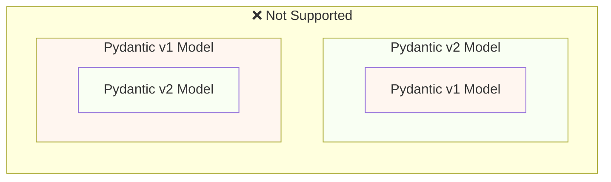
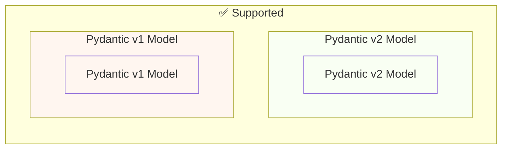

# 從 Pydantic v1 遷移到 Pydantic v2 { #migrate-from-pydantic-v1-to-pydantic-v2 }

如果你有一個舊的 FastAPI 應用，可能正在使用 Pydantic 1 版。

FastAPI 0.100.0 同時支援 Pydantic v1 或 v2，會使用你已安裝的那個版本。

FastAPI 0.119.0 透過 Pydantic v2 內的 `pydantic.v1` 提供對 Pydantic v1 的部分支援，以便遷移到 v2。

FastAPI 0.126.0 移除了對 Pydantic v1 的支援，但在一段時間內仍支援 `pydantic.v1`。

/// warning

Pydantic 團隊自 **Python 3.14** 起，已停止在最新的 Python 版本中支援 Pydantic v1。

這也包含 `pydantic.v1`，在 Python 3.14 及以上版本不再支援。

如果你想使用最新的 Python 功能，就需要確保使用 Pydantic v2。

///

如果你的舊 FastAPI 應用仍使用 Pydantic v1，這裡會示範如何遷移到 Pydantic v2，並介紹 **FastAPI 0.119.0** 中可協助你逐步遷移的功能。

## 官方指南 { #official-guide }

Pydantic 提供從 v1 遷移到 v2 的官方<a href="https://docs.pydantic.dev/latest/migration/" class="external-link" target="_blank">遷移指南</a>。

其中包含變更內容、驗證如何更正確且更嚴格、可能的注意事項等。

你可以先閱讀以更好理解具體變更。

## 測試 { #tests }

確保你的應用有[測試](../tutorial/testing.md){.internal-link target=_blank}，並在 CI（持續整合）上執行。

如此一來，你可以升級後確認一切仍如預期運作。

## `bump-pydantic` { #bump-pydantic }

在許多情況下，若你使用的是未自訂的標準 Pydantic 模型，多數遷移步驟都能自動化完成。

你可以使用 Pydantic 團隊提供的 <a href="https://github.com/pydantic/bump-pydantic" class="external-link" target="_blank">`bump-pydantic`</a>。

這個工具會自動修改大部分需要變更的程式碼。

之後執行測試確認一切正常即可完成。😎

## v2 中的 Pydantic v1 { #pydantic-v1-in-v2 }

Pydantic v2 內含子模組 `pydantic.v1`，提供 Pydantic v1 的所有內容。但在 Python 3.13 以上版本不再支援。

這表示你可以安裝最新的 Pydantic v2，並從該子模組匯入並使用舊的 Pydantic v1 元件，就像安裝了舊版 Pydantic v1 一樣。

{* ../../docs_src/pydantic_v1_in_v2/tutorial001_an_py310.py hl[1,4] *}

### FastAPI 對 v2 中 Pydantic v1 的支援 { #fastapi-support-for-pydantic-v1-in-v2 }

自 FastAPI 0.119.0 起，也支援透過 Pydantic v2 內的 Pydantic v1（部分）以協助遷移至 v2。

因此，你可以先升級到最新的 Pydantic v2，並將匯入改為使用 `pydantic.v1` 子模組，在多數情況下即可正常運作。

{* ../../docs_src/pydantic_v1_in_v2/tutorial002_an_py310.py hl[2,5,15] *}

/// warning

請注意，由於 Pydantic 團隊自 Python 3.14 起不再支援 Pydantic v1，因此在 Python 3.14 及以上版本中也不支援使用 `pydantic.v1`。

///

### 同一應用同時使用 Pydantic v1 與 v2 { #pydantic-v1-and-v2-on-the-same-app }

Pydantic 不支援在 Pydantic v2 模型的欄位中使用 Pydantic v1 模型，反之亦然。

...但你可以在同一應用中同時存在分開的 Pydantic v1 與 v2 模型。

在某些情況下，你甚至可以在同一個 FastAPI 路徑操作（path operation）中同時使用 Pydantic v1 與 v2 模型：

{* ../../docs_src/pydantic_v1_in_v2/tutorial003_an_py310.py hl[2:3,6,12,21:22] *}

在上面的範例中，輸入模型是 Pydantic v1，輸出模型（於 `response_model=ItemV2` 定義）是 Pydantic v2。

### Pydantic v1 參數 { #pydantic-v1-parameters }

若你需要在 Pydantic v1 模型上使用 FastAPI 的參數工具（例如 `Body`、`Query`、`Form` 等），在完成遷移到 Pydantic v2 之前，可以從 `fastapi.temp_pydantic_v1_params` 匯入：

{* ../../docs_src/pydantic_v1_in_v2/tutorial004_an_py310.py hl[4,18] *}

### 分步遷移 { #migrate-in-steps }

/// tip

先嘗試使用 `bump-pydantic`，如果測試通過且一切正常，你就能用一條指令完成遷移。✨

///

若 `bump-pydantic` 不適用於你的情境，可以利用在同一應用同時支援 Pydantic v1 與 v2 的能力，逐步完成遷移。

你可以先升級 Pydantic 到最新 v2，並將所有模型的匯入改為使用 `pydantic.v1`。

接著按群組逐步把模型從 Pydantic v1 遷移到 v2。🚶
