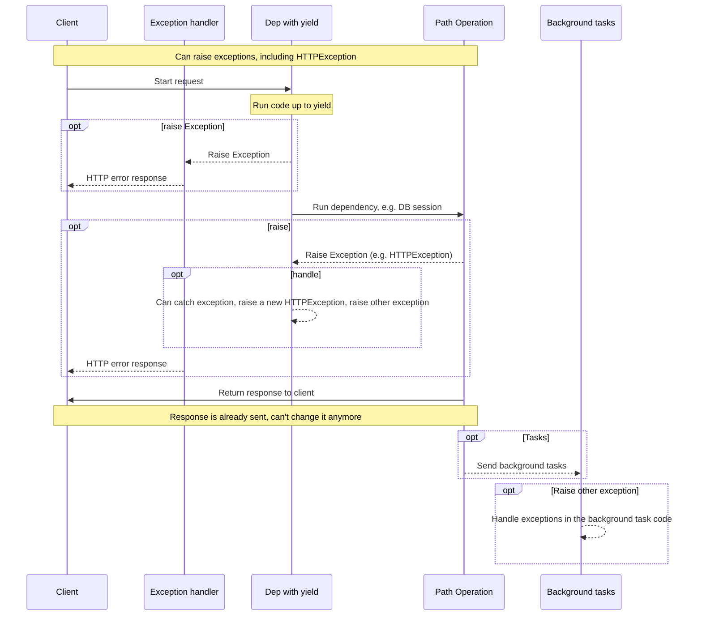
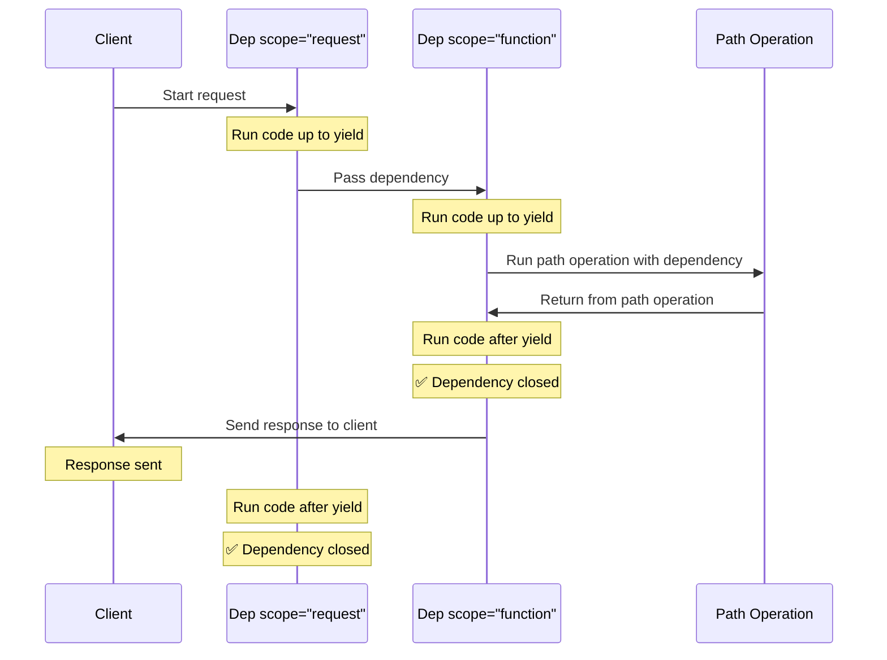

# 使用 yield 的相依 { #dependencies-with-yield }

FastAPI 支援在完成後執行一些<dfn title="有時也稱為「結束程式碼」、「清理程式碼」、「釋放程式碼」、「關閉程式碼」、「情境管理器結束程式碼」等">額外步驟</dfn>的相依。

要做到這點，使用 `yield` 取代 `return`，並把額外步驟（程式碼）寫在其後。

/// tip

請確保每個相依內只使用一次 `yield`。

///

/// note | 技術細節

任何可用於下列裝飾器的函式：

* <a href="https://docs.python.org/3/library/contextlib.html#contextlib.contextmanager" class="external-link" target="_blank">`@contextlib.contextmanager`</a> 或
* <a href="https://docs.python.org/3/library/contextlib.html#contextlib.asynccontextmanager" class="external-link" target="_blank">`@contextlib.asynccontextmanager`</a>

都可以作為 **FastAPI** 的相依。

事實上，FastAPI 內部就是使用這兩個裝飾器。

///

## 使用 `yield` 的資料庫相依 { #a-database-dependency-with-yield }

例如，你可以用它建立一個資料庫 session，並在完成後關閉。

只有 `yield` 之前（含 `yield` 本身）的程式碼會在產生回應之前執行：

{* ../../docs_src/dependencies/tutorial007_py310.py hl[2:4] *}

由 `yield` 產生的值會被注入到路徑操作（path operation）與其他相依中：

{* ../../docs_src/dependencies/tutorial007_py310.py hl[4] *}

位於 `yield` 之後的程式碼會在回應之後執行：

{* ../../docs_src/dependencies/tutorial007_py310.py hl[5:6] *}

/// tip

你可以使用 `async` 或一般函式。

**FastAPI** 都會正確處理，和一般相依相同。

///

## 同時使用 `yield` 與 `try` 的相依 { #a-dependency-with-yield-and-try }

如果在含 `yield` 的相依中使用 `try` 區塊，你會接收到使用該相依時拋出的任何例外。

例如，如果在中途的某段程式碼、其他相依，或某個路徑操作中，讓資料庫交易「rollback」或產生了任何例外，你都會在你的相依中接收到該例外。

因此，你可以在相依內用 `except SomeException` 來攔截特定例外。

同樣地，你可以使用 `finally` 來確保無論是否有例外都會執行結束步驟。

{* ../../docs_src/dependencies/tutorial007_py310.py hl[3,5] *}

## 含 `yield` 的子相依 { #sub-dependencies-with-yield }

你可以擁有任何大小與形狀的子相依與相依樹，而它們都可以（或不）使用 `yield`。

**FastAPI** 會確保每個使用 `yield` 的相依，其「結束程式碼」會以正確的順序執行。

例如，`dependency_c` 可以相依於 `dependency_b`，而 `dependency_b` 相依於 `dependency_a`：

{* ../../docs_src/dependencies/tutorial008_an_py310.py hl[6,14,22] *}

而且它們都可以使用 `yield`。

在這個例子中，`dependency_c` 為了執行它的結束程式碼，需要來自 `dependency_b`（此處命名為 `dep_b`）的值仍然可用。

同理，`dependency_b` 為了執行它的結束程式碼，需要來自 `dependency_a`（此處命名為 `dep_a`）的值可用。

{* ../../docs_src/dependencies/tutorial008_an_py310.py hl[18:19,26:27] *}

同樣地，你可以同時擁有使用 `yield` 的相依與使用 `return` 的相依，並讓其中一些相依彼此相依。

你也可以有一個相依同時需要多個使用 `yield` 的其他相依，等等。

你可以擁有任何你需要的相依組合。

**FastAPI** 會確保一切都以正確的順序執行。

/// note | 技術細節

這能運作，多虧了 Python 的 <a href="https://docs.python.org/3/library/contextlib.html" class="external-link" target="_blank">Context Managers</a>。

**FastAPI** 在內部使用它們來達成這點。

///

## 含 `yield` 與 `HTTPException` 的相依 { #dependencies-with-yield-and-httpexception }

你已看到可以在含 `yield` 的相依中使用 `try` 區塊，嘗試執行一些程式碼，然後在 `finally` 後執行結束程式碼。

你也可以用 `except` 來攔截被拋出的例外並加以處理。

例如，你可以拋出不同的例外，如 `HTTPException`。

/// tip

這算是進階技巧；多數情況你並不需要，因為你可以在應用程式其他程式碼中（例如在路徑操作函式（path operation function）中）直接拋出例外（包含 `HTTPException`）。

但如果你需要，它就在這裡。🤓

///

{* ../../docs_src/dependencies/tutorial008b_an_py310.py hl[18:22,31] *}

如果你想攔截例外並據此回傳自訂回應，請建立一個[自訂例外處理器](../handling-errors.md#install-custom-exception-handlers){.internal-link target=_blank}。

## 含 `yield` 與 `except` 的相依 { #dependencies-with-yield-and-except }

如果你在含 `yield` 的相依中用 `except` 攔截了例外，且沒有再次拋出它（或拋出新的例外），FastAPI 將無法察覺有例外發生，就像在一般的 Python 中一樣：

{* ../../docs_src/dependencies/tutorial008c_an_py310.py hl[15:16] *}

在這種情況下，客戶端會如預期地看到一個 *HTTP 500 Internal Server Error* 回應（因為我們沒有拋出 `HTTPException` 或類似的東西），但伺服器將不會有任何日誌或其他錯誤線索。😱

### 在含 `yield` 與 `except` 的相依中務必 `raise` { #always-raise-in-dependencies-with-yield-and-except }

如果你在含 `yield` 的相依中攔截到了例外，除非你要拋出另一個 `HTTPException` 或類似的例外，否則**你應該重新拋出原本的例外**。

你可以使用 `raise` 重新拋出同一個例外：

{* ../../docs_src/dependencies/tutorial008d_an_py310.py hl[17] *}

現在客戶端仍會獲得同樣的 *HTTP 500 Internal Server Error* 回應，但伺服器的日誌中會有我們自訂的 `InternalError`。😎

## 含 `yield` 的相依執行順序 { #execution-of-dependencies-with-yield }

執行順序大致如下圖。時間從上往下流動，每一欄代表一個互動或執行程式碼的部分。



/// info

只會向用戶端送出「一個回應」。可能是其中一個錯誤回應，或是來自該路徑操作的回應。

一旦送出了其中一個回應，就不能再送出其他回應。

///

/// tip

如果你在路徑操作函式的程式碼中拋出任何例外，它會被傳遞到使用 `yield` 的相依中（包含 `HTTPException`）。大多數情況你會想在該使用 `yield` 的相依中重新拋出相同的例外或一個新的例外，以確保它被正確處理。

///

## 提早關閉與 `scope` { #early-exit-and-scope }

通常，含 `yield` 的相依之結束程式碼會在回應送出給用戶端之後才執行。

但如果你確定在從路徑操作函式返回後就不會再使用該相依，你可以使用 `Depends(scope="function")`，告訴 FastAPI 應在路徑操作函式返回之後、但在回應送出之前關閉該相依。

{* ../../docs_src/dependencies/tutorial008e_an_py310.py hl[12,16] *}

`Depends()` 接受一個 `scope` 參數，可以是：

* `"function"`：在處理請求的路徑操作函式之前啟動相依，在路徑操作函式結束之後結束相依，但在回應送回用戶端之前。所以，相依函式會在路徑操作**函式**的「周圍」執行。
* `"request"`：在處理請求的路徑操作函式之前啟動相依（與使用 `"function"` 類似），但在回應送回用戶端之後才結束相依。所以，相依函式會在整個**請求**與回應循環的「周圍」執行。

如果未指定且相依使用了 `yield`，則預設 `scope` 為 `"request"`。

### 子相依的 `scope` { #scope-for-sub-dependencies }

當你宣告一個 `scope="request"`（預設值）的相依時，任何子相依也需要有 `"request"` 的 `scope`。

但一個 `scope` 為 `"function"` 的相依，可以擁有 `scope` 為 `"function"` 或 `"request"` 的子相依。

這是因為任何相依都需要能在子相依之前執行其結束程式碼，因為它可能在結束程式碼中仍需要使用那些子相依。



## 含 `yield`、`HTTPException`、`except` 與背景任務的相依 { #dependencies-with-yield-httpexception-except-and-background-tasks }

含 `yield` 的相依隨時間演進，以涵蓋不同的使用情境並修正一些問題。

如果你想了解在不同 FastAPI 版本中改了哪些內容，可以在進階指南中閱讀：[進階相依 — 含 `yield`、`HTTPException`、`except` 與背景任務的相依](../../advanced/advanced-dependencies.md#dependencies-with-yield-httpexception-except-and-background-tasks){.internal-link target=_blank}。
## 情境管理器 { #context-managers }

### 什麼是「情境管理器」 { #what-are-context-managers }

「情境管理器」是那些你可以在 `with` 陳述式中使用的 Python 物件。

例如，<a href="https://docs.python.org/3/tutorial/inputoutput.html#reading-and-writing-files" class="external-link" target="_blank">你可以用 `with` 來讀取檔案</a>：

```Python
with open("./somefile.txt") as f:
    contents = f.read()
    print(contents)
```

在底層，`open("./somefile.txt")` 會建立一個稱為「情境管理器」的物件。

當 `with` 區塊結束時，它會確保關閉檔案，即使發生了例外也一樣。

當你建立一個含 `yield` 的相依時，**FastAPI** 會在內部為它建立一個情境管理器，並與其他相關工具結合。

### 在含 `yield` 的相依中使用情境管理器 { #using-context-managers-in-dependencies-with-yield }

/// warning

這大致算是一個「進階」概念。

如果你剛開始學習 **FastAPI**，此處可以先跳過。

///

在 Python 中，你可以透過<a href="https://docs.python.org/3/reference/datamodel.html#context-managers" class="external-link" target="_blank">建立一個擁有 `__enter__()` 與 `__exit__()` 兩個方法的類別</a>來建立情境管理器。

你也可以在 **FastAPI** 的含 `yield` 相依中，於相依函式內使用 `with` 或 `async with` 陳述式來使用它們：

{* ../../docs_src/dependencies/tutorial010_py310.py hl[1:9,13] *}

/// tip

建立情境管理器的另一種方式是：

* <a href="https://docs.python.org/3/library/contextlib.html#contextlib.contextmanager" class="external-link" target="_blank">`@contextlib.contextmanager`</a> 或
* <a href="https://docs.python.org/3/library/contextlib.html#contextlib.asynccontextmanager" class="external-link" target="_blank">`@contextlib.asynccontextmanager`</a>

用它們裝飾一個只包含單一 `yield` 的函式。

這正是 **FastAPI** 在內部為含 `yield` 的相依所使用的方法。

但你不需要（而且也不該）在 FastAPI 的相依上使用這些裝飾器。

FastAPI 會在內部替你處理好。

///
