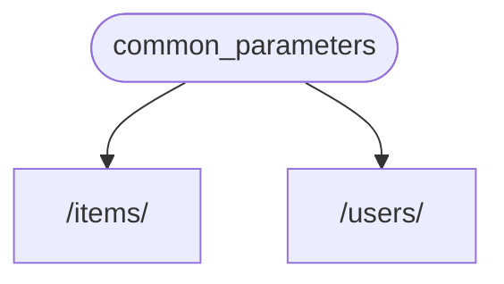
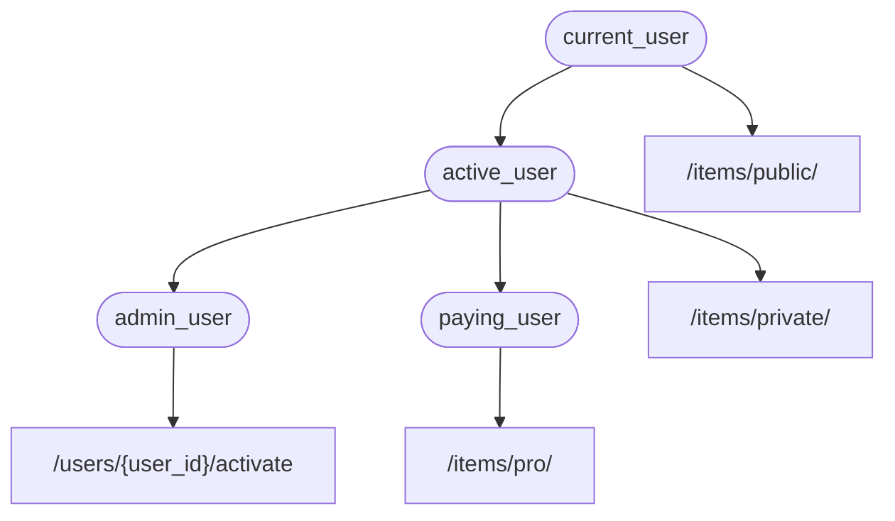

# 依賴 { #dependencies }

**FastAPI** 內建一套強大且直覺的 **<dfn title="也稱為：元件、資源、提供者、服務、可注入項">依賴注入</dfn>** 系統。

它被設計為易於使用，使任何開發者都能輕鬆將其他元件與 **FastAPI** 整合。

## 什麼是「依賴注入」 { #what-is-dependency-injection }

在程式設計中，「依賴注入」的意思是：你的程式碼（此處指你的「路徑操作函式 (path operation functions)」）可以宣告它為了正常運作所需要的各種東西：也就是「依賴」。

接著，這個系統（此處是 **FastAPI**）會負責做任何必要的事，將這些所需的依賴提供給你的程式碼（「注入」依賴）。

當你需要以下情境時，這特別有用：

* 共享邏輯（相同的邏輯一次又一次地使用）。
* 共用資料庫連線。
* 強制套用安全性、驗證、角色要求等。
* 以及許多其他事情...

同時把重複的程式碼降到最低。

## 入門 { #first-steps }

先看一個非常簡單的範例。它現在還不太實用，但夠簡單，讓我們能專注在 **依賴注入** 的運作方式。

### 建立一個依賴，或稱「dependable」 { #create-a-dependency-or-dependable }

先專注在依賴本身。

它就是一個函式，可以接受與「路徑操作函式」相同的各種參數：

{* ../../docs_src/dependencies/tutorial001_an_py310.py hl[8:9] *}

就這樣。

僅僅兩行。

而且它的外觀與結構和你的所有「路徑操作函式」一樣。

你可以把它想成一個沒有「裝飾器」（沒有 `@app.get("/some-path")`）的「路徑操作函式」。

它可以回傳你想要的任何東西。

在這個例子中，這個依賴會期望：

* 一個選用的查詢參數 `q`，型別為 `str`。
* 一個選用的查詢參數 `skip`，型別為 `int`，預設為 `0`。
* 一個選用的查詢參數 `limit`，型別為 `int`，預設為 `100`。

然後它只會回傳一個包含這些值的 `dict`。

/// info | 說明

FastAPI 在 0.95.0 版新增了對 `Annotated` 的支援（並開始建議使用）。

如果你使用較舊的版本，嘗試使用 `Annotated` 時會出現錯誤。

在使用 `Annotated` 之前，請先[升級 FastAPI 版本](../../deployment/versions.md#upgrading-the-fastapi-versions){.internal-link target=_blank}到至少 0.95.1。

///

### 匯入 `Depends` { #import-depends }

{* ../../docs_src/dependencies/tutorial001_an_py310.py hl[3] *}

### 在「被依賴者」（dependant）中宣告依賴 { #declare-the-dependency-in-the-dependant }

和你在「路徑操作函式」參數上使用 `Body`、`Query` 等方式一樣，針對新參數使用 `Depends`：

{* ../../docs_src/dependencies/tutorial001_an_py310.py hl[13,18] *}

雖然你在函式參數上使用 `Depends` 的方式和 `Body`、`Query` 等相同，但 `Depends` 的運作方式有點不同。

你只需要傳給 `Depends` 一個參數。

這個參數必須是類似函式的東西。

你不需要直接呼叫它（不要在後面加上括號），只要把它作為參數傳給 `Depends()` 即可。

而該函式的參數宣告方式與「路徑操作函式」相同。

/// tip | 提示

除了函式之外，還有其他「東西」也能當作依賴，會在下一章介紹。

///

當有新的請求到達時，**FastAPI** 會負責：

* 以正確的參數呼叫你的依賴（dependable）函式。
* 取得該函式的回傳結果。
* 將結果指定給你的「路徑操作函式」中的對應參數。



如此一來，你只需撰寫一次共用程式碼，**FastAPI** 會替你的各個「路徑操作」呼叫它。

/// check | 檢查

注意，你不必建立特殊的類別並把它傳到 **FastAPI** 去「註冊」或做類似的事。

只要把它傳給 `Depends`，**FastAPI** 就知道該怎麼處理其餘的部分。

///

## 共用 `Annotated` 依賴 { #share-annotated-dependencies }

在上面的範例中，可以看到有一點點的「重複程式碼」。

當你要使用 `common_parameters()` 這個依賴時，你得寫出完整的型別註解搭配 `Depends()`：

```Python
commons: Annotated[dict, Depends(common_parameters)]
```

但因為我們在使用 `Annotated`，我們可以把這個 `Annotated` 的值存到一個變數中，並在多個地方重複使用：

{* ../../docs_src/dependencies/tutorial001_02_an_py310.py hl[12,16,21] *}

/// tip | 提示

這只是標準的 Python，用的是所謂的「型別別名 (type alias)」，其實和 **FastAPI** 本身無關。

但因為 **FastAPI** 是建立在 Python 標準之上（包含 `Annotated`），你就可以在程式碼中使用這個技巧。😎

///

這些依賴依然會如預期運作，而最棒的是「型別資訊會被保留」，代表你的編輯器仍能提供「自動完成」、「即時錯誤」等功能，像 `mypy` 等其他工具也一樣受益。

當你在「大型程式碼庫」中，於許多「路徑操作」反覆使用「相同的依賴」時，這會特別有用。

## 要不要使用 `async` { #to-async-or-not-to-async }

因為依賴也會由 **FastAPI** 呼叫（就像你的「路徑操作函式」），所以在定義函式時套用相同的規則。

你可以使用 `async def` 或一般的 `def`。

而且你可以在一般 `def` 的「路徑操作函式」中宣告 `async def` 的依賴，或在 `async def` 的「路徑操作函式」中宣告 `def` 的依賴，等等。

都沒關係。**FastAPI** 會知道該怎麼做。

/// note | 注意

如果你不熟悉，請參考文件中的 [Async: "In a hurry?"](../../async.md#in-a-hurry){.internal-link target=_blank} 一節，瞭解 `async` 與 `await`。

///

## 與 OpenAPI 整合 { #integrated-with-openapi }

你的依賴（以及其子依賴）所宣告的所有請求參數、驗證與需求，都會整合進同一份 OpenAPI 結構中。

因此，互動式文件也會包含來自這些依賴的所有資訊：


## 簡單用法 { #simple-usage }

想一想，「路徑操作函式」是宣告好讓框架在「路徑」與「操作」符合時使用的，然後 **FastAPI** 會負責帶入正確的參數、從請求中擷取資料，並呼叫該函式。

其實，所有（或大多數）Web 框架都是這樣運作。

你從不會直接呼叫這些函式。它們是由框架（此處是 **FastAPI**）呼叫的。

透過依賴注入系統，你也可以告訴 **FastAPI**：你的「路徑操作函式」還「依賴」其他東西，應在你的「路徑操作函式」之前執行，**FastAPI** 會負責執行它並「注入」其結果。

這個「依賴注入」概念的其他常見稱呼包括：

* 資源
* 提供者
* 服務
* 可注入項
* 元件

## **FastAPI** 外掛 { #fastapi-plug-ins }

各種整合與「外掛」都能以 **依賴注入** 系統來構建。但事實上，並不需要真的去打造「外掛」，因為透過依賴，你可以宣告無數的整合與互動，並讓它們供你的「路徑操作函式」使用。

而且依賴可以用非常簡單直覺的方式建立，你只需要匯入所需的 Python 套件，然後用幾行程式碼就能把它們與你的 API 函式整合，真的是「只要幾行」。

在接下來的章節中你會看到這方面的例子，例如關聯式與 NoSQL 資料庫、安全性等。

## **FastAPI** 相容性 { #fastapi-compatibility }

依賴注入系統的簡潔，使 **FastAPI** 能與以下事物相容：

* 所有關聯式資料庫
* NoSQL 資料庫
* 外部套件
* 外部 API
* 驗證與授權系統
* API 使用監控系統
* 回應資料注入系統
* 等等

## 簡單而強大 { #simple-and-powerful }

雖然階層式的依賴注入系統相當容易定義與使用，但它依然非常強大。

你可以定義會進一步依賴其他依賴的依賴。

最終會形成一棵階層式的依賴樹，而 **依賴注入** 系統會負責為你解決所有這些依賴（以及它們的子依賴），並在每一步提供（注入）對應的結果。

例如，假設你有 4 個 API 端點（「路徑操作」）：

* `/items/public/`
* `/items/private/`
* `/users/{user_id}/activate`
* `/items/pro/`

那麼你就能只透過依賴與子依賴，為每個端點加入不同的權限需求：



## 與 **OpenAPI** 整合 { #integrated-with-openapi_1 }

所有這些依賴在宣告其需求的同時，也會為你的「路徑操作」新增參數、驗證等。

**FastAPI** 會負責把這一切加入 OpenAPI 結構中，讓它們顯示在互動式文件系統裡。
