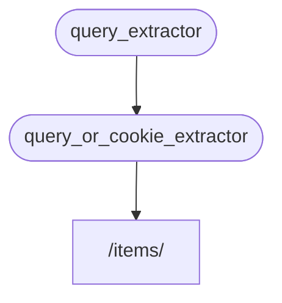

# 子相依 { #sub-dependencies }

你可以建立具有「子相依」的相依項。

它們可以按你的需要，層級任意加深。

**FastAPI** 會負責解析它們。

## 第一個相依項 "dependable" { #first-dependency-dependable }

你可以建立第一個相依項（"dependable"）如下：

{* ../../docs_src/dependencies/tutorial005_an_py310.py hl[8:9] *}

它宣告了一個可選的查詢參數 `q`（型別為 `str`），然後直接回傳它。

這很簡單（不太實用），但有助於我們專注於子相依如何運作。

## 第二個相依，同時是 "dependable" 也是 "dependant" { #second-dependency-dependable-and-dependant }

接著你可以建立另一個相依函式（"dependable"），同時它也宣告了自己的相依（因此它同時也是 "dependant"）：

{* ../../docs_src/dependencies/tutorial005_an_py310.py hl[13] *}

來看它所宣告的參數：

- 即使這個函式本身是個相依項（"dependable"），它也宣告了另一個相依（它「相依於」其他東西）。
    - 它相依 `query_extractor`，並把其回傳值指定給參數 `q`。
- 它還宣告了一個可選的 `last_query` cookie，型別為 `str`。
    - 如果使用者沒有提供查詢 `q`，我們就使用先前儲存在 cookie 中的最後一次查詢值。

## 使用相依項 { #use-the-dependency }

然後我們可以這樣使用這個相依項：

{* ../../docs_src/dependencies/tutorial005_an_py310.py hl[23] *}

/// info

注意，在路徑操作函式中我們只宣告了一個相依項 `query_or_cookie_extractor`。

但 **FastAPI** 會知道它必須先解析 `query_extractor`，在呼叫 `query_or_cookie_extractor` 時把其結果傳入。

///



## 多次使用同一個相依項 { #using-the-same-dependency-multiple-times }

如果你的某個相依項在同一個路徑操作中被宣告了多次，例如多個相依共用同一個子相依，**FastAPI** 會知道只需在每次請求中呼叫該子相依一次。

它會把回傳值儲存在一個 <dfn title="用來儲存已計算/產生之值的工具／系統，以便重複使用而不必再次計算。">「快取」</dfn> 中，並在該次請求中傳遞給所有需要它的「相依者」，而不是為同一個請求多次呼叫相同的相依項。

在進階情境下，如果你確定需要在同一次請求的每個步驟都呼叫該相依（可能呼叫多次），而不是使用「快取」的值，你可以在使用 `Depends` 時設定參數 `use_cache=False`：

//// tab | Python 3.10+

```Python hl_lines="1"
async def needy_dependency(fresh_value: Annotated[str, Depends(get_value, use_cache=False)]):
    return {"fresh_value": fresh_value}
```

////

//// tab | Python 3.10+ 未使用 Annotated

/// tip

若可行，建議使用 `Annotated` 的版本。

///

```Python hl_lines="1"
async def needy_dependency(fresh_value: str = Depends(get_value, use_cache=False)):
    return {"fresh_value": fresh_value}
```

////

## 回顧 { #recap }

撇開這裡用到的術語不談，**相依性注入（Dependency Injection）** 系統其實很簡單。

它只是一些與路徑操作函式外觀相同的函式。

但它非常強大，允許你宣告任意深度巢狀的相依「圖」（樹）。

/// tip

用這些簡單的例子看起來可能不那麼有用。

但在關於安全性的章節中，你會看到它有多實用。

你也會看到它能為你省下多少程式碼。

///
