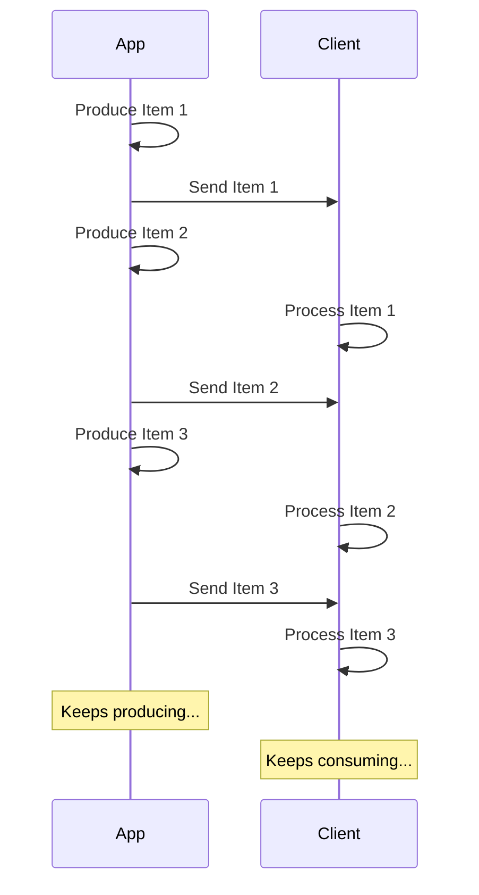

# 串流 JSON Lines { #stream-json-lines }

當你有一連串資料想以「**串流**」方式傳送時，可以使用 **JSON Lines**。

/// info

在 FastAPI 0.134.0 新增。

///

## 什麼是串流？ { #what-is-a-stream }

「**Streaming**」資料表示你的應用會在整個資料序列尚未完全準備好之前，就開始將資料項目傳送給用戶端。

也就是說，它會先送出第一個項目，用戶端接收並開始處理時，你的應用可能仍在產生下一個項目。



它甚至可以是無限串流，你可以一直持續傳送資料。

## JSON Lines { #json-lines }

在這些情況下，常見做法是傳送「**JSON Lines**」，這是一種每一行各包含一個 JSON 物件的格式。

回應的 content type 會是 `application/jsonl`（而不是 `application/json`），而本體內容會像這樣：

```json
{"name": "Plumbus", "description": "A multi-purpose household device."}
{"name": "Portal Gun", "description": "A portal opening device."}
{"name": "Meeseeks Box", "description": "A box that summons a Meeseeks."}
```

它和 JSON 陣列（相當於 Python 的 list）很像，但不同於用 `[]` 包起來並以 `,` 分隔項目，它是每一行各放一個 JSON 物件，彼此以換行字元分隔。

/// info

重點在於你的應用能夠逐行產生資料，同時用戶端在消耗前一行的資料。

///

/// note | 技術細節

由於每個 JSON 物件會以換行分隔，它們的內容中不能包含實際的換行字元，但可以包含跳脫後的換行（`\n`），這是 JSON 標準的一部分。

不過通常你不需要為此煩惱，這些都會自動處理，繼續往下看吧。🤓

///

## 使用情境 { #use-cases }

你可以用這種方式從 **AI LLM** 服務、**日誌**或**遙測**串流資料，或任何能以 **JSON** 項目結構化的其他型態資料。

/// tip

如果你想串流二進位資料，例如影像或音訊，請參考進階指南：[串流資料](../advanced/stream-data.md)。

///

## 使用 FastAPI 串流 JSON Lines { #stream-json-lines-with-fastapi }

要用 FastAPI 串流 JSON Lines，你可以在你的*路徑操作函式*中改用 `yield` 逐一產生項目，而不是用 `return`。

{* ../../docs_src/stream_json_lines/tutorial001_py310.py ln[1:24] hl[24] *}

如果你要回傳的每個 JSON 項目型別都是 `Item`（一個 Pydantic 模型），而且該函式是 async，你可以將回傳型別宣告為 `AsyncIterable[Item]`：

{* ../../docs_src/stream_json_lines/tutorial001_py310.py ln[1:24] hl[9:11,22] *}

如果你宣告了回傳型別，FastAPI 會用它來進行資料的**驗證**、在 OpenAPI 中**文件化**、**過濾**，並使用 Pydantic 進行**序列化**。

/// tip

由於 Pydantic 會在 **Rust** 端進行序列化，宣告回傳型別可獲得比未宣告時高得多的**效能**。

///

### 非 async 的*路徑操作函式* { #non-async-path-operation-functions }

你也可以用一般的 `def` 函式（沒有 `async`），同樣用 `yield`。

FastAPI 會確保正確執行，不會阻塞事件迴圈。

因為這種情況下函式不是 async，正確的回傳型別會是 `Iterable[Item]`：

{* ../../docs_src/stream_json_lines/tutorial001_py310.py ln[27:30] hl[28] *}

### 不宣告回傳型別 { #no-return-type }

你也可以省略回傳型別。此時 FastAPI 會使用 [`jsonable_encoder`](./encoder.md) 將資料轉換為可序列化為 JSON 的形式，然後以 JSON Lines 傳送。

{* ../../docs_src/stream_json_lines/tutorial001_py310.py ln[33:36] hl[34] *}

## 伺服器推播事件（SSE） { #server-sent-events-sse }

FastAPI 也原生支援 Server-Sent Events（SSE），它們與此相當類似，但多了幾個細節。你可以在下一章學到更多：[伺服器推播事件（SSE）](server-sent-events.md)。🤓
