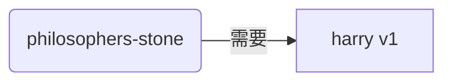
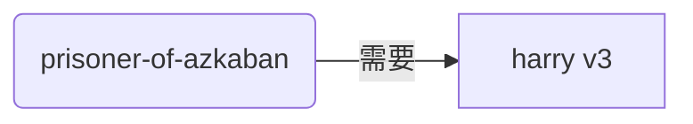
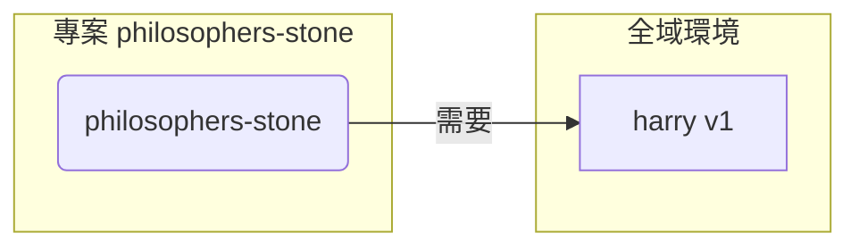
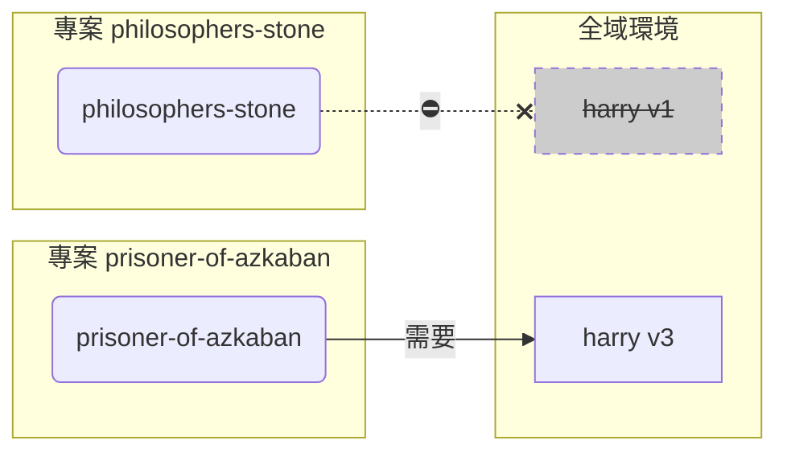
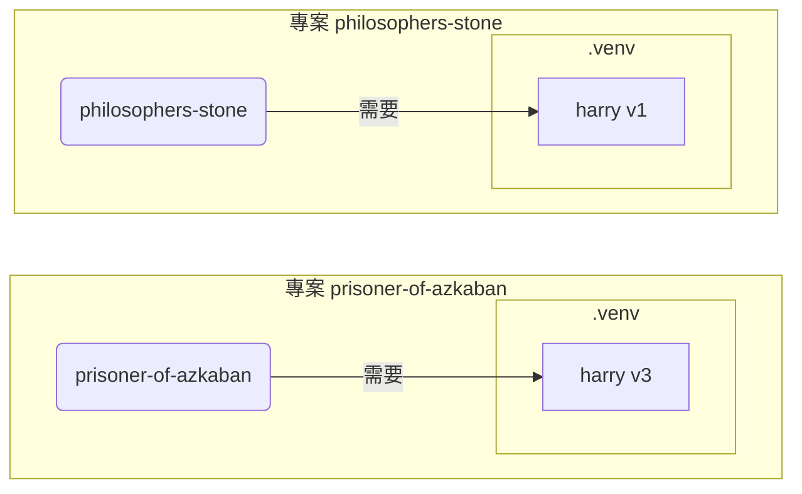

# 虛擬環境

當你在 Python 專案中工作時，你可能會需要使用一個**虛擬環境**（或類似的機制）來隔離你為每個專案安裝的套件。

/// info

如果你已經了解虛擬環境，知道如何建立和使用它們，你可以考慮跳過這一部分。🤓

///

/// tip

**虛擬環境**和**環境變數**是不同的。

**環境變數**是系統中的一個變數，可以被程式使用。

**虛擬環境**是一個包含一些檔案的目錄。

///

/// info

這個頁面將教你如何使用**虛擬環境**以及了解它們的工作原理。

如果你計畫使用一個**可以為你管理一切的工具**（包括安裝 Python），試試 <a href="https://github.com/astral-sh/uv" class="external-link" target="_blank">uv</a>。

///

## 建立一個專案

首先，為你的專案建立一個目錄。

我（指原作者 —— 譯者注）通常會在我的主目錄下建立一個名為 `code` 的目錄。

在這個目錄下，我再為每個專案建立一個目錄。

<div class="termy">

```console
// 進入主目錄
$ cd
// 建立一個用於存放所有程式碼專案的目錄
$ mkdir code
// 進入 code 目錄
$ cd code
// 建立一個用於存放這個專案的目錄
$ mkdir awesome-project
// 進入這個專案的目錄
$ cd awesome-project
```

</div>

## 建立一個虛擬環境

在開始一個 Python 專案的**第一時間**，**<abbr title="還有其他做法，此處僅作為一個簡單的指引">在你的專案內部</abbr>**建立一個虛擬環境。

/// tip

你只需要**在每個專案中操作一次**，而不是每次工作時都操作。

///

//// tab | `venv`

你可以使用 Python 自帶的 `venv` 模組來建立一個虛擬環境。

<div class="termy">

```console
$ python -m venv .venv
```

</div>

/// details | 上述命令的含義

* `python`: 使用名為 `python` 的程式
* `-m`: 以腳本的方式呼叫一個模組，我們將告訴它接下來使用哪個模組
* `venv`: 使用名為 `venv` 的模組，這個模組通常隨 Python 一起安裝
* `.venv`: 在新目錄 `.venv` 中建立虛擬環境

///

////

//// tab | `uv`

如果你安裝了 <a href="https://github.com/astral-sh/uv" class="external-link" target="_blank">`uv`</a>，你也可以使用它來建立一個虛擬環境。

<div class="termy">

```console
$ uv venv
```

</div>

/// tip

預設情況下，`uv` 會在一個名為 `.venv` 的目錄中建立一個虛擬環境。

但你可以透過傳遞一個額外的引數來自訂它，指定目錄的名稱。

///

////

這個命令會在一個名為 `.venv` 的目錄中建立一個新的虛擬環境。

/// details | `.venv`，或是其他名稱

你可以在不同的目錄下建立虛擬環境，但通常我們會把它命名為 `.venv`。

///

## 啟動虛擬環境

啟動新的虛擬環境來確保你運行的任何 Python 指令或安裝的套件都能使用到它。

/// tip

**每次**開始一個**新的終端會話**來在這個專案工作時，你都需要執行這個操作。

///

//// tab | Linux, macOS

<div class="termy">

```console
$ source .venv/bin/activate
```

</div>

////

//// tab | Windows PowerShell

<div class="termy">

```console
$ .venv\Scripts\Activate.ps1
```

</div>

////

//// tab | Windows Bash

或者，如果你在 Windows 上使用 Bash（例如 <a href="https://gitforwindows.org/" class="external-link" target="_blank">Git Bash</a>）：

<div class="termy">

```console
$ source .venv/Scripts/activate
```

</div>

////

/// tip

每次你在這個環境中安裝一個**新的套件**時，都需要**重新啟動**這個環境。

這麼做確保了當你使用一個由這個套件安裝的**終端（<abbr title="命令列介面">CLI</abbr>）程式**時，你使用的是你的虛擬環境中的程式，而不是全域安裝、可能版本不同的程式。

///

## 檢查虛擬環境是否啟動

檢查虛擬環境是否啟動（前面的指令是否生效）。

/// tip

這是**非必需的**，但這是一個很好的方法，可以**檢查**一切是否按預期工作，以及你是否使用了你打算使用的虛擬環境。

///

//// tab | Linux, macOS, Windows Bash

<div class="termy">

```console
$ which python

/home/user/code/awesome-project/.venv/bin/python
```

</div>

如果它顯示了在你專案（在這個例子中是 `awesome-project`）的 `.venv/bin/python` 中的 `python` 二進位檔案，那麼它就生效了。🎉

////

//// tab | Windows PowerShell

<div class="termy">

```console
$ Get-Command python

C:\Users\user\code\awesome-project\.venv\Scripts\python
```

</div>

如果它顯示了在你專案（在這個例子中是 `awesome-project`）的 `.venv\Scripts\python` 中的 `python` 二進位檔案，那麼它就生效了。🎉

////

## 升級 `pip`

/// tip

如果你使用 <a href="https://github.com/astral-sh/uv" class="external-link" target="_blank">`uv`</a> 來安裝內容，而不是 `pip`，那麼你就不需要升級 `pip`。😎

///

如果你使用 `pip` 來安裝套件（它是 Python 的預設元件），你應該將它**升級**到最新版本。

在安裝套件時出現的許多奇怪的錯誤都可以透過先升級 `pip` 來解決。

/// tip

通常你只需要在建立虛擬環境後**執行一次**這個操作。

///

確保虛擬環境是啟動的（使用上面的指令），然後運行：

<div class="termy">

```console
$ python -m pip install --upgrade pip

---> 100%
```

</div>

## 加入 `.gitignore`

如果你使用 **Git**（這是你應該使用的），加入一個 `.gitignore` 檔案來排除你的 `.venv` 中的所有內容。

/// tip

如果你使用 <a href="https://github.com/astral-sh/uv" class="external-link" target="_blank">`uv`</a> 來建立虛擬環境，它會自動為你完成這個操作，你可以跳過這一步。😎

///

/// tip

通常你只需要在建立虛擬環境後**執行一次**這個操作。

///

<div class="termy">

```console
$ echo "*" > .venv/.gitignore
```

</div>

/// details | 上述指令的含義

-   `echo "*"`: 將在終端中「顯示」文本 `*`（接下來的部分會對這個操作進行一些修改）
-   `>`: 使左邊的指令顯示到終端的任何內容實際上都不會被顯示，而是會被寫入到右邊的檔案中
-   `.gitignore`: 被寫入文本的檔案的名稱

而 `*` 對於 Git 來說意味著「所有內容」。所以，它會忽略 `.venv` 目錄中的所有內容。

該指令會建立一個名為 .gitignore 的檔案，內容如下：

```gitignore
*
```

///

## 安裝套件

在啟用虛擬環境後，你可以在其中安裝套件。

/// tip

當你需要安裝或升級套件時，執行本操作**一次**；

如果你需要再升級版本或新增套件，你可以**再次執行此操作**。

///

### 直接安裝套件

如果你急於安裝，不想使用檔案來聲明專案的套件依賴，你可以直接安裝它們。

/// tip

將程式所需的套件及其版本放在檔案中（例如 `requirements.txt` 或 `pyproject.toml`）是個好（而且非常好）的主意。

///

//// tab | `pip`

<div class="termy">

```console
$ pip install "fastapi[standard]"

---> 100%
```

</div>

////

//// tab | `uv`

如果你有 <a href="https://github.com/astral-sh/uv" class="external-link" target="_blank">`uv`</a>:

<div class="termy">

```console
$ uv pip install "fastapi[standard]"
---> 100%
```

</div>

////

### 從 `requirements.txt` 安裝

如果你有一個 `requirements.txt` 檔案，你可以使用它來安裝其中的套件。

//// tab | `pip`

<div class="termy">

```console
$ pip install -r requirements.txt
---> 100%
```

</div>

////

//// tab | `uv`

如果你有 <a href="https://github.com/astral-sh/uv" class="external-link" target="_blank">`uv`</a>:

<div class="termy">

```console
$ uv pip install -r requirements.txt
---> 100%
```

</div>

////

/// details | 關於 `requirements.txt`

一個包含一些套件的 `requirements.txt` 檔案看起來應該是這樣的：

```requirements.txt
fastapi[standard]==0.113.0
pydantic==2.8.0
```

///

## 執行程式

在啟用虛擬環境後，你可以執行你的程式，它將使用虛擬環境中的 Python 和你在其中安裝的套件。

<div class="termy">

```console
$ python main.py

Hello World
```

</div>

## 設定編輯器

你可能會用到編輯器，請確保設定它使用你建立的相同虛擬環境（它可能會自動偵測到），以便你可以獲得自動完成和内嵌錯誤提示。

例如：

* <a href="https://code.visualstudio.com/docs/python/environments#_select-and-activate-an-environment" class="external-link" target="_blank">VS Code</a>
* <a href="https://www.jetbrains.com/help/pycharm/creating-virtual-environment.html" class="external-link" target="_blank">PyCharm</a>

/// tip

通常你只需要在建立虛擬環境時執行此操作**一次**。

///

## 退出虛擬環境

當你完成工作後，你可以**退出**虛擬環境。

<div class="termy">

```console
$ deactivate
```

</div>

這樣，當你執行 `python` 時它不會嘗試從已安裝套件的虛擬環境中執行。

## 開始工作

現在你已經準備好開始你的工作了。


/// tip

你想要理解上面的所有內容嗎？

繼續閱讀。👇🤓

///

## 為什麼要使用虛擬環境

你需要安裝 <a href="https://www.python.org/" class="external-link" target="_blank">Python</a> 才能使用 FastAPI。

接下來，你需要**安裝** FastAPI 以及你想使用的其他**套件**。

要安裝套件，你通常會使用隨 Python 一起提供的 `pip` 指令（或類似的替代工具）。

然而，如果你直接使用 `pip`，套件將會安裝在你的**全域 Python 環境**中（即 Python 的全域安裝）。

### 存在的問題

那麼，在全域 Python 環境中安裝套件有什麼問題呢？

有時候，你可能會開發許多不同的程式，而這些程式各自依賴於**不同的套件**；有些專案甚至需要依賴於**相同套件的不同版本**。😱

例如，你可能會建立一個名為 `philosophers-stone` 的專案，這個程式依賴於另一個名為 **`harry` 的套件，並使用版本 `1`**。因此，你需要安裝 `harry`。



然而，在此之後，你又建立了另一個名為 `prisoner-of-azkaban` 的專案，而這個專案也依賴於 `harry`，但需要的是 **`harry` 版本 `3`**。



現在的問題是，如果你在全域環境中安裝套件而不是在本地**虛擬環境**中，你將面臨選擇安裝哪個版本的 `harry` 的困境。

如果你想運行 `philosophers-stone`，你需要先安裝 `harry` 版本 `1`，例如：

<div class="termy">

```console
$ pip install "harry==1"
```

</div>

然後你會在全域 Python 環境中安裝 `harry` 版本 `1`。



但如果你想運行 `prisoner-of-azkaban`，你需要解除安裝 `harry` 版本 `1` 並安裝 `harry` 版本 `3`（或者只要你安裝版本 `3`，版本 `1` 就會自動移除）。

<div class="termy">

```console
$ pip install "harry==3"
```

</div>

於是，你在全域 Python 環境中安裝了 `harry` 版本 `3`。

如果你再次嘗試運行 `philosophers-stone`，很可能會**無法正常運作**，因為它需要的是 `harry` 版本 `1`。



/// tip

Python 套件在推出**新版本**時通常會儘量**避免破壞性更改**，但最好還是要謹慎，在安裝新版本前進行測試，以確保一切能正常運行。

///

現在，想像一下如果有**許多**其他**套件**，它們都是你的**專案所依賴的**。這樣是非常難以管理的。你可能會發現有些專案使用了一些**不相容的套件版本**，而無法得知為什麼某些程式無法正常運作。

此外，取決於你的操作系統（例如 Linux、Windows、macOS），它可能已經預先安裝了 Python。在這種情況下，它可能已經有一些系統所需的套件和特定版本。如果你在全域 Python 環境中安裝套件，可能會**破壞**某些隨作業系統一起安裝的程式。

## 套件安裝在哪裡

當你安裝 Python 時，它會在你的電腦中建立一些目錄並放置一些檔案。

其中一些目錄專門用來存放你所安裝的所有套件。

當你運行：

<div class="termy">

```console
// 先別去運行這個指令，這只是個示例 🤓
$ pip install "fastapi[standard]"
---> 100%
```

</div>

這會從 <a href="https://pypi.org/project/fastapi/" class="external-link" target="_blank">PyPI</a> 下載一個壓縮檔案，其中包含 FastAPI 的程式碼。

它還會**下載** FastAPI 所依賴的其他套件的檔案。

接著，它會**解壓**所有這些檔案，並將它們放在你的電腦中的某個目錄中。

預設情況下，這些下載和解壓的檔案會放置於隨 Python 安裝的目錄中，即**全域環境**。

## 什麼是虛擬環境

解決套件都安裝在全域環境中的問題方法是為你所做的每個專案使用一個**虛擬環境**。

虛擬環境是一個**目錄**，與全域環境非常相似，你可以在其中針對某個專案安裝套件。

這樣，每個專案都會有自己的虛擬環境（`.venv` 目錄），其中包含自己的套件。



## 啟用虛擬環境意味著什麼

當你啟用了虛擬環境，例如：

//// tab | Linux, macOS

<div class="termy">

```console
$ source .venv/bin/activate
```

</div>

////

//// tab | Windows PowerShell

<div class="termy">

```console
$ .venv\Scripts\Activate.ps1
```

</div>

////

//// tab | Windows Bash

或者如果你在 Windows 上使用 Bash（例如 <a href="https://gitforwindows.org/" class="external-link" target="_blank">Git Bash</a>）：

<div class="termy">

```console
$ source .venv/Scripts/activate
```

</div>

////

這個命令會建立或修改一些[環境變數](environment-variables.md){.internal-link target=_blank}，這些環境變數將在接下來的指令中可用。

其中之一是 `PATH` 變數。

/// tip

你可以在 [環境變數](environment-variables.md#path-environment-variable){.internal-link target=_blank} 部分了解更多關於 `PATH` 環境變數的內容。

///

啟用虛擬環境會將其路徑 `.venv/bin`（在 Linux 和 macOS 上）或 `.venv\Scripts`（在 Windows 上）加入到 `PATH` 環境變數中。

假設在啟用環境之前，`PATH` 變數看起來像這樣：

//// tab | Linux, macOS

```plaintext
/usr/bin:/bin:/usr/sbin:/sbin
```

這意味著系統會在以下目錄中查找程式：

* `/usr/bin`
* `/bin`
* `/usr/sbin`
* `/sbin`

////

//// tab | Windows

```plaintext
C:\Windows\System32
```

這意味著系統會在以下目錄中查找程式：

* `C:\Windows\System32`

////

啟用虛擬環境後，`PATH` 變數會變成這樣：

//// tab | Linux, macOS

```plaintext
/home/user/code/awesome-project/.venv/bin:/usr/bin:/bin:/usr/sbin:/sbin
```

這意味著系統現在會首先在以下目錄中查找程式：

```plaintext
/home/user/code/awesome-project/.venv/bin
```

然後再在其他目錄中查找。

因此，當你在終端機中輸入 `python` 時，系統會在以下目錄中找到 Python 程式：

```plaintext
/home/user/code/awesome-project/.venv/bin/python
```

並使用這個。

////

//// tab | Windows

```plaintext
C:\Users\user\code\awesome-project\.venv\Scripts;C:\Windows\System32
```

這意味著系統現在會首先在以下目錄中查找程式：

```plaintext
C:\Users\user\code\awesome-project\.venv\Scripts
```

然後再在其他目錄中查找。

因此，當你在終端機中輸入 `python` 時，系統會在以下目錄中找到 Python 程式：

```plaintext
C:\Users\user\code\awesome-project\.venv\Scripts\python
```

並使用這個。

////

一個重要的細節是，虛擬環境路徑會被放在 `PATH` 變數的**開頭**。系統會在找到任何其他可用的 Python **之前**找到它。這樣，當你運行 `python` 時，它會使用**虛擬環境中的** Python，而不是任何其他 `python`（例如，全域環境中的 `python`）。

啟用虛擬環境還會改變其他一些內容，但這是它所做的最重要的事情之一。

## 檢查虛擬環境

當你檢查虛擬環境是否啟動時，例如：

//// tab | Linux, macOS, Windows Bash

<div class="termy">

```console
$ which python

/home/user/code/awesome-project/.venv/bin/python
```

</div>

////

//// tab | Windows PowerShell

<div class="termy">

```console
$ Get-Command python

C:\Users\user\code\awesome-project\.venv\Scripts\python
```

</div>

////

這表示將使用的 `python` 程式是**在虛擬環境中**的那一個。

在 Linux 和 macOS 中使用 `which`，在 Windows PowerShell 中使用 `Get-Command`。

這個指令的運作方式是，它會在 `PATH` 環境變數中搜尋，依序**逐個路徑**查找名為 `python` 的程式。一旦找到，它會**顯示該程式的路徑**。

最重要的是，當你呼叫 `python` 時，將執行的就是這個確切的 "`python`"。

因此，你可以確認是否在正確的虛擬環境中。

/// tip

啟動一個虛擬環境，取得一個 Python，然後**切換到另一個專案**是件很容易的事；

但如果第二個專案**無法正常運作**，那可能是因為你使用了來自其他專案的虛擬環境的、**不正確的 Python**。

因此，檢查正在使用的 `python` 是非常實用的。🤓

///

## 為什麼要停用虛擬環境

例如，你可能正在一個專案 `philosophers-stone` 上工作，**啟動了該虛擬環境**，安裝了套件並使用了該環境，

然後你想要在**另一個專案** `prisoner-of-azkaban` 上工作，

你進入那個專案：

<div class="termy">

```console
$ cd ~/code/prisoner-of-azkaban
```

</div>

如果你不去停用 `philosophers-stone` 的虛擬環境，當你在終端中執行 `python` 時，它會嘗試使用 `philosophers-stone` 中的 Python。

<div class="termy">

```console
$ cd ~/code/prisoner-of-azkaban

$ python main.py

// 匯入 sirius 錯誤，未安裝 😱
Traceback (most recent call last):
    File "main.py", line 1, in <module>
        import sirius
```

</div>

但如果你停用虛擬環境並啟用 `prisoner-of-askaban` 的新虛擬環境，那麼當你執行 `python` 時，它會使用 `prisoner-of-askaban` 中虛擬環境的 Python。

<div class="termy">

```console
$ cd ~/code/prisoner-of-azkaban

// 你不需要在舊目錄中操作停用，你可以在任何地方操作停用，甚至在切換到另一個專案之後 😎
$ deactivate

// 啟用 prisoner-of-azkaban/.venv 中的虛擬環境 🚀
$ source .venv/bin/activate

// 現在當你執行 python 時，它會在這個虛擬環境中找到已安裝的 sirius 套件 ✨
$ python main.py

I solemnly swear 🐺
```

</div>

## 替代方案

這是一個簡單的指南，幫助你入門並教會你如何理解一切**底層**的原理。

有許多**替代方案**來管理虛擬環境、套件依賴（requirements）、專案。

當你準備好並想要使用一個工具來**管理整個專案**、套件依賴、虛擬環境等，建議你嘗試 <a href="https://github.com/astral-sh/uv" class="external-link" target="_blank">uv</a>。

`uv` 可以執行許多操作，它可以：

* 為你**安裝 Python**，包括不同的版本
* 為你的專案管理**虛擬環境**
* 安裝**套件**
* 為你的專案管理套件的**依賴和版本**
* 確保你有一個**精確**的套件和版本集合來安裝，包括它們的依賴項，這樣你可以確保專案在生產環境中運行的狀態與開發時在你的電腦上運行的狀態完全相同，這被稱為**鎖定**
* 還有很多其他功能

## 結論

如果你讀過並理解了所有這些，現在**你對虛擬環境的了解已超過許多開發者**。🤓

未來當你為看起來複雜的問題除錯時，了解這些細節很可能會有所幫助，你會知道**它是如何在底層運作的**。😎
