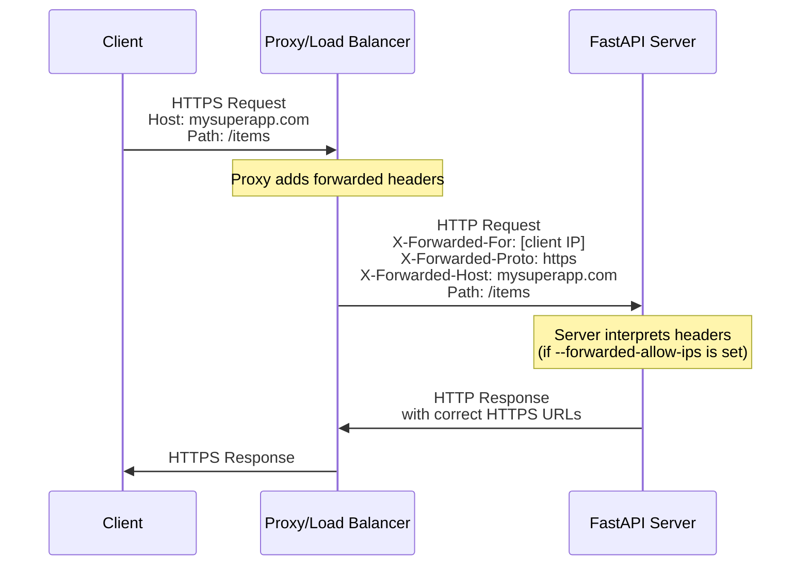
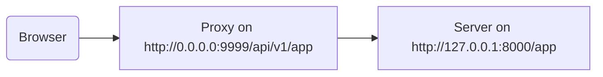

# 使用代理 { #behind-a-proxy }

在很多情况下，你会在 FastAPI 应用前面使用像 Traefik 或 Nginx 这样的**代理**。

这些代理可以处理 HTTPS 证书等事项。

## 代理转发的请求头 { #proxy-forwarded-headers }

在你的应用前面的**代理**通常会在把请求转发给你的**服务器**之前，临时设置一些请求头，让服务器知道该请求是由代理**转发**的，并告知原始（公网）URL，包括域名、是否使用 HTTPS 等。

**服务器**程序（例如通过 **FastAPI CLI** 运行的 **Uvicorn**）能够解析这些请求头，然后把这些信息传递给你的应用。

但出于安全考虑，由于服务器并不知道自己处在受信任的代理之后，它默认不会解析这些请求头。

/// note | 技术细节

这些代理相关的请求头包括：

- <a href="https://developer.mozilla.org/en-US/docs/Web/HTTP/Reference/Headers/X-Forwarded-For" class="external-link" target="_blank">X-Forwarded-For</a>
- <a href="https://developer.mozilla.org/en-US/docs/Web/HTTP/Reference/Headers/X-Forwarded-Proto" class="external-link" target="_blank">X-Forwarded-Proto</a>
- <a href="https://developer.mozilla.org/en-US/docs/Web/HTTP/Reference/Headers/X-Forwarded-Host" class="external-link" target="_blank">X-Forwarded-Host</a>

///

### 启用代理转发的请求头 { #enable-proxy-forwarded-headers }

你可以用 *CLI 选项* `--forwarded-allow-ips` 启动 FastAPI CLI，并传入应该被信任、允许读取这些转发请求头的 IP 地址列表。

如果设置为 `--forwarded-allow-ips="*"`，就会信任所有来源 IP。

如果你的**服务器**位于受信任的**代理**之后，并且只有代理会与它通信，这将使其接受该**代理**的任何 IP。

<div class="termy">

```console
$ fastapi run --forwarded-allow-ips="*"

<span style="color: green;">INFO</span>:     Uvicorn running on http://127.0.0.1:8000 (Press CTRL+C to quit)
```

</div>

### 使用 HTTPS 的重定向 { #redirects-with-https }

例如，假设你定义了一个*路径操作* `/items/`：

{* ../../docs_src/behind_a_proxy/tutorial001_01_py310.py hl[6] *}

如果客户端尝试访问 `/items`，默认会被重定向到 `/items/`。

但在设置 *CLI 选项* `--forwarded-allow-ips` 之前，它可能会重定向到 `http://localhost:8000/items/`。

而你的应用可能托管在 `https://mysuperapp.com`，重定向应当是 `https://mysuperapp.com/items/`。

通过设置 `--proxy-headers`，FastAPI 现在就可以重定向到正确的位置。😎

```
https://mysuperapp.com/items/
```

/// tip | 提示

如果你想了解更多关于 HTTPS 的内容，查看指南：[关于 HTTPS](../deployment/https.md){.internal-link target=_blank}。

///

### 代理转发请求头如何工作 { #how-proxy-forwarded-headers-work }

下面是一个可视化图示，展示了**代理**如何在客户端与**应用服务器**之间添加转发请求头：



**代理**会拦截原始客户端请求，并在将请求传递给**应用服务器**之前，添加特殊的*转发*请求头（`X-Forwarded-*`）。

这些请求头保留了原始请求中否则会丢失的信息：

- X-Forwarded-For：原始客户端的 IP 地址
- X-Forwarded-Proto：原始协议（`https`）
- X-Forwarded-Host：原始主机（`mysuperapp.com`）

当 **FastAPI CLI** 配置了 `--forwarded-allow-ips` 后，它会信任并使用这些请求头，例如用于在重定向中生成正确的 URL。

## 移除路径前缀的代理 { #proxy-with-a-stripped-path-prefix }

你可能会有一个代理，为你的应用添加一个路径前缀。

在这些情况下，你可以使用 `root_path` 来配置你的应用。

`root_path` 是 ASGI 规范（FastAPI 基于该规范，通过 Starlette 构建）提供的机制。

`root_path` 用于处理这些特定情况。

在挂载子应用时，它也会在内部使用。

“移除路径前缀的代理”在这里的意思是：你可以在代码中声明一个路径 `/app`，然后在顶层添加一层（代理），把你的 **FastAPI** 应用放在类似 `/api/v1` 的路径下。

在这种情况下，原始路径 `/app` 实际上会在 `/api/v1/app` 提供服务。

即使你的所有代码都假设只有 `/app`。

{* ../../docs_src/behind_a_proxy/tutorial001_py310.py hl[6] *}

代理会在将请求传递给应用服务器（可能是通过 FastAPI CLI 运行的 Uvicorn）之前，实时**“移除”**这个**路径前缀**，让你的应用认为它是在 `/app` 被服务，这样你就不需要更新所有代码去包含 `/api/v1` 前缀。

到这里，一切都会像往常一样工作。

但是，当你打开集成的文档界面（前端）时，它会期望在 `/openapi.json` 获取 OpenAPI 模式，而不是在 `/api/v1/openapi.json`。

因此，（在浏览器中运行的）前端会尝试访问 `/openapi.json`，但无法获取 OpenAPI 模式。

因为我们的应用使用了路径前缀为 `/api/v1` 的代理，前端需要从 `/api/v1/openapi.json` 获取 OpenAPI 模式。



/// tip | 提示

IP `0.0.0.0` 通常表示程序监听该机器/服务器上的所有可用 IP。

///

文档界面还需要 OpenAPI 模式声明该 API 的 `server` 位于 `/api/v1`（代理后面）。例如：

```JSON hl_lines="4-8"
{
    "openapi": "3.1.0",
    // More stuff here
    "servers": [
        {
            "url": "/api/v1"
        }
    ],
    "paths": {
            // More stuff here
    }
}
```

在此示例中，“Proxy” 可以是 **Traefik** 之类的。服务器可以是用 **Uvicorn** 的 **FastAPI CLI** 运行你的 FastAPI 应用。

### 提供 `root_path` { #providing-the-root-path }

为此，你可以像下面这样使用命令行选项 `--root-path`：

<div class="termy">

```console
$ fastapi run main.py --forwarded-allow-ips="*" --root-path /api/v1

<span style="color: green;">INFO</span>:     Uvicorn running on http://127.0.0.1:8000 (Press CTRL+C to quit)
```

</div>

如果你使用 Hypercorn，它也有 `--root-path` 选项。

/// note | 技术细节

ASGI 规范为这种用例定义了 `root_path`。

命令行选项 `--root-path` 会提供该 `root_path`。

///

### 查看当前的 `root_path` { #checking-the-current-root-path }

你可以获取应用在每个请求中使用的当前 `root_path`，它是 `scope` 字典的一部分（ASGI 规范的一部分）。

这里我们把它包含在响应消息中仅用于演示。

{* ../../docs_src/behind_a_proxy/tutorial001_py310.py hl[8] *}

然后，如果你这样启动 Uvicorn：

<div class="termy">

```console
$ fastapi run main.py --forwarded-allow-ips="*" --root-path /api/v1

<span style="color: green;">INFO</span>:     Uvicorn running on http://127.0.0.1:8000 (Press CTRL+C to quit)
```

</div>

响应类似于：

```JSON
{
    "message": "Hello World",
    "root_path": "/api/v1"
}
```

### 在 FastAPI 应用中设置 `root_path` { #setting-the-root-path-in-the-fastapi-app }

或者，如果你无法提供类似 `--root-path` 的命令行选项，你可以在创建 FastAPI 应用时设置参数 `root_path`：

{* ../../docs_src/behind_a_proxy/tutorial002_py310.py hl[3] *}

把 `root_path` 传给 `FastAPI` 等同于把命令行选项 `--root-path` 传给 Uvicorn 或 Hypercorn。

### 关于 `root_path` { #about-root-path }

请注意，服务器（Uvicorn）不会用这个 `root_path` 做别的事情，只会把它传给应用。

但是，如果你用浏览器打开 <a href="http://127.0.0.1:8000/app" class="external-link" target="_blank">http://127.0.0.1:8000/app</a>，你会看到正常的响应：

```JSON
{
    "message": "Hello World",
    "root_path": "/api/v1"
}
```

因此，它不会期望被访问于 `http://127.0.0.1:8000/api/v1/app`。

Uvicorn 会期望代理以 `http://127.0.0.1:8000/app` 访问 Uvicorn，而在顶部额外添加 `/api/v1` 前缀是代理的职责。

## 关于移除路径前缀的代理 { #about-proxies-with-a-stripped-path-prefix }

请记住，移除路径前缀只是配置代理的一种方式。

在很多情况下，默认是代理不会移除路径前缀。

在这种情况下（没有移除路径前缀），代理会监听类似 `https://myawesomeapp.com`，当浏览器访问 `https://myawesomeapp.com/api/v1/app` 且你的服务器（例如 Uvicorn）监听 `http://127.0.0.1:8000` 时，代理（未移除路径前缀）会以相同路径访问 Uvicorn：`http://127.0.0.1:8000/api/v1/app`。

## 使用 Traefik 进行本地测试 { #testing-locally-with-traefik }

你可以很容易地使用 <a href="https://docs.traefik.io/" class="external-link" target="_blank">Traefik</a> 在本地运行一个移除路径前缀的实验。

<a href="https://github.com/containous/traefik/releases" class="external-link" target="_blank">下载 Traefik</a>，它是一个单独的二进制文件，你可以解压压缩包并直接在终端中运行。

然后创建一个 `traefik.toml` 文件，内容如下：

```TOML hl_lines="3"
[entryPoints]
  [entryPoints.http]
    address = ":9999"

[providers]
  [providers.file]
    filename = "routes.toml"
```

这告诉 Traefik 监听端口 9999，并使用另一个文件 `routes.toml`。

/// tip | 提示

我们使用 9999 端口而不是标准 HTTP 端口 80，这样你就不需要用管理员（`sudo`）权限运行。

///

现在创建另一个文件 `routes.toml`：

```TOML hl_lines="5  12  20"
[http]
  [http.middlewares]

    [http.middlewares.api-stripprefix.stripPrefix]
      prefixes = ["/api/v1"]

  [http.routers]

    [http.routers.app-http]
      entryPoints = ["http"]
      service = "app"
      rule = "PathPrefix(`/api/v1`)"
      middlewares = ["api-stripprefix"]

  [http.services]

    [http.services.app]
      [http.services.app.loadBalancer]
        [[http.services.app.loadBalancer.servers]]
          url = "http://127.0.0.1:8000"
```

这个文件配置 Traefik 使用路径前缀 `/api/v1`。

随后 Traefik 会把请求转发到运行在 `http://127.0.0.1:8000` 的 Uvicorn。

现在启动 Traefik：

<div class="termy">

```console
$ ./traefik --configFile=traefik.toml

INFO[0000] Configuration loaded from file: /home/user/awesomeapi/traefik.toml
```

</div>

然后使用 `--root-path` 选项启动你的应用：

<div class="termy">

```console
$ fastapi run main.py --forwarded-allow-ips="*" --root-path /api/v1

<span style="color: green;">INFO</span>:     Uvicorn running on http://127.0.0.1:8000 (Press CTRL+C to quit)
```

</div>

### 查看响应 { #check-the-responses }

现在，如果你访问 Uvicorn 端口对应的 URL：<a href="http://127.0.0.1:8000/app" class="external-link" target="_blank">http://127.0.0.1:8000/app</a>，你会看到正常响应：

```JSON
{
    "message": "Hello World",
    "root_path": "/api/v1"
}
```

/// tip | 提示

注意，尽管你是通过 `http://127.0.0.1:8000/app` 访问，它仍显示 `root_path` 为 `/api/v1`，该值来自 `--root-path` 选项。

///

现在打开包含路径前缀、使用 Traefik 端口的 URL：<a href="http://127.0.0.1:9999/api/v1/app" class="external-link" target="_blank">http://127.0.0.1:9999/api/v1/app</a>。

我们得到相同的响应：

```JSON
{
    "message": "Hello World",
    "root_path": "/api/v1"
}
```

但这次 URL 中带有代理提供的前缀路径：`/api/v1`。

当然，这里的想法是每个人都通过代理访问应用，因此带有路径前缀 `/api/v1` 的版本才是“正确”的。

而不带路径前缀的版本（`http://127.0.0.1:8000/app`）由 Uvicorn 直接提供，仅供_代理_（Traefik）访问。

这说明了代理（Traefik）如何使用路径前缀，以及服务器（Uvicorn）如何使用 `--root-path` 选项提供的 `root_path`。

### 查看文档界面 { #check-the-docs-ui }

有趣的部分来了。✨

访问应用的“官方”方式应该是通过我们定义的带有路径前缀的代理。因此，正如预期的那样，如果你尝试不带路径前缀、直接由 Uvicorn 提供的文档界面，它将无法工作，因为它期望通过代理访问。

你可以在 <a href="http://127.0.0.1:8000/docs" class="external-link" target="_blank">http://127.0.0.1:8000/docs</a> 查看：


但如果我们在“官方”URL（代理端口为 `9999`）的 `/api/v1/docs` 访问文档界面，它就能正常工作！🎉

你可以在 <a href="http://127.0.0.1:9999/api/v1/docs" class="external-link" target="_blank">http://127.0.0.1:9999/api/v1/docs</a> 查看：


完全符合我们的预期。✔️

这是因为 FastAPI 使用该 `root_path` 在 OpenAPI 中创建默认的 `server`，其 URL 来自 `root_path`。

## 附加的服务器 { #additional-servers }

/// warning | 警告

这是一个更高级的用例，可以跳过。

///

默认情况下，**FastAPI** 会在 OpenAPI 模式中使用 `root_path` 的 URL 创建一个 `server`。

但你也可以提供其他备选的 `servers`，例如你希望让“同一个”文档界面同时与预发布环境和生产环境交互。

如果你传入了自定义的 `servers` 列表，并且存在 `root_path`（因为你的 API 位于代理后面），**FastAPI** 会在列表开头插入一个使用该 `root_path` 的“server”。

例如：

{* ../../docs_src/behind_a_proxy/tutorial003_py310.py hl[4:7] *}

会生成如下的 OpenAPI 模式：

```JSON hl_lines="5-7"
{
    "openapi": "3.1.0",
    // More stuff here
    "servers": [
        {
            "url": "/api/v1"
        },
        {
            "url": "https://stag.example.com",
            "description": "Staging environment"
        },
        {
            "url": "https://prod.example.com",
            "description": "Production environment"
        }
    ],
    "paths": {
            // More stuff here
    }
}
```

/// tip | 提示

注意这个自动生成的服务器，`url` 的值为 `/api/v1`，取自 `root_path`。

///

在 <a href="http://127.0.0.1:9999/api/v1/docs" class="external-link" target="_blank">http://127.0.0.1:9999/api/v1/docs</a> 的文档界面中，它看起来是这样的：


/// tip | 提示

文档界面会与你所选择的服务器交互。

///

/// note | 技术细节

OpenAPI 规范中的 `servers` 属性是可选的。

如果你没有指定 `servers` 参数，并且 `root_path` 等于 `/`，则默认情况下，生成的 OpenAPI 模式中会完全省略 `servers` 属性，这等价于只有一个 `url` 值为 `/` 的服务器。

///

### 从 `root_path` 禁用自动服务器 { #disable-automatic-server-from-root-path }

如果你不希望 **FastAPI** 包含一个使用 `root_path` 的自动服务器，可以使用参数 `root_path_in_servers=False`：

{* ../../docs_src/behind_a_proxy/tutorial004_py310.py hl[9] *}

这样它就不会被包含到 OpenAPI 模式中。

## 挂载子应用 { #mounting-a-sub-application }

如果你需要在使用带有 `root_path` 的代理时挂载一个子应用（参见 [子应用 - 挂载](sub-applications.md){.internal-link target=_blank}），你可以像预期的那样正常操作。

FastAPI 会在内部智能地使用 `root_path`，因此它可以直接正常工作。✨
