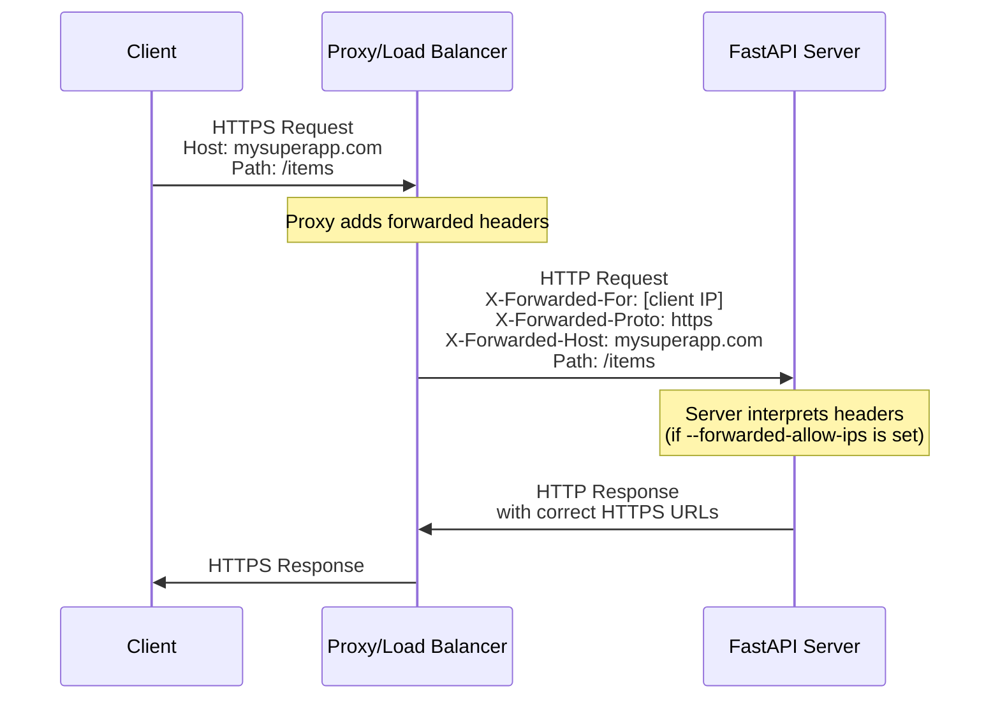
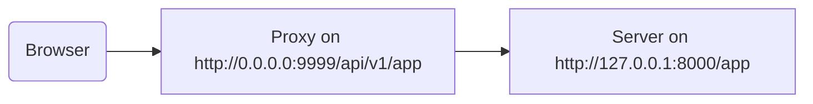

# 在代理之后 { #behind-a-proxy }

在很多情况下，你会在 FastAPI 应用前面使用 **proxy**（代理），例如 Traefik 或 Nginx。

这些代理可以处理 HTTPS 证书以及其他事情。

## Proxy 转发头 { #proxy-forwarded-headers }

在你的应用前面的 **proxy** 通常会在将请求发送到你的 **server**（服务器）之前，动态设置一些 headers，让服务器知道该请求是由代理 **forwarded**（转发）的，从而让它知道原始（公网）URL（包含域名）、它在使用 HTTPS 等信息。

**server** 程序（例如通过 **FastAPI CLI** 使用 **Uvicorn**）能够解释这些 headers，然后将该信息传递给你的应用。

但出于安全原因，由于 server 不知道自己在一个受信任的代理之后，它不会解释这些 headers。

/// note | 技术细节

proxy headers 包括：

* <a href="https://developer.mozilla.org/en-US/docs/Web/HTTP/Reference/Headers/X-Forwarded-For" class="external-link" target="_blank">X-Forwarded-For</a>
* <a href="https://developer.mozilla.org/en-US/docs/Web/HTTP/Reference/Headers/X-Forwarded-Proto" class="external-link" target="_blank">X-Forwarded-Proto</a>
* <a href="https://developer.mozilla.org/en-US/docs/Web/HTTP/Reference/Headers/X-Forwarded-Host" class="external-link" target="_blank">X-Forwarded-Host</a>

///

### 启用 Proxy 转发头 { #enable-proxy-forwarded-headers }

你可以使用 *CLI Option* `--forwarded-allow-ips` 启动 FastAPI CLI，并传入应被信任来读取这些转发 headers 的 IP 地址。

如果你设置为 `--forwarded-allow-ips="*"`，它会信任所有传入的 IP。

如果你的 **server** 在一个受信任的 **proxy** 后面，并且只有代理会与它通信，这会让它接受该 **proxy** 的 IP。

<div class="termy">

```console
$ fastapi run --forwarded-allow-ips="*"

<span style="color: green;">INFO</span>:     Uvicorn running on http://127.0.0.1:8000 (Press CTRL+C to quit)
```

</div>

### HTTPS 的重定向 { #redirects-with-https }

例如，假设你定义了一个 *路径操作* `/items/`：

{* ../../docs_src/behind_a_proxy/tutorial001_01_py39.py hl[6] *}

如果客户端尝试访问 `/items`，默认情况下会被重定向到 `/items/`。

但在设置 *CLI Option* `--forwarded-allow-ips` 之前，它可能会重定向到 `http://localhost:8000/items/`。

但也许你的应用托管在 `https://mysuperapp.com`，重定向应该是 `https://mysuperapp.com/items/`。

现在通过设置 `--proxy-headers`，FastAPI 就能够重定向到正确的位置。 😎

```
https://mysuperapp.com/items/
```

/// tip | 提示

如果你想了解更多关于 HTTPS 的内容，请查看指南 [关于 HTTPS](../deployment/https.md){.internal-link target=_blank}。

///

### Proxy 转发头如何工作 { #how-proxy-forwarded-headers-work }

下面是一个可视化示例，展示 **proxy** 如何在客户端和 **application server**（应用服务器）之间添加转发头：



**proxy** 会拦截客户端的原始请求，并在将请求传递给 **application server** 之前添加特殊的 *forwarded* headers（`X-Forwarded-*`）。

这些 headers 保留了原始请求的信息，否则这些信息会丢失：

* **X-Forwarded-For**：原始客户端的 IP 地址
* **X-Forwarded-Proto**：原始协议（`https`）
* **X-Forwarded-Host**：原始主机（`mysuperapp.com`）

当 **FastAPI CLI** 配置了 `--forwarded-allow-ips` 时，它会信任并使用这些 headers，例如用于在重定向中生成正确的 URL。

## 带有剥离路径前缀的代理 { #proxy-with-a-stripped-path-prefix }

你可能有一个 proxy，会为你的应用添加一个路径前缀。

在这些情况下，你可以使用 `root_path` 来配置你的应用。

`root_path` 是 ASGI 规范提供的机制（FastAPI 通过 Starlette 构建在该规范之上）。

`root_path` 用于处理这些特定情况。

并且它也会在挂载子应用时在内部使用。

在这种情况下，使用带有剥离路径前缀的代理意味着：你可以在代码里声明路径 `/app`，但你在上层（代理）添加了一层，把你的 **FastAPI** 应用放在类似 `/api/v1` 这样的路径之下。

此时，原始路径 `/app` 实际上会在 `/api/v1/app` 提供服务。

即便你的所有代码都假设只有 `/app`。

{* ../../docs_src/behind_a_proxy/tutorial001_py39.py hl[6] *}

并且代理会在将请求传递给应用服务器（可能是通过 FastAPI CLI 的 Uvicorn）之前，动态 **“剥离”** 这个 **路径前缀**，让你的应用一直以为它是在 `/app` 下提供服务，因此你不需要更新所有代码来包含前缀 `/api/v1`。

到这里为止，一切都会像平常一样工作。

但是，当你打开集成的 docs UI（前端）时，它会期望从 `/openapi.json` 获取 OpenAPI schema，而不是从 `/api/v1/openapi.json` 获取。

所以，（运行在浏览器中的）前端会尝试访问 `/openapi.json`，但它无法获取 OpenAPI schema。

因为我们的应用是通过一个带有 `/api/v1` 路径前缀的代理提供服务的，前端需要从 `/api/v1/openapi.json` 获取 OpenAPI schema。



/// tip | 提示

IP `0.0.0.0` 通常用于表示程序监听该机器/服务器上的所有可用 IP。

///

docs UI 还需要 OpenAPI schema 来声明这个 API 的 `server` 位于 `/api/v1`（在代理之后）。例如：

```JSON hl_lines="4-8"
{
    "openapi": "3.1.0",
    // More stuff here
    "servers": [
        {
            "url": "/api/v1"
        }
    ],
    "paths": {
            // More stuff here
    }
}
```

在这个示例中，“Proxy” 可能是 **Traefik** 之类的东西。而 server 则可能是带 **Uvicorn** 的 FastAPI CLI，用来运行你的 FastAPI 应用。

### 提供 `root_path` { #providing-the-root-path }

为实现这一点，你可以使用命令行选项 `--root-path`，例如：

<div class="termy">

```console
$ fastapi run main.py --forwarded-allow-ips="*" --root-path /api/v1

<span style="color: green;">INFO</span>:     Uvicorn running on http://127.0.0.1:8000 (Press CTRL+C to quit)
```

</div>

如果你使用 Hypercorn，它也有 `--root-path` 选项。

/// note | 技术细节

ASGI 规范为这个用例定义了 `root_path`。

而命令行选项 `--root-path` 会提供这个 `root_path`。

///

### 检查当前的 `root_path` { #checking-the-current-root-path }

你可以获取你的应用在每个请求中使用的当前 `root_path`，它是 `scope` 字典的一部分（这也是 ASGI 规范的一部分）。

这里我们把它包含在消息中只是为了演示。

{* ../../docs_src/behind_a_proxy/tutorial001_py39.py hl[8] *}

然后，如果你用下面的方式启动 Uvicorn：

<div class="termy">

```console
$ fastapi run main.py --forwarded-allow-ips="*" --root-path /api/v1

<span style="color: green;">INFO</span>:     Uvicorn running on http://127.0.0.1:8000 (Press CTRL+C to quit)
```

</div>

响应会类似于：

```JSON
{
    "message": "Hello World",
    "root_path": "/api/v1"
}
```

### 在 FastAPI 应用中设置 `root_path` { #setting-the-root-path-in-the-fastapi-app }

另一种方式是，如果你没有办法提供像 `--root-path` 这样的命令行选项或等效方式，你可以在创建 FastAPI 应用时设置 `root_path` 参数：

{* ../../docs_src/behind_a_proxy/tutorial002_py39.py hl[3] *}

将 `root_path` 传给 `FastAPI` 等同于将命令行选项 `--root-path` 传给 Uvicorn 或 Hypercorn。

### 关于 `root_path` { #about-root-path }

请记住，server（Uvicorn）除了把 `root_path` 传递给应用之外，不会把它用于其他任何事情。

但如果你在浏览器中打开 <a href="http://127.0.0.1:8000/app" class="external-link" target="_blank">http://127.0.0.1:8000/app</a>，你会看到正常响应：

```JSON
{
    "message": "Hello World",
    "root_path": "/api/v1"
}
```

因此，它不会期望通过 `http://127.0.0.1:8000/api/v1/app` 被访问。

Uvicorn 会期望代理在 `http://127.0.0.1:8000/app` 访问 Uvicorn，然后由代理负责在其上额外添加 `/api/v1` 前缀。

## 关于带有剥离路径前缀的代理 { #about-proxies-with-a-stripped-path-prefix }

请记住，带有剥离路径前缀的代理只是其中一种配置方式。

在很多情况下，默认可能是代理不会剥离路径前缀。

在这种情况下（没有剥离路径前缀），代理会监听类似 `https://myawesomeapp.com` 的地址；然后如果浏览器访问 `https://myawesomeapp.com/api/v1/app`，并且你的 server（例如 Uvicorn）监听在 `http://127.0.0.1:8000`，那么代理（没有剥离路径前缀）会在相同路径访问 Uvicorn：`http://127.0.0.1:8000/api/v1/app`。

## 使用 Traefik 本地测试 { #testing-locally-with-traefik }

你可以使用 <a href="https://docs.traefik.io/" class="external-link" target="_blank">Traefik</a>，在本地很容易地运行带有剥离路径前缀的实验。

<a href="https://github.com/containous/traefik/releases" class="external-link" target="_blank">下载 Traefik</a>，它是一个单独的二进制文件，你可以解压压缩包并直接在终端中运行。

然后创建一个文件 `traefik.toml`，内容如下：

```TOML hl_lines="3"
[entryPoints]
  [entryPoints.http]
    address = ":9999"

[providers]
  [providers.file]
    filename = "routes.toml"
```

这会告诉 Traefik 监听 9999 端口，并使用另一个文件 `routes.toml`。

/// tip | 提示

我们使用 9999 端口而不是标准的 HTTP 端口 80，这样你就不需要使用管理员（`sudo`）权限运行它。

///

现在创建另一个文件 `routes.toml`：

```TOML hl_lines="5  12  20"
[http]
  [http.middlewares]

    [http.middlewares.api-stripprefix.stripPrefix]
      prefixes = ["/api/v1"]

  [http.routers]

    [http.routers.app-http]
      entryPoints = ["http"]
      service = "app"
      rule = "PathPrefix(`/api/v1`)"
      middlewares = ["api-stripprefix"]

  [http.services]

    [http.services.app]
      [http.services.app.loadBalancer]
        [[http.services.app.loadBalancer.servers]]
          url = "http://127.0.0.1:8000"
```

这个文件将 Traefik 配置为使用路径前缀 `/api/v1`。

然后 Traefik 会将它的请求重定向到运行在 `http://127.0.0.1:8000` 的 Uvicorn。

现在启动 Traefik：

<div class="termy">

```console
$ ./traefik --configFile=traefik.toml

INFO[0000] Configuration loaded from file: /home/user/awesomeapi/traefik.toml
```

</div>

然后启动你的应用，使用 `--root-path` 选项：

<div class="termy">

```console
$ fastapi run main.py --forwarded-allow-ips="*" --root-path /api/v1

<span style="color: green;">INFO</span>:     Uvicorn running on http://127.0.0.1:8000 (Press CTRL+C to quit)
```

</div>

### 检查响应 { #check-the-responses }

现在，如果你打开带 Uvicorn 端口的 URL：<a href="http://127.0.0.1:8000/app" class="external-link" target="_blank">http://127.0.0.1:8000/app</a>，你会看到正常响应：

```JSON
{
    "message": "Hello World",
    "root_path": "/api/v1"
}
```

/// tip | 提示

注意，即便你访问的是 `http://127.0.0.1:8000/app`，它仍然会显示来自选项 `--root-path` 的 `root_path` `/api/v1`。

///

然后打开带 Traefik 端口的 URL，并包含路径前缀：<a href="http://127.0.0.1:9999/api/v1/app" class="external-link" target="_blank">http://127.0.0.1:9999/api/v1/app</a>。

你会得到相同的响应：

```JSON
{
    "message": "Hello World",
    "root_path": "/api/v1"
}
```

但这一次是在包含代理提供的前缀路径 `/api/v1` 的 URL 上。

当然，这里的想法是每个人都应该通过代理访问应用，所以带路径前缀 `/api/v1` 的版本是“正确”的。

而不带路径前缀的版本（`http://127.0.0.1:8000/app`）由 Uvicorn 直接提供，只会专门用于让 _proxy_（Traefik）访问。

这演示了 Proxy（Traefik）如何使用路径前缀，以及 server（Uvicorn）如何使用来自选项 `--root-path` 的 `root_path`。

### 检查 docs UI { #check-the-docs-ui }

但有趣的部分来了。 ✨

访问应用的“官方”方式，是通过我们定义了路径前缀的代理来访问。因此，正如你所预期的那样，如果你尝试直接访问由 Uvicorn 提供的 docs UI，而 URL 中没有路径前缀，它将无法工作，因为它期望通过代理访问。

你可以在 <a href="http://127.0.0.1:8000/docs" class="external-link" target="_blank">http://127.0.0.1:8000/docs</a> 查看：


但如果我们通过端口为 `9999` 的代理，以“官方”URL `/api/v1/docs` 访问 docs UI，它就能正常工作！ 🎉

你可以在 <a href="http://127.0.0.1:9999/api/v1/docs" class="external-link" target="_blank">http://127.0.0.1:9999/api/v1/docs</a> 查看：


正如我们所希望的那样。 ✔️

这是因为 FastAPI 会使用这个 `root_path`，用 `root_path` 提供的 URL 在 OpenAPI 中创建默认的 `server`。

## 附加的服务器 { #additional-servers }

/// warning | 警告

这是一个更高级的用例，可以跳过。

///

默认情况下，**FastAPI** 会在 OpenAPI schema 中使用 `root_path` 的 URL 创建一个 `server`。

但你也可以提供其他备选 `servers`，例如，你希望 *同一个* docs UI 同时与 staging 环境和生产环境交互。

如果你传入了自定义的 `servers` 列表，并且存在 `root_path`（因为你的 API 在代理之后），**FastAPI** 会在列表开头插入一个使用该 `root_path` 的“server”。

例如：

{* ../../docs_src/behind_a_proxy/tutorial003_py39.py hl[4:7] *}

会生成类似下面的 OpenAPI schema：

```JSON hl_lines="5-7"
{
    "openapi": "3.1.0",
    // More stuff here
    "servers": [
        {
            "url": "/api/v1"
        },
        {
            "url": "https://stag.example.com",
            "description": "Staging environment"
        },
        {
            "url": "https://prod.example.com",
            "description": "Production environment"
        }
    ],
    "paths": {
            // More stuff here
    }
}
```

/// tip | 提示

注意自动生成的 server，其 `url` 值为 `/api/v1`，来自 `root_path`。

///

在 <a href="http://127.0.0.1:9999/api/v1/docs" class="external-link" target="_blank">http://127.0.0.1:9999/api/v1/docs</a> 的 docs UI 中会是这样的：


/// tip | 提示

docs UI 会与你选择的 server 进行交互。

///

/// note | 技术细节

OpenAPI 规范中的 `servers` 属性是可选的。

如果你不指定 `servers` 参数，并且 `root_path` 等于 `/`，则生成的 OpenAPI schema 会默认完全省略 `servers` 属性，这等同于只有一个 `url` 值为 `/` 的 server。

///

### 从 `root_path` 禁用自动 server { #disable-automatic-server-from-root-path }

如果你不想让 **FastAPI** 包含使用 `root_path` 的自动 server，可以使用参数 `root_path_in_servers=False`：

{* ../../docs_src/behind_a_proxy/tutorial004_py39.py hl[9] *}

然后它就不会在 OpenAPI schema 中包含它。

## 挂载子应用 { #mounting-a-sub-application }

如果你需要挂载子应用（如 [子应用 - 挂载](sub-applications.md){.internal-link target=_blank} 所述），同时也使用带 `root_path` 的代理，你可以像预期一样正常操作。

FastAPI 会在内部智能地使用 `root_path`，所以它会直接工作。 ✨
