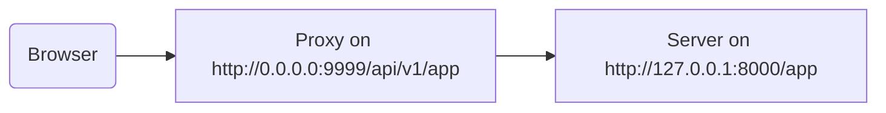

# 使用代理

有些情况下，您可能要使用 Traefik 或 Nginx 等**代理**服务器，并添加应用不能识别的附加路径前缀配置。

此时，要使用 `root_path` 配置应用。

`root_path` 是 ASGI 规范提供的机制，FastAPI 就是基于此规范开发的（通过 Starlette）。

`root_path` 用于处理这些特定情况。

在挂载子应用时，也可以在内部使用。

## 移除路径前缀的代理

本例中，移除路径前缀的代理是指在代码中声明路径 `/app`，然后在应用顶层添加代理，把 **FastAPI** 应用放在 `/api/v1` 路径下。

本例的原始路径 `/app` 实际上是在 `/api/v1/app` 提供服务。

哪怕所有代码都假设只有 `/app`。

代理只在把请求传送给 Uvicorn 之前才会**移除路径前缀**，让应用以为它是在 `/app` 提供服务，因此不必在代码中加入前缀 `/api/v1`。

但之后，在（前端）打开 API 文档时，代理会要求在 `/openapi.json`，而不是 `/api/v1/openapi.json` 中提取 OpenAPI 概图。

因此， （运行在浏览器中的）前端会尝试访问 `/openapi.json`，但没有办法获取 OpenAPI 概图。

这是因为应用使用了以 `/api/v1` 为路径前缀的代理，前端要从 `/api/v1/openapi.json`  中提取 OpenAPI 概图。



/// tip | 提示

IP `0.0.0.0` 常用于指程序监听本机或服务器上的所有有效 IP。

///

API 文档还需要 OpenAPI 概图声明 API `server` 位于 `/api/v1`（使用代理时的 URL）。例如：

```JSON hl_lines="4-8"
{
    "openapi": "3.0.2",
    // More stuff here
    "servers": [
        {
            "url": "/api/v1"
        }
    ],
    "paths": {
            // More stuff here
    }
}
```

本例中的 `Proxy` 是 **Traefik**，`server` 是运行 FastAPI 应用的 **Uvicorn**。

### 提供 `root_path`

为此，要以如下方式使用命令行选项 `--root-path`：

<div class="termy">

```console
$ uvicorn main:app --root-path /api/v1

<span style="color: green;">INFO</span>:     Uvicorn running on http://127.0.0.1:8000 (Press CTRL+C to quit)
```

</div>

Hypercorn 也支持 `--root-path `选项。

/// note | 技术细节

ASGI 规范定义的 `root_path` 就是为了这种用例。

并且 `--root-path` 命令行选项支持 `root_path`。

///

### 查看当前的 `root_path`

获取应用为每个请求使用的当前 `root_path`，这是 `scope` 字典的内容（也是 ASGI 规范的内容）。

我们在这里的信息里包含 `roo_path` 只是为了演示。

{* ../../docs_src/behind_a_proxy/tutorial001.py hl[8] *}

然后，用以下命令启动 Uvicorn：

<div class="termy">

```console
$ uvicorn main:app --root-path /api/v1

<span style="color: green;">INFO</span>:     Uvicorn running on http://127.0.0.1:8000 (Press CTRL+C to quit)
```

</div>

返回的响应如下：

```JSON
{
    "message": "Hello World",
    "root_path": "/api/v1"
}
```

### 在 FastAPI 应用里设置 `root_path`

还有一种方案，如果不能提供 `--root-path` 或等效的命令行选项，则在创建 FastAPI 应用时要设置 `root_path` 参数。

{* ../../docs_src/behind_a_proxy/tutorial002.py hl[3] *}

传递 `root_path` 给 `FastAPI` 与传递 `--root-path` 命令行选项给 Uvicorn 或 Hypercorn 一样。

### 关于 `root_path`

注意，服务器（Uvicorn）只是把 `root_path` 传递给应用。

在浏览器中输入 <a href="http://127.0.0.1:8000" class="external-link" target="_blank">http://127.0.0.1:8000/app 时能看到标准响应：</a>

```JSON
{
    "message": "Hello World",
    "root_path": "/api/v1"
}
```

它不要求访问 `http://127.0.0.1:800/api/v1/app`。

Uvicorn 预期代理在 `http://127.0.0.1:8000/app` 访问 Uvicorn，而在顶部添加 `/api/v1` 前缀是代理要做的事情。

## 关于移除路径前缀的代理

注意，移除路径前缀的代理只是配置代理的方式之一。

大部分情况下，代理默认都不会移除路径前缀。

（未移除路径前缀时）代理监听 `https://myawesomeapp.com` 等对象，如果浏览器跳转到 `https://myawesomeapp.com/api/v1/app`，且服务器（例如 Uvicorn）监听 `http://127.0.0.1:8000` 代理（未移除路径前缀） 会在同样的路径：`http://127.0.0.1:8000/api/v1/app` 访问 Uvicorn。

## 本地测试 Traefik

您可以轻易地在本地使用 <a href="https://docs.traefik.io/" class="external-link" target="_blank">Traefik</a> 运行移除路径前缀的试验。

<a href="https://github.com/containous/traefik/releases" class="external-link" target="_blank">下载 Traefik</a>，这是一个二进制文件，需要解压文件，并在 Terminal 中直接运行。

然后创建包含如下内容的 `traefik.toml` 文件：

```TOML hl_lines="3"
[entryPoints]
  [entryPoints.http]
    address = ":9999"

[providers]
  [providers.file]
    filename = "routes.toml"
```

这个文件把 Traefik 监听端口设置为 `9999`，并设置要使用另一个文件 `routes.toml`。

/// tip | 提示

使用端口 9999 代替标准的 HTTP 端口 80，这样就不必使用管理员权限运行（`sudo`）。

///

接下来，创建 `routes.toml`：

```TOML hl_lines="5  12  20"
[http]
  [http.middlewares]

    [http.middlewares.api-stripprefix.stripPrefix]
      prefixes = ["/api/v1"]

  [http.routers]

    [http.routers.app-http]
      entryPoints = ["http"]
      service = "app"
      rule = "PathPrefix(`/api/v1`)"
      middlewares = ["api-stripprefix"]

  [http.services]

    [http.services.app]
      [http.services.app.loadBalancer]
        [[http.services.app.loadBalancer.servers]]
          url = "http://127.0.0.1:8000"
```

这个文件配置 Traefik 使用路径前缀 `/api/v1`。

然后，它把请求重定位到运行在 `http://127.0.0.1:8000` 上的 Uvicorn。

现在，启动 Traefik：

<div class="termy">

```console
$ ./traefik --configFile=traefik.toml

INFO[0000] Configuration loaded from file: /home/user/awesomeapi/traefik.toml
```

</div>

接下来，使用 Uvicorn 启动应用，并使用 `--root-path` 选项：

<div class="termy">

```console
$ uvicorn main:app --root-path /api/v1

<span style="color: green;">INFO</span>:     Uvicorn running on http://127.0.0.1:8000 (Press CTRL+C to quit)
```

</div>

### 查看响应

访问含 Uvicorn 端口的 URL：<a href="http://127.0.0.1:8000/app" class="external-link" target="_blank">http://127.0.0.1:8000/app，就能看到标准响应：</a>

```JSON
{
    "message": "Hello World",
    "root_path": "/api/v1"
}
```

/// tip | 提示

注意，就算访问 `http://127.0.0.1:8000/app`，也显示从选项 `--root-path` 中提取的 `/api/v1`，这是 `root_path` 的值。

///

打开含 Traefik 端口的 URL，包含路径前缀：<a href="http://127.0.0.1:9999/api/v1/app" class="external-link" target="_blank">http://127.0.0.1:9999/api/v1/app。</a>

得到同样的响应：

```JSON
{
    "message": "Hello World",
    "root_path": "/api/v1"
}
```

但这一次 URL 包含了代理提供的路径前缀：`/api/v1`。

当然，这是通过代理访问应用的方式，因此，路径前缀 `/app/v1` 版本才是**正确**的。

而不带路径前缀的版本（`http://127.0.0.1:8000/app`），则由 Uvicorn 直接提供，专供*代理*（Traefik）访问。

这演示了代理（Traefik）如何使用路径前缀，以及服务器（Uvicorn）如何使用选项 `--root-path` 中的 `root_path`。

### 查看文档

但这才是有趣的地方 ✨

访问应用的**官方**方式是通过含路径前缀的代理。因此，不出所料，如果没有在 URL 中添加路径前缀，直接访问通过 Uvicorn 运行的 API 文档，不能正常访问，因为需要通过代理才能访问。

输入 <a href="http://127.0.0.1:8000/docs" class="external-link" target="_blank">http://127.0.0.1:8000/docs 查看 API 文档：</a>


但输入**官方**链接 `/api/v1/docs`，并使用端口 `9999` 访问 API 文档，就能正常运行了！🎉

输入 <a href="http://127.0.0.1:9999/api/v1/docs" class="external-link" target="_blank">http://127.0.0.1:9999/api/v1/docs 查看文档：</a>


一切正常。 ✔️

这是因为 FastAPI 在 OpenAPI 里使用 `root_path` 提供的 URL 创建默认 `server`。

## 附加的服务器

/// warning | 警告

此用例较难，可以跳过。

///

默认情况下，**FastAPI** 使用 `root_path` 的链接在 OpenAPI 概图中创建 `server`。

但也可以使用其它备选 `servers`，例如，需要同一个 API 文档与 staging 和生产环境交互。

如果传递自定义 `servers` 列表，并有 `root_path`（ 因为 API 使用了代理），**FastAPI** 会在列表开头使用这个 `root_path` 插入**服务器**。

例如：

{* ../../docs_src/behind_a_proxy/tutorial003.py hl[4:7] *}

这段代码生产如下 OpenAPI 概图：

```JSON hl_lines="5-7"
{
    "openapi": "3.0.2",
    // More stuff here
    "servers": [
        {
            "url": "/api/v1"
        },
        {
            "url": "https://stag.example.com",
            "description": "Staging environment"
        },
        {
            "url": "https://prod.example.com",
            "description": "Production environment"
        }
    ],
    "paths": {
            // More stuff here
    }
}
```

/// tip | 提示

注意，自动生成服务器时，`url` 的值 `/api/v1` 提取自 `roog_path`。

///

<a href="http://127.0.0.1:9999/api/v1/docs" class="external-link" target="_blank">http://127.0.0.1:9999/api/v1/docs 的 API 文档所示如下：</a>


/// tip | 提示

API 文档与所选的服务器进行交互。

///

### 从 `root_path` 禁用自动服务器

如果不想让 **FastAPI** 包含使用 `root_path` 的自动服务器，则要使用参数 `root_path_in_servers=False`：

{* ../../docs_src/behind_a_proxy/tutorial004.py hl[9] *}

这样，就不会在 OpenAPI 概图中包含服务器了。

## 挂载子应用

如需挂载子应用（详见 [子应用 - 挂载](sub-applications.md){.internal-link target=_blank}），也要通过 `root_path` 使用代理，这与正常应用一样，别无二致。

FastAPI 在内部使用 `root_path`，因此子应用也可以正常运行。✨
