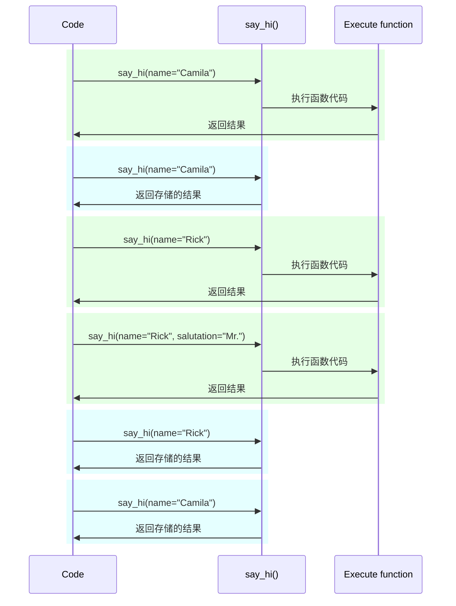

# 设置和环境变量 { #settings-and-environment-variables }

在许多情况下，你的应用可能需要一些外部设置或配置，例如密钥、数据库凭据、电子邮件服务的凭据等。

这些设置中的大多数是可变的（可能会改变），例如数据库 URL。并且很多可能是敏感的，比如密钥。

因此，通常会将它们提供为由应用程序读取的环境变量。

/// tip | 提示

要理解环境变量，你可以阅读[环境变量](../environment-variables.md){.internal-link target=_blank}。

///

## 类型和验证 { #types-and-validation }

这些环境变量只能处理文本字符串，因为它们在 Python 之外，并且必须与其他程序及系统的其余部分兼容（甚至与不同的操作系统，如 Linux、Windows、macOS）。

这意味着，在 Python 中从环境变量读取的任何值都是 `str` 类型，任何到不同类型的转换或任何验证都必须在代码中完成。

## Pydantic 的 `Settings` { #pydantic-settings }

幸运的是，Pydantic 提供了一个很好的工具来处理来自环境变量的这些设置：<a href="https://docs.pydantic.dev/latest/concepts/pydantic_settings/" class="external-link" target="_blank">Pydantic: Settings management</a>。

### 安装 `pydantic-settings` { #install-pydantic-settings }

首先，确保你创建并激活了[虚拟环境](../virtual-environments.md){.internal-link target=_blank}，然后安装 `pydantic-settings` 包：

<div class="termy">

```console
$ pip install pydantic-settings
---> 100%
```

</div>

当你用以下方式安装 `all` 扩展时，它也会被一并安装：

<div class="termy">

```console
$ pip install "fastapi[all]"
---> 100%
```

</div>

### 创建 `Settings` 对象 { #create-the-settings-object }

从 Pydantic 导入 `BaseSettings` 并创建一个子类，这与创建 Pydantic 模型非常相似。

与 Pydantic 模型一样，用类型注解声明类属性，也可以指定默认值。

你可以使用与 Pydantic 模型相同的验证功能和工具，例如不同的数据类型，以及使用 `Field()` 进行附加验证。

{* ../../docs_src/settings/tutorial001_py310.py hl[2,5:8,11] *}

/// tip | 提示

如果你想要一个可以快速复制粘贴的示例，请不要使用这个示例，使用下面最后一个示例。

///

当你创建该 `Settings` 类的实例（此处是 `settings` 对象）时，Pydantic 会以不区分大小写的方式读取环境变量，因此，大写变量 `APP_NAME` 仍会用于属性 `app_name`。

接着它会转换并验证数据。因此，当你使用该 `settings` 对象时，你将获得你声明的类型的数据（例如 `items_per_user` 将是 `int`）。

### 使用 `settings` { #use-the-settings }

然后你可以在应用中使用新的 `settings` 对象：

{* ../../docs_src/settings/tutorial001_py310.py hl[18:20] *}

### 运行服务器 { #run-the-server }

接下来，运行服务器，并把配置作为环境变量传入，例如你可以设置 `ADMIN_EMAIL` 和 `APP_NAME`：

<div class="termy">

```console
$ ADMIN_EMAIL="deadpool@example.com" APP_NAME="ChimichangApp" fastapi run main.py

<span style="color: green;">INFO</span>:     Uvicorn running on http://127.0.0.1:8000 (Press CTRL+C to quit)
```

</div>

/// tip | 提示

要为单个命令设置多个环境变量，只需用空格分隔它们，并把它们都放在命令前面。

///

然后，`admin_email` 设置将为 `"deadpool@example.com"`。

`app_name` 将为 `"ChimichangApp"`。

而 `items_per_user` 会保持默认值 `50`。

## 在另一个模块中放置设置 { #settings-in-another-module }

你可以把这些设置放在另一个模块文件中，就像你在[更大的应用 - 多个文件](../tutorial/bigger-applications.md){.internal-link target=_blank}中看到的那样。

例如，可以有一个 `config.py` 文件：

{* ../../docs_src/settings/app01_py310/config.py *}

然后在 `main.py` 文件中使用它：

{* ../../docs_src/settings/app01_py310/main.py hl[3,11:13] *}

/// tip | 提示

你还需要一个 `__init__.py` 文件，就像你在[更大的应用 - 多个文件](../tutorial/bigger-applications.md){.internal-link target=_blank}中看到的那样。

///

## 在依赖项中提供设置 { #settings-in-a-dependency }

在某些情况下，从依赖项中提供设置可能更有用，而不是在所有地方都使用一个全局的 `settings` 对象。

这在测试期间尤其有用，因为可以很容易地用你自己的自定义设置覆盖依赖项。

### 配置文件 { #the-config-file }

延续上一个示例，你的 `config.py` 文件可能如下所示：

{* ../../docs_src/settings/app02_an_py310/config.py hl[10] *}

注意，现在我们不再创建默认实例 `settings = Settings()`。

### 主应用文件 { #the-main-app-file }

现在我们创建一个依赖项，返回一个新的 `config.Settings()`。

{* ../../docs_src/settings/app02_an_py310/main.py hl[6,12:13] *}

/// tip | 提示

我们稍后会讨论 `@lru_cache`。

目前你可以把 `get_settings()` 当作普通函数。

///

然后我们可以在路径操作函数中将其作为依赖项引入，并在需要的任何地方使用它。

{* ../../docs_src/settings/app02_an_py310/main.py hl[17,19:21] *}

### 设置与测试 { #settings-and-testing }

接着，在测试期间，通过为 `get_settings` 创建依赖项覆盖，就可以很容易地提供一个不同的设置对象：

{* ../../docs_src/settings/app02_an_py310/test_main.py hl[9:10,13,21] *}

在依赖项覆盖中，我们在创建新的 `Settings` 对象时为 `admin_email` 设置了一个新值，然后返回该新对象。

然后我们可以测试它是否被使用。

## 读取 `.env` 文件 { #reading-a-env-file }

如果你有许多设置可能经常变化，或在不同环境中不同，那么把它们放进一个文件中，然后像环境变量一样从中读取，可能非常有用。

这种做法非常常见：这些环境变量通常放在名为 `.env` 的文件中，该文件被称为 “dotenv”。

/// tip | 提示

以点（`.`）开头的文件在类 Unix 系统（如 Linux 和 macOS）中是隐藏文件。

但 dotenv 文件并不一定必须是这个确切的文件名。

///

Pydantic 支持使用一个外部库来从这类文件中读取。你可以在 <a href="https://docs.pydantic.dev/latest/concepts/pydantic_settings/#dotenv-env-support" class="external-link" target="_blank">Pydantic Settings: Dotenv (.env) support</a> 中阅读更多信息。

/// tip | 提示

要使其工作，你需要执行 `pip install python-dotenv`。

///

### `.env` 文件 { #the-env-file }

你可以有一个 `.env` 文件，内容如下：

```bash
ADMIN_EMAIL="deadpool@example.com"
APP_NAME="ChimichangApp"
```

### 从 `.env` 中读取设置 { #read-settings-from-env }

然后更新 `config.py`：

{* ../../docs_src/settings/app03_an_py310/config.py hl[9] *}

/// tip | 提示

`model_config` 属性仅用于 Pydantic 配置。你可以在 <a href="https://docs.pydantic.dev/latest/concepts/config/" class="external-link" target="_blank">Pydantic: Concepts: Configuration</a> 中阅读更多信息。

///

这里我们在你的 Pydantic `Settings` 类中定义配置项 `env_file`，并将其设置为我们想要使用的 dotenv 文件名。

### 使用 `lru_cache` 仅创建一次 `Settings` { #creating-the-settings-only-once-with-lru-cache }

从磁盘读取文件通常是一个代价较高（缓慢）的操作，所以你可能希望只在第一次读取，然后复用同一个设置对象，而不是为每个请求都重新读取。

但是，每次我们执行：

```Python
Settings()
```

都会创建一个新的 `Settings` 对象，并且在创建时会再次读取 `.env` 文件。

如果依赖项函数是这样的：

```Python
def get_settings():
    return Settings()
```

我们就会为每个请求创建该对象，并为每个请求读取 `.env` 文件。 ⚠️

但由于我们在顶部使用了 `@lru_cache` 装饰器，`Settings` 对象只会在第一次调用时创建一次。 ✔️

{* ../../docs_src/settings/app03_an_py310/main.py hl[1,11] *}

接着，对于后续请求中依赖项里对 `get_settings()` 的任何调用，它不会再次执行 `get_settings()` 的内部代码并创建新的 `Settings` 对象，而是会一遍又一遍地返回第一次调用时返回的那个相同对象。

#### `lru_cache` 技术细节 { #lru-cache-technical-details }

`@lru_cache` 会修改它所装饰的函数，使其返回第一次返回的相同值，而不是每次都重新计算并执行函数代码。

因此，下面的函数会针对每个参数组合执行一次。然后，当以完全相同的参数组合调用该函数时，将重复使用该参数组合先前返回的值。

例如，如果你有一个函数：

```Python
@lru_cache
def say_hi(name: str, salutation: str = "Ms."):
    return f"Hello {salutation} {name}"
```

你的程序可能会像这样执行：



在我们的依赖项 `get_settings()` 的情况下，该函数甚至不接受任何参数，因此它始终返回相同的值。

这样，它的行为几乎就像是一个全局变量。但由于它使用了依赖项函数，我们可以在测试时很容易地覆盖它。

`@lru_cache` 是 `functools` 的一部分，它属于 Python 标准库。你可以在 <a href="https://docs.python.org/3/library/functools.html#functools.lru_cache" class="external-link" target="_blank">Python 文档中关于 `@lru_cache` 的章节</a>阅读更多信息。

## 小结 { #recap }

你可以使用 Pydantic Settings 来处理应用的设置或配置，享受 Pydantic 模型的全部能力。

- 通过使用依赖项，你可以简化测试。
- 你可以与它一起使用 `.env` 文件。
- 使用 `@lru_cache` 可以避免为每个请求反复读取 dotenv 文件，同时允许你在测试时进行覆盖。
