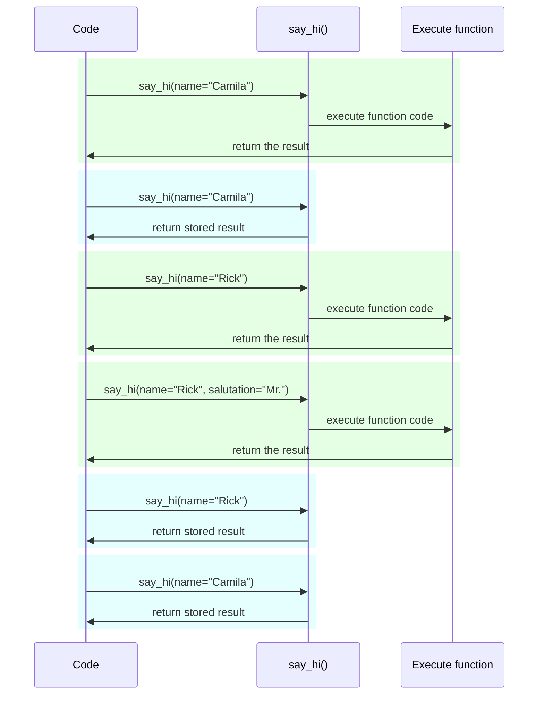

# 设置与环境变量

有时，我们要在应用外部对密钥、数据库凭证、电子邮件服务凭证等进行设置或配置。

这些设置大多数都是数据库 URL 等（可修改的）变量。有一些变量则包含密钥等敏感信息。

因此，FastAPI 应用通常需要读取环境变量里的配置。


## 环境变量

!!! tip "提示"

    如果您已经了解**环境变量**，并知道怎么使用环境变量，可以跳过本章下面的内容。

<a href="https://en.wikipedia.org/wiki/Environment_variable" class="external-link" target="_blank">环境变量</a>（即 **env var**）存储在操作系统里，虽然环境变量在 Python 代码之外，但能被 Python 代码（或其它程序）读取。

没有 Python，也能在 Shell 里创建与使用环境变量。

=== "Linux, macOS, Windows Bash"

    <div class="termy">
    
    ```console
    // 创建 MY_NAME 环境变量
    $ export MY_NAME="Wade Wilson"
    
    // 其它程序也可以使用环境变量，例如：
    $ echo "Hello $MY_NAME"
    
    Hello Wade Wilson
    ```
    
    </div>

=== "Windows PowerShell"

    <div class="termy">
    
    ```console
    // 创建 MY_NAME 环境变量
    $ $Env:MY_NAME = "Wade Wilson"
    
    // 其它程序也可以使用环境变量，例如：
    $ echo "Hello $Env:MY_NAME"
    
    Hello Wade Wilson
    ```
    
    </div>

### Python 读取环境变量

使用 Terminal 命令窗口等方式在 Python 外部创建环境变量，再在 Python 里读取环境变量。

以如下的 `main.py` 为例：

```Python hl_lines="3"
import os

name = os.getenv("MY_NAME", "World")
print(f"Hello {name} from Python")
```

!!! tip "提示"

    <a href="https://docs.python.org/3.8/library/os.html#os.getenv" class="external-link" target="_blank">`os.getenv()`</a> 的第二个参数是要返回的默认值。
    
    如果没有提供这个参数，则默认为 `None`，此处使用 `World` 作为默认值。

然后，调用 Python 程序：

<div class="termy">

```console
// 此时还没有设置环境变量
$ python main.py

// 因为尚未设置环境变量，所以返回默认值

Hello World from Python

// 但如果事先创建了环境变量
$ export MY_NAME="Wade Wilson"

// 然后再调用程序
$ python main.py

// 现在，程序就能读取环境变量了

Hello Wade Wilson from Python
```

</div>

环境变量是在代码之外设置的，代码可以读取，但不能把环境变量与其它文件一起保存（用 `git` 提交），因此，这种方式常用于配置或设置。

您还可以创建仅供特定程序调用的环境变量，即专供指定程序使用，而且只能在程序运行期间使用。

为此要在同一命令行中，在调用程序之前创建环境变量：

<div class="termy">

```console
// 在调用程序的同一命令行中创建环境变量 MY_NAME
$ MY_NAME="Wade Wilson" python main.py

// 现在，程序就能够读取环境变量了

Hello Wade Wilson from Python

// 程序运行完毕后，环境变量就不存在了
$ python main.py

Hello World from Python
```

</div>

!!! tip "提示"

    详见 <a href="https://12factor.net/config" class="external-link" target="_blank">The Twelve-Factor App: Config</a>。

### 类型与验证

环境变量只能处理文本字符串，因为它们在 Python 外部，必须兼容其它程序和操作系统组件，甚至还要兼容 Linux、Windows、macOS 等操作系统。

即，Python 从环境变量中读取的值必须是**字符串**，类型转换与验证等操作只能在代码中完成。

## Pydantic 的 `Settings`

还好 Pydantic 提供了处理环境变量设置的工具，详见 <a href="https://pydantic-docs.helpmanual.io/usage/settings/" class="external-link" target="_blank">Pydantic 官档 - 设置管理</a>。

### 创建 `Settings` 对象

从 Pydantic 导入 `BaseSettings` 并创建子类，这与创建 Pydantic 模型类似。

创建 `Settings` 对象和 Pydantic 模型一样，可以使用类型注解声明类的属性，并设置默认值。

还可以使用 Pydantic 模型的验证功能与工具，比如声明不同数据类型或使用 `Field()` 实现附加验证操作。

```Python hl_lines="2  5-8  11"
{!../../../docs_src/settings/tutorial001.py!}
```

!!! tip "提示"

    不要复用本例中的代码，使用下文中最后的代码。

创建 `Settings` 类实例时（本例中是 `settings` 对象），Pydantic 读取环境变量，且不区分大小写，因此大写变量 `APP_NAME` 会被读取为 `app_name`。

对于数据转换与验证，使用 `settings` 对象时会保留声明的数据类型（例如，`items_per_user` 的类型还是 `int`）。

### 使用 `settings`

在 `app` 中使用新的 `settings` 对象：

```Python hl_lines="18-20"
{!../../../docs_src/settings/tutorial001.py!}
```

### 运行服务器

使用环境变量传递配置参数并运行服务器，以如下方式设置 `ADMIN_EMAIL` 和 `APP_NAME`：

<div class="termy">

```console
$ ADMIN_EMAIL="deadpool@example.com" APP_NAME="ChimichangApp" uvicorn main:app

<span style="color: green;">INFO</span>:     Uvicorn running on http://127.0.0.1:8000 (Press CTRL+C to quit)
```

</div>

!!! tip "提示"

    在单一命令中设置多个环境变量，要用空格分隔，并把环境变量放在命令前面。

这样就可以把 `admin_email` 设置为 `"deadpool@example.com"`。

`app_name` 的值则是 `ChimichangApp`。

并且 `items_per_user` 的默认值还是 `50`。

## 在其它模块中设置

如[大型应用 - 多个文件](../tutorial/bigger-applications.md){.internal-link target=_blank}一章中所示，还可以把设置放在模块文件里。

例如下面的 `config.py`：

```Python
{!../../../docs_src/settings/app01/config.py!}
```

然后在 `main.py` 中使用：

```Python hl_lines="3  11-13"
{!../../../docs_src/settings/app01/main.py!}
```

!!! tip "提示"

    如[大型应用 - 多文件](../tutorial/bigger-applications.md){.internal-link target=_blank}一章所示，还要在文件夹中创建 `__init__.py` 文件。

## 依赖项中的设置

有时使用依赖项进行设置比使用 `settings` 全局对象更实用。

特别是在测试时，使用自定义设置可以轻易地覆盖依赖项。

### 配置文件

参照上例，以如下方式修改 `config.py`：

```Python hl_lines="10"
{!../../../docs_src/settings/app02/config.py!}
```

注意，本例没有创建默认实例 `settings = Settings()`。

### 主应用文件

现在，创建返回新的 `config.Settings()` 的依赖项。

```Python hl_lines="5  11-12"
{!../../../docs_src/settings/app02/main.py!}
```

!!! tip "提示"

    稍后再介绍 `@lru_cache()`。
    
    现在假设 `get_settings()` 只是普通函数。

然后，通过*路径操作函数*中的依赖项请求并使用设置。

```Python hl_lines="16  18-20"
{!../../../docs_src/settings/app02/main.py!}
```

### 设置与测试

在测试期间，创建依赖项覆盖 `get_settings` 可以轻松地使用不同的设置对象：

```Python hl_lines="9-10  13  21"
{!../../../docs_src/settings/app02/test_main.py!}
```

在覆盖依赖项中，创建新的 `Settings` 对象，并为 `admin_email` 设置新的值，然后再返回新的对象。

然后，就可以用它来进行测试。

## 读取 `.env` 文件

如果经常要在不同环境下改变很多设置，最好把这些设置放到一个文件里，并从文件中以环境变量的形式读取设置内容。

这种做法很常见，通常会把设置变量放在 **dotenv**（ `.env`）文件里。

!!! tip "提示"

    以点（`.`）开头的文件在 Linux 和 macOS 等 Unix 系统里是隐藏文件。
    
    但是 dotenv 文件实际上不必有明确的文件名。

Pydantic 支持使用外部支持库读取这种类型的文件。详见 <a href="https://pydantic-docs.helpmanual.io/usage/settings/#dotenv-env-support" class="external-link" target="_blank">Pydantic 官档 - 设置：Dotenv (.env) 支持</a>。

!!! tip "提示"

    使用这个功能需要先安装 `pip install python-dotenv`。

### `.env` 文件

假设 `.env` 文件内容如下：

```bash
ADMIN_EMAIL="deadpool@example.com"
APP_NAME="ChimichangApp"
```

### 读取 `.env` 中的设置

然后更新 `config.py`：

```Python hl_lines="9-10"
{!../../../docs_src/settings/app03/config.py!}
```

此处，创建 Pydantic `Settings`类中的 `Config` 类，并使用 `env_file` 设置 `dotenv` 文件名。

!!! tip "提示"

    `Config` 类只用于 Pydantic 配置。详见 <a href="https://pydantic-docs.helpmanual.io/usage/model_config/" class="external-link" target="_blank">Pydantic 模型配置</a>

### 使用 `lru_cache` 只创建一次 `Settings`

从磁盘读取文件的成本较高（慢），最好只操作一次，然后复用同一个设置对象，不要每次请求时都反复读取。

但每次操作都要使用如下代码：

```Python
Settings()
```

因此每次创建新的 `Settings` 对象时都要读取 `.env`。

如果使用下面的依赖项函数：

```Python
def get_settings():
    return Settings()
```

每次请求时还要创建对象，并读取 `.env` 文件。⚠️

但使用 `@lru_cache` 装饰器，则只需在第一次调用时创建一次 `Settings` 对象。✔️

```Python hl_lines="1  10"
{!../../../docs_src/settings/app03/main.py!}
```

再次请求时，调用依赖项中的 `get_settings()` 时不再执行内部代码 `get_settings()` ，也不再创建新的 `Settings` 对象，每次请求时只返回第一次调用时返回的对象。

#### `lru_cache` 技术细节

`@lru_cache()` 修改装饰的函数，使其返回与第一次返回相同的值，不用每次都重新计算，也不用每次都执行函数代码。

因此，它下面的函数每次只为同一种实参组合执行一次。然后，每次使用相同实参组合调用函数时都使用同一个返回值。

例如，使用如下函数：

```Python
@lru_cache()
def say_hi(name: str, salutation: str = "Ms."):
    return f"Hello {salutation} {name}"
```

程序执行流程如下图：



本例中，依赖项 `get_settings()`函数甚至没有任何参数，因此每次返回的都是同一个值。

函数的这种操作方式有点像全局变量。但因为它使用依赖项函数，所以测试时可以轻易地覆盖。

`@lru_cache()` 是 Python 标准库 `functools` 的组件，详见 <a href="https://docs.python.org/3/library/functools.html#functools.lru_cache" class="external-link" target="_blank">Python 官档 - `@lru_cache()`</a>。

## 小结

充分利用 Pydantic 模型的优势，使用 Pydantic 的 `Settings` 处理应用的设置或配置。

* 通过依赖项简化测试
* 支持使用 `.env`
* 使用 `@lru_cache()`，不用每次请求时都读取 `dotenv` 文件，并且支持测试时覆盖使用

