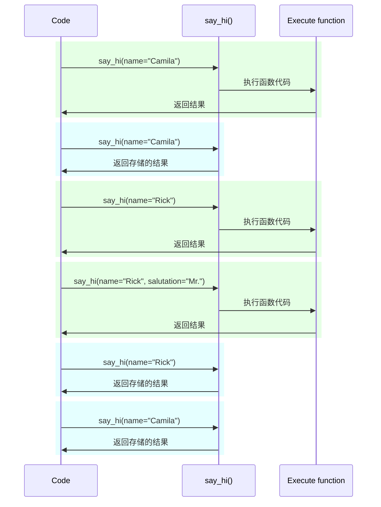

# 设置和环境变量

在许多情况下，您的应用程序可能需要一些外部设置或配置，例如密钥、数据库凭据、电子邮件服务的凭据等等。

这些设置中的大多数是可变的（可以更改的），比如数据库的 URL。而且许多设置可能是敏感的，比如密钥。

因此，通常会将它们提供为由应用程序读取的环境变量。

## 环境变量

/// tip

如果您已经知道什么是"环境变量"以及如何使用它们，请随意跳到下面的下一节。

///

环境变量（也称为"env var"）是一种存在于 Python 代码之外、存在于操作系统中的变量，可以被您的 Python 代码（或其他程序）读取。

您可以在 shell 中创建和使用环境变量，而无需使用 Python：

//// tab | Linux、macOS、Windows Bash

<div class="termy">

```console
// 您可以创建一个名为 MY_NAME 的环境变量
$ export MY_NAME="Wade Wilson"

// 然后您可以与其他程序一起使用它，例如
$ echo "Hello $MY_NAME"

Hello Wade Wilson
```

</div>

////

//// tab | Windows PowerShell

<div class="termy">

```console
// 创建一个名为 MY_NAME 的环境变量
$ $Env:MY_NAME = "Wade Wilson"

// 与其他程序一起使用它，例如
$ echo "Hello $Env:MY_NAME"

Hello Wade Wilson
```

</div>

////

### 在 Python 中读取环境变量

您还可以在 Python 之外的地方（例如终端中或使用任何其他方法）创建环境变量，然后在 Python 中读取它们。

例如，您可以有一个名为 `main.py` 的文件，其中包含以下内容：

```Python hl_lines="3"
import os

name = os.getenv("MY_NAME", "World")
print(f"Hello {name} from Python")
```

/// tip

<a href="https://docs.python.org/3.8/library/os.html#os.getenv" class="external-link" target="_blank">`os.getenv()`</a> 的第二个参数是要返回的默认值。

如果没有提供默认值，默认为 `None`，此处我们提供了 `"World"` 作为要使用的默认值。

///

然后，您可以调用该 Python 程序：

<div class="termy">

```console
// 这里我们还没有设置环境变量
$ python main.py

// 因为我们没有设置环境变量，所以我们得到默认值

Hello World from Python

// 但是如果我们先创建一个环境变量
$ export MY_NAME="Wade Wilson"

// 然后再次调用程序
$ python main.py

// 现在它可以读取环境变量

Hello Wade Wilson from Python
```

</div>

由于环境变量可以在代码之外设置，但可以由代码读取，并且不需要与其他文件一起存储（提交到 `git`），因此通常将它们用于配置或设置。


您还可以仅为特定程序调用创建一个环境变量，该环境变量仅对该程序可用，并且仅在其运行期间有效。

要做到这一点，在程序本身之前的同一行创建它：

<div class="termy">

```console
// 在此程序调用行中创建一个名为 MY_NAME 的环境变量
$ MY_NAME="Wade Wilson" python main.py

// 现在它可以读取环境变量

Hello Wade Wilson from Python

// 之后环境变量不再存在
$ python main.py

Hello World from Python
```

</div>

/// tip

您可以在 <a href="https://12factor.net/config" class="external-link" target="_blank">Twelve-Factor App: Config</a> 中阅读更多相关信息。

///

### 类型和验证

这些环境变量只能处理文本字符串，因为它们是外部于 Python 的，并且必须与其他程序和整个系统兼容（甚至与不同的操作系统，如 Linux、Windows、macOS）。

这意味着从环境变量中在 Python 中读取的任何值都将是 `str` 类型，任何类型的转换或验证都必须在代码中完成。

## Pydantic 的 `Settings`

幸运的是，Pydantic 提供了一个很好的工具来处理来自环境变量的设置，即<a href="https://docs.pydantic.dev/latest/concepts/pydantic_settings/" class="external-link" target="_blank">Pydantic: Settings management</a>。

### 创建 `Settings` 对象

从 Pydantic 导入 `BaseSettings` 并创建一个子类，与 Pydantic 模型非常相似。

与 Pydantic 模型一样，您使用类型注释声明类属性，还可以指定默认值。

您可以使用与 Pydantic 模型相同的验证功能和工具，比如不同的数据类型和使用 `Field()` 进行附加验证。

{* ../../docs_src/settings/tutorial001.py hl[2,5:8,11] *}

/// tip

如果您需要一个快速的复制粘贴示例，请不要使用此示例，而应使用下面的最后一个示例。

///

然后，当您创建该 `Settings` 类的实例（在此示例中是 `settings` 对象）时，Pydantic 将以不区分大小写的方式读取环境变量，因此，大写的变量 `APP_NAME` 仍将为属性 `app_name` 读取。

然后，它将转换和验证数据。因此，当您使用该 `settings` 对象时，您将获得您声明的类型的数据（例如 `items_per_user` 将为 `int` 类型）。

### 使用 `settings`

然后，您可以在应用程序中使用新的 `settings` 对象：

{* ../../docs_src/settings/tutorial001.py hl[18:20] *}

### 运行服务器

接下来，您将运行服务器，并将配置作为环境变量传递。例如，您可以设置一个 `ADMIN_EMAIL` 和 `APP_NAME`，如下所示：

<div class="termy">

```console
$ ADMIN_EMAIL="deadpool@example.com" APP_NAME="ChimichangApp"uvicorn main:app

<span style="color: green;">INFO</span>:     Uvicorn running on http://127.0.0.1:8000 (Press CTRL+C to quit)
```

</div>

/// tip

要为单个命令设置多个环境变量，只需用空格分隔它们，并将它们全部放在命令之前。

///

然后，`admin_email` 设置将为 `"deadpool@example.com"`。

`app_name` 将为 `"ChimichangApp"`。

而 `items_per_user` 将保持其默认值为 `50`。

## 在另一个模块中设置

您可以将这些设置放在另一个模块文件中，就像您在[Bigger Applications - Multiple Files](../tutorial/bigger-applications.md){.internal-link target=_blank}中所见的那样。

例如，您可以创建一个名为 `config.py` 的文件，其中包含以下内容：

{* ../../docs_src/settings/app01/config.py *}

然后在一个名为 `main.py` 的文件中使用它：

{* ../../docs_src/settings/app01/main.py hl[3,11:13] *}

/// tip

您还需要一个名为 `__init__.py` 的文件，就像您在[Bigger Applications - Multiple Files](../tutorial/bigger-applications.md){.internal-link target=_blank}中看到的那样。

///

## 在依赖项中使用设置

在某些情况下，从依赖项中提供设置可能比在所有地方都使用全局对象 `settings` 更有用。

这在测试期间尤其有用，因为很容易用自定义设置覆盖依赖项。

### 配置文件

根据前面的示例，您的 `config.py` 文件可能如下所示：

{* ../../docs_src/settings/app02/config.py hl[10] *}

请注意，现在我们不创建默认实例 `settings = Settings()`。

### 主应用程序文件

现在我们创建一个依赖项，返回一个新的 `config.Settings()`。

{* ../../docs_src/settings/app02_an_py39/main.py hl[6,12:13] *}

/// tip

我们稍后会讨论 `@lru_cache`。

目前，您可以将 `get_settings()` 视为普通函数。

///

然后，我们可以将其作为依赖项从“路径操作函数”中引入，并在需要时使用它。

{* ../../docs_src/settings/app02_an_py39/main.py hl[17,19:21] *}

### 设置和测试

然后，在测试期间，通过创建 `get_settings` 的依赖项覆盖，很容易提供一个不同的设置对象：

{* ../../docs_src/settings/app02/test_main.py hl[9:10,13,21] *}

在依赖项覆盖中，我们在创建新的 `Settings` 对象时为 `admin_email` 设置了一个新值，然后返回该新对象。

然后，我们可以测试它是否被使用。

## 从 `.env` 文件中读取设置

如果您有许多可能经常更改的设置，可能在不同的环境中，将它们放在一个文件中，然后从该文件中读取它们，就像它们是环境变量一样，可能非常有用。

这种做法相当常见，有一个名称，这些环境变量通常放在一个名为 `.env` 的文件中，该文件被称为“dotenv”。

/// tip

以点 (`.`) 开头的文件是 Unix-like 系统（如 Linux 和 macOS）中的隐藏文件。

但是，dotenv 文件实际上不一定要具有确切的文件名。

///

Pydantic 支持使用外部库从这些类型的文件中读取。您可以在<a href="https://docs.pydantic.dev/latest/concepts/pydantic_settings/#dotenv-env-support" class="external-link" target="_blank">Pydantic 设置: Dotenv (.env) 支持</a>中阅读更多相关信息。

/// tip

要使其工作，您需要执行 `pip install python-dotenv`。

///

### `.env` 文件

您可以使用以下内容创建一个名为 `.env` 的文件：

```bash
ADMIN_EMAIL="deadpool@example.com"
APP_NAME="ChimichangApp"
```

### 从 `.env` 文件中读取设置

然后，您可以使用以下方式更新您的 `config.py`：

{* ../../docs_src/settings/app03/config.py hl[9:10] *}

在这里，我们在 Pydantic 的 `Settings` 类中创建了一个名为 `Config` 的类，并将 `env_file` 设置为我们想要使用的 dotenv 文件的文件名。

/// tip

`Config` 类仅用于 Pydantic 配置。您可以在<a href="https://docs.pydantic.dev/latest/api/config/" class="external-link" target="_blank">Pydantic Model Config</a>中阅读更多相关信息。

///

### 使用 `lru_cache` 仅创建一次 `Settings`

从磁盘中读取文件通常是一项耗时的（慢）操作，因此您可能希望仅在首次读取后并重复使用相同的设置对象，而不是为每个请求都读取它。

但是，每次执行以下操作：

```Python
Settings()
```

都会创建一个新的 `Settings` 对象，并且在创建时会再次读取 `.env` 文件。

如果依赖项函数只是这样的：

```Python
def get_settings():
    return Settings()
```

我们将为每个请求创建该对象，并且将在每个请求中读取 `.env` 文件。 ⚠️

但是，由于我们在顶部使用了 `@lru_cache` 装饰器，因此只有在第一次调用它时，才会创建 `Settings` 对象一次。 ✔️

{* ../../docs_src/settings/app03_an_py39/main.py hl[1,11] *}

然后，在下一次请求的依赖项中对 `get_settings()` 进行任何后续调用时，它不会执行 `get_settings()` 的内部代码并创建新的 `Settings` 对象，而是返回在第一次调用时返回的相同对象，一次又一次。

#### `lru_cache` 技术细节

`@lru_cache` 修改了它所装饰的函数，以返回第一次返回的相同值，而不是再次计算它，每次都执行函数的代码。

因此，下面的函数将对每个参数组合执行一次。然后，每个参数组合返回的值将在使用完全相同的参数组合调用函数时再次使用。

例如，如果您有一个函数：
```Python
@lru_cache
def say_hi(name: str, salutation: str = "Ms."):
    return f"Hello {salutation} {name}"
```

您的程序可以像这样执行：



对于我们的依赖项 `get_settings()`，该函数甚至不接受任何参数，因此它始终返回相同的值。

这样，它的行为几乎就像是一个全局变量。但是由于它使用了依赖项函数，因此我们可以轻松地进行测试时的覆盖。

`@lru_cache` 是 `functools` 的一部分，它是 Python 标准库的一部分，您可以在<a href="https://docs.python.org/3/library/functools.html#functools.lru_cache" class="external-link" target="_blank">Python 文档中了解有关 `@lru_cache` 的更多信息</a>。

## 小结

您可以使用 Pydantic 设置处理应用程序的设置或配置，利用 Pydantic 模型的所有功能。

* 通过使用依赖项，您可以简化测试。
* 您可以使用 `.env` 文件。
* 使用 `@lru_cache` 可以避免为每个请求重复读取 dotenv 文件，同时允许您在测试时进行覆盖。
