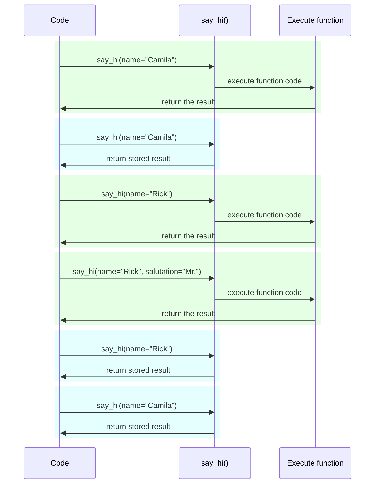

# 设置和环境变量

在许多情况下，你的应用程序可能需要一些外部设置或配置，例如密钥、数据库凭据、电子邮件服务的凭据等。

这些设置大多是可变的（可以更改），如数据库的 URLs。而且许多可能是敏感的，如隐私。

由于这个原因，通常是在环境变量中提供它们，再由应用程序读取。

## 环境变量

!!! tip
    如果你已经知道什么是 “环境变量” 以及如何使用它们，请直接跳到下面的章节。

<a href="https://en.wikipedia.org/wiki/Environment_variable" class="external-link" target="_blank">环境变量</a> （也称"env var"） 是一个设置在 Python 代码之外的变量，在操作系统中，可以被你的 Python 代码读取（或者也可以被其它程序读取）。

你无需使用 Python 程序 就可以在 shell 中创建和使用环境变量:

=== "Linux, macOS, Windows Bash"

    <div class="termy">

    ```console
    // You could create an env var MY_NAME with
    $ export MY_NAME="Wade Wilson"

    // Then you could use it with other programs, like
    $ echo "Hello $MY_NAME"

    Hello Wade Wilson
    ```

    </div>

=== "Windows PowerShell"

    <div class="termy">

    ```console
    // Create an env var MY_NAME
    $ $Env:MY_NAME = "Wade Wilson"

    // Use it with other programs, like
    $ echo "Hello $Env:MY_NAME"

    Hello Wade Wilson
    ```

    </div>

### 在 Python 中读取环境变量

你也可以在 Python 程序之外，在终端（或用任何其他方法）创建环境变量，然后在 Python 中读取它们。

例如你有一个 `main.py`：

```Python hl_lines="3"
import os

name = os.getenv("MY_NAME", "World")
print(f"Hello {name} from Python")
```

!!! tip
    <a href="https://docs.python.org/3.8/library/os.html#os.getenv" class="external-link" target="_blank">`os.getenv()`</a>的第二个参数是默认值。

    如果未获取到值, 默认值将为`None`, 这里我们提供 `"World"` 作为默认值使用.

接着你可以调用那个 Python 程序。

<div class="termy">

```console
// Here we don't set the env var yet
$ python main.py

// As we didn't set the env var, we get the default value

Hello World from Python

// But if we create an environment variable first
$ export MY_NAME="Wade Wilson"

// And then call the program again
$ python main.py

// Now it can read the environment variable

Hello Wade Wilson from Python
```

</div>

由于环境变量可以在代码外设置，但可以被代码读取，而且不与其他文件一起存储（提交到 `git` ），所以通常使用它们来配置或设置。

你也可以为一个特定的程序调用创建一个环境变量，该变量只对该程序有效，并且只在其持续时间内有效。

要做到这一点，就是在程序本身之前，在同一行创建它：

<div class="termy">

```console
// Create an env var MY_NAME in line for this program call
$ MY_NAME="Wade Wilson" python main.py

// Now it can read the environment variable

Hello Wade Wilson from Python

// The env var no longer exists afterwards
$ python main.py

Hello World from Python
```

</div>

!!! tip
    你可以在<a href="https://12factor.net/config" class="external-link" target="_blank">The Twelve-Factor App: Config</a>了解到更多。

### 类型与验证

这些环境变量只能处理文本字符串，因为它们是 Python 外部的，必须与其他程序和系统的其他部分兼容（甚至与不同的操作系统，如 Linux、Windows、macOS）。

这意味着在 Python 中从环境变量中读取的任何值都是`str`类型，任何转换为不同类型或验证都必须在代码中完成。

## Pydantic `Settings`

幸运的是，提供了一个很好的工具<a href="https://pydantic-docs.helpmanual.io/usage/settings/" class="external-link" target="_blank">Pydantic: Settings management</a>，可以用 Pydantic 处理这些来自环境变量的设置。

### 创建 `Settings` 对象

从 Pydantic 导入 `BaseSettings` ，并创建一个子类，与 Pydantic 模型非常相似。

与 Pydantic 模型的方式相同，使用类型注解来声明类属性，可能还有默认值。

你可以使用你用于 Pydantic 模型的所有相同的验证功能和工具，比如不同的数据类型和用 `Field()` 进行的额外验证。

```Python hl_lines="2  5-8  11"
{!../../../docs_src/settings/tutorial001.py!}
```

!!! tip
    如果你想快速复制和粘贴的东西，不要用这个例子，用下面最后一个例子。

接着，当你创建该 `Settings` 类的实例时（在这种情况下，在 `settings` 对象中），Pydantic 将以不区分大小写的方式读取环境变量，因此，大写的变量 `APP_NAME` 仍将被读取为属性 `app_name`。

接下来它将转换和验证数据。因此，当你使用该 `settings` 对象时，你将拥有你声明的类型的数据（例如，`items_per_user` 将是一个 `int` ）。

### 使用 `settings`

你可以在你的应用程序中使用 `settings` 对象:

```Python hl_lines="18-20"
{!../../../docs_src/settings/tutorial001.py!}
```

### 启动服务

接下来，你将运行服务器，将配置作为环境变量，例如，你可以设置 `ADMIN_EMAIL` 和 `APP_NAME` 。

<div class="termy">

```console
$ ADMIN_EMAIL="deadpool@example.com" APP_NAME="ChimichangApp" uvicorn main:app

<span style="color: green;">INFO</span>:     Uvicorn running on http://127.0.0.1:8000 (Press CTRL+C to quit)
```

</div>

!!! tip
    需要为一条命令设置多个环境变量时，只需用空格隔开，并把它们都放在命令前。

然后 `admin_email` 设置将被设置为 `"deadpool@example.com"` 。

`app_name` 变为 `"ChimichangApp"`.

`items_per_user` 将保持默认值 `50`.

## 在另一个 module 中设置

你可以将它分散到不同的 module 中，就像你在[更大的应用 - 多个文件](../tutorial/bigger-applications.md){.internal-link target=\_blank}中看到的一样。

例如你有一个 `config.py` 文件:

```Python
{!../../../docs_src/settings/app01/config.py!}
```

然后在 `main.py` 中使用它:

```Python hl_lines="3  11-13"
{!../../../docs_src/settings/app01/main.py!}
```

!!! tip
    你仍让需要 `__init__.py` 文件如你在[更大的应用 - 多个文件](../tutorial/bigger-applications.md){.internal-link target=\_blank}中看到的那样。

## 在依赖中设置

在某些情况下，从一个依赖关系中提供设置可能是有用的，而不是有一个在任何地方都使用的全局对象 `settings`。

这在测试过程中可能特别有用，因为用你自己的自定义设置覆盖一个依赖关系非常容易。

### 配置文件

从前面的例子来看，你的 `config.py` 文件如下。

```Python hl_lines="10"
{!../../../docs_src/settings/app02/config.py!}
```

注意，现在我们没有创建一个默认的实例 `settings = Settings()` 。

### 主应用程序文件

现在我们创建一个依赖，返回一个新的 `config.Settings()` 。

```Python hl_lines="5  11-12"
{!../../../docs_src/settings/app02/main.py!}
```

!!! tip
我们将在稍后讨论 `@lru_cache()` 。

     现在你可以假设 `get_settings()` 是一个正常的函数。

然后我们可以从 _路径操作函数_ 中要求它作为一个依赖，并在我们需要的任何地方使用它。

```Python hl_lines="16  18-20"
{!../../../docs_src/settings/app02/main.py!}
```

### 设置和测试

那么在测试过程中，通过为 `get_settings` 创建一个依赖覆盖，就可以非常容易地提供一个不同的设置对象。

```Python hl_lines="9-10  13  21"
{!../../../docs_src/settings/app02/test_main.py!}
```

在依赖覆盖中，我们在创建新的 `Settings` 对象时为 `admin_email` 设置了一个新的值，然后我们返回这个新对象。

接着我们可以测试它是否被使用。

## 读取 `.env` 文件

如果你有许多可能经常变化的设置，也许在不同的环境中，把它们放在一个文件中，然后从文件中读取它们，就像它们是环境变量一样，这可能很有用。

这种做法非常普遍，以至于它有一个名字，这些环境变量通常被放在一个文件 `.env` 中，这个文件被称为 "dotenv" 。

!!! tip
    在类 Unix 的系统中，如 Linux 和 macOS，以点（`.`）开头的文件是一个隐藏文件。

    但 dotenv 文件不一定要有那个确切的文件名。

Pydantic 支持使用外部库从这些类型的文件中进行读取。你可以在 <a href="https://pydantic-docs.helpmanual.io/usage/settings/#dotenv-env-support" class="external-link" target="_blank">Pydantic Settings: Dotenv (.env) support</a>了解更多。

!!! tip
    要让这个工作，你需要运行`pip install python-dotenv`.

### `.env` 文件

你应该有一个如下的`.env`文件:

```bash
ADMIN_EMAIL="deadpool@example.com"
APP_NAME="ChimichangApp"
```

### 从 `.env`中读取设置

然后用以下内容更新你的 `config.py`。

```Python hl_lines="9-10"
{!../../../docs_src/settings/app03/config.py!}
```

这里，我们在你的 Pydantic `Settings` 类中创建一个 `Config` 类，并将 `env_file` 设置为我们想要使用的 dotenv 文件的文件名。

!!! tip
使用 `Config` 类仅仅是为了 Pydantic 的设置. 你可以在<a href="https://pydantic-docs.helpmanual.io/usage/model_config/" class="external-link" target="_blank">Pydantic Model Config</a>中了解更多。

### 只用 `lru_cache` 创建 `Settings` 一次

从磁盘上读取文件通常是一个昂贵的（缓慢的）操作，所以你可能只想读取一次，然后重新使用相同的设置对象，而不是为每个请求读取它。

但每次我们都会这样做。

```Python
Settings()
```

一个新的 `Settings` 对象将被创建，在创建时它将再次读取 `.env` 文件。

如果依赖函数像这样:

```Python
def get_settings():
    return Settings()
```

我们将为每个请求创建该对象，并且我们将为每个请求读取 `.env` 文件。 ⚠️

但由于我们在上面使用了 `@lru_cache()` 装饰器，`Settings` 对象将只被创建一次，即在第一次调用时。 ✔️

```Python hl_lines="1  10"
{!../../../docs_src/settings/app03/main.py!}
```

然后对于接下来的请求的依赖中的任何后续的 `get_settings()` 的调用，不是执行 `get_settings()`的内部代码并创建一个新的`Settings'对象，而是返回第一次调用时返回的同一个对象，一次又一次。

#### `lru_cache` 技术细节

`@lru_cache()` 修改它所装饰的函数，返回与第一次相同的值，而不是再次计算，每次都执行该函数的代码。

因此，它下面的函数将为每个参数组合执行一次。然后，每一个参数组合所返回的值都将被反复使用，只要该函数被调用时的参数组合完全相同。

比如说，如果你有一个函数：

```Python
@lru_cache()
def say_hi(name: str, salutation: str = "Ms."):
    return f"Hello {salutation} {name}"
```

你的程序这样执行：



在我们的依赖关系 `get_settings()` 的情况下，该函数甚至不接受任何参数，所以它总是返回相同的值。

这样，它的行为几乎就像是一个全局变量一样。但由于它使用了一个依赖函数，那么我们就可以很容易地覆盖它进行测试。

`@lru_cache()` 是 `functools` 的一部分，它是 Python 标准库的一部分, 你可以在<a href="https://docs.python.org/3/library/functools.html#functools.lru_cache" class="external-link" target="_blank">Python docs for `@lru_cache()`</a>了解到更多。

## 总结

你可以使用 Pydantic 设置来处理你的应用程序的设置或配置，并使用 Pydantic 模型的所有功能。

- 通过使用依赖，你可以简化测试。
- 你可以在处理 `.env` 文件时使用到它。
- 使用 `@lru_cache()` 让你避免为每个请求反复读取 dotenv 文件，同时允许你在测试期间覆盖它。
