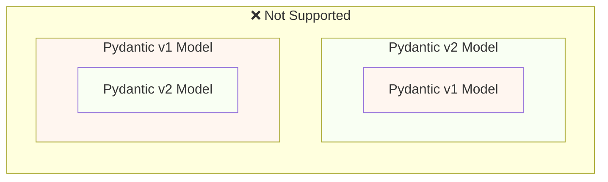
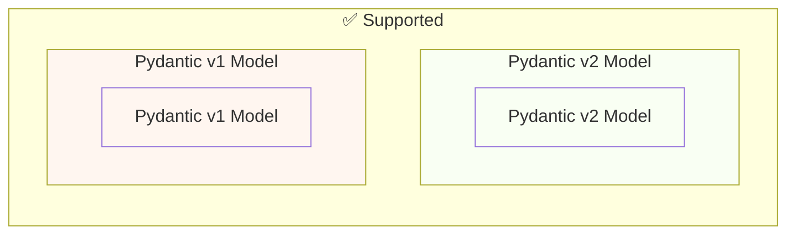

# 从 Pydantic v1 迁移到 Pydantic v2 { #migrate-from-pydantic-v1-to-pydantic-v2 }

如果你有一个较旧的 FastAPI 应用，可能在使用 Pydantic v1。

FastAPI 0.100.0 同时支持 Pydantic v1 和 v2，会使用你已安装的任一版本。

FastAPI 0.119.0 引入了在 Pydantic v2 内部以 `pydantic.v1` 形式对 Pydantic v1 的部分支持，以便于迁移到 v2。

FastAPI 0.126.0 移除了对 Pydantic v1 的支持，但在一段时间内仍支持 `pydantic.v1`。

/// warning | 警告

从 Python 3.14 开始，Pydantic 团队不再为最新的 Python 版本提供 Pydantic v1 的支持。

这也包括 `pydantic.v1`，在 Python 3.14 及更高版本中不再受支持。

如果你想使用 Python 的最新特性，需要确保使用 Pydantic v2。

///

如果你的旧 FastAPI 应用在用 Pydantic v1，这里将向你展示如何迁移到 Pydantic v2，以及 FastAPI 0.119.0 中可帮助你渐进式迁移的功能。

## 官方指南 { #official-guide }

Pydantic 有一份从 v1 迁移到 v2 的官方 <a href="https://docs.pydantic.dev/latest/migration/" class="external-link" target="_blank">迁移指南</a>。

其中包含变更内容、校验如何更准确更严格、可能的注意事项等。

你可以阅读以更好地了解变更。

## 测试 { #tests }

请确保你的应用有[测试](../tutorial/testing.md){.internal-link target=_blank}，并在持续集成（CI）中运行它们。

这样你就可以升级并确保一切仍按预期工作。

## `bump-pydantic` { #bump-pydantic }

在很多情况下，如果你使用的是未做自定义的常规 Pydantic 模型，可以将从 Pydantic v1 迁移到 v2 的大部分过程自动化。

你可以使用同一 Pydantic 团队提供的 <a href="https://github.com/pydantic/bump-pydantic" class="external-link" target="_blank">`bump-pydantic`</a>。

该工具会帮助你自动修改大部分需要变更的代码。

之后运行测试检查是否一切正常。如果正常，你就完成了。😎

## v2 中的 Pydantic v1 { #pydantic-v1-in-v2 }

Pydantic v2 以子模块 `pydantic.v1` 的形式包含了 Pydantic v1 的全部内容。但在 Python 3.13 以上的版本中不再受支持。

这意味着你可以安装最新的 Pydantic v2，并从该子模块导入并使用旧的 Pydantic v1 组件，就像安装了旧版 Pydantic v1 一样。

{* ../../docs_src/pydantic_v1_in_v2/tutorial001_an_py310.py hl[1,4] *}

### FastAPI 对 v2 中 Pydantic v1 的支持 { #fastapi-support-for-pydantic-v1-in-v2 }

自 FastAPI 0.119.0 起，FastAPI 也对 Pydantic v2 内的 Pydantic v1 提供了部分支持，以便迁移到 v2。

因此，你可以将 Pydantic 升级到最新的 v2，并将导入改为使用 `pydantic.v1` 子模块，在很多情况下就能直接工作。

{* ../../docs_src/pydantic_v1_in_v2/tutorial002_an_py310.py hl[2,5,15] *}

/// warning | 警告

请注意，由于 Pydantic 团队自 Python 3.14 起不再在较新的 Python 版本中支持 Pydantic v1，使用 `pydantic.v1` 在 Python 3.14 及更高版本中也不受支持。

///

### 同一应用中同时使用 Pydantic v1 与 v2 { #pydantic-v1-and-v2-on-the-same-app }

Pydantic 不支持在一个 Pydantic v2 模型的字段中定义 Pydantic v1 模型，反之亦然。

...但是，你可以在同一个应用中分别使用 Pydantic v1 和 v2 的独立模型。

在某些情况下，甚至可以在 FastAPI 应用的同一个路径操作中同时使用 Pydantic v1 和 v2 模型：

{* ../../docs_src/pydantic_v1_in_v2/tutorial003_an_py310.py hl[2:3,6,12,21:22] *}

在上面的示例中，输入模型是 Pydantic v1 模型，输出模型（在 `response_model=ItemV2` 中定义）是 Pydantic v2 模型。

### Pydantic v1 参数 { #pydantic-v1-parameters }

如果你需要在 Pydantic v1 模型中使用 FastAPI 特有的参数工具，如 `Body`、`Query`、`Form` 等，在完成向 Pydantic v2 的迁移前，可以从 `fastapi.temp_pydantic_v1_params` 导入它们：

{* ../../docs_src/pydantic_v1_in_v2/tutorial004_an_py310.py hl[4,18] *}

### 分步迁移 { #migrate-in-steps }

/// tip | 提示

优先尝试 `bump-pydantic`，如果测试通过且可行，那么你就用一个命令完成了。✨

///

如果 `bump-pydantic` 不适用于你的场景，你可以在同一应用中同时支持 Pydantic v1 和 v2 模型，逐步迁移到 Pydantic v2。

你可以首先将 Pydantic 升级到最新的 v2，并将所有模型的导入改为使用 `pydantic.v1`。

然后按模块或分组，逐步把模型从 Pydantic v1 迁移到 v2。🚶
