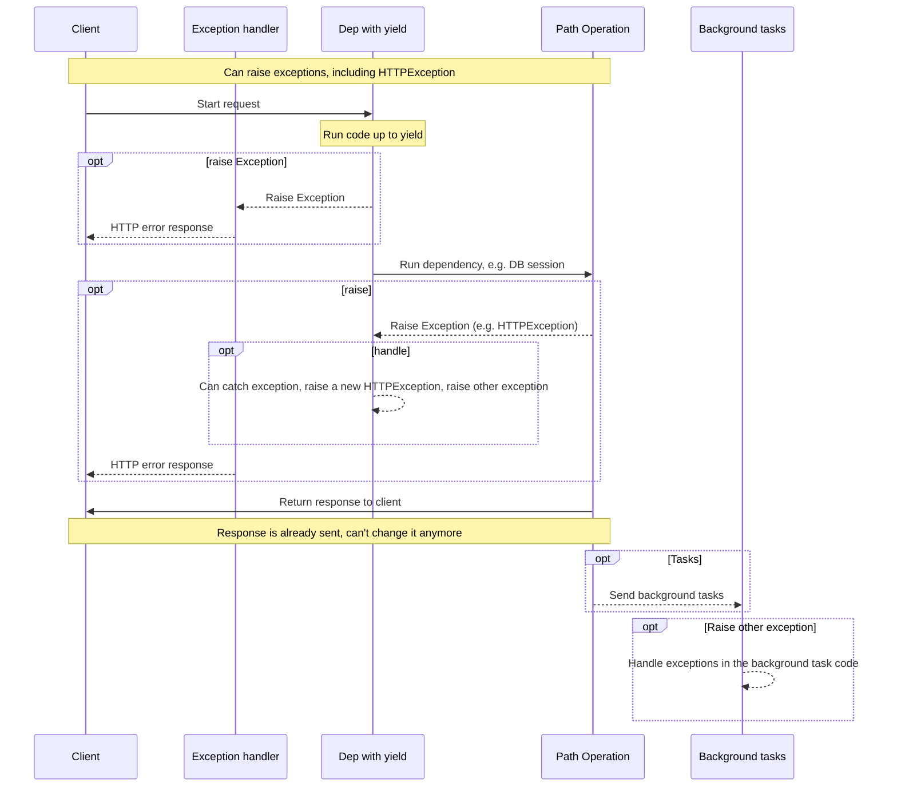

# 使用yield的依赖项

FastAPI支持在完成后执行一些<abbr title='有时也被称为"退出"("exit")，"清理"("cleanup")，"拆卸"("teardown")，"关闭"("close")，"上下文管理器"("context managers")。 ...'>额外步骤</abbr>的依赖项.

为此，你需要使用 `yield` 而不是 `return`，然后再编写这些额外的步骤（代码）。

/// tip | 提示

确保在每个依赖中只使用一次 `yield`。

///

/// note | 技术细节

任何一个可以与以下内容一起使用的函数：

* <a href="https://docs.python.org/3/library/contextlib.html#contextlib.contextmanager" class="external-link" target="_blank">`@contextlib.contextmanager`</a> 或者
* <a href="https://docs.python.org/3/library/contextlib.html#contextlib.asynccontextmanager" class="external-link" target="_blank">`@contextlib.asynccontextmanager`</a>

都可以作为 **FastAPI** 的依赖项。

实际上，FastAPI内部就使用了这两个装饰器。

///

## 使用 `yield` 的数据库依赖项

例如，你可以使用这种方式创建一个数据库会话，并在完成后关闭它。

在发送响应之前，只会执行 `yield` 语句及之前的代码：

{* ../../docs_src/dependencies/tutorial007.py hl[2:4] *}

生成的值会注入到 *路由函数* 和其他依赖项中：

{* ../../docs_src/dependencies/tutorial007.py hl[4] *}

`yield` 语句后面的代码会在创建响应后，发送响应前执行：

{* ../../docs_src/dependencies/tutorial007.py hl[5:6] *}

/// tip | 提示

你可以使用 `async` 或普通函数。

**FastAPI** 会像处理普通依赖一样，对每个依赖做正确的处理。

///

## 包含 `yield` 和 `try` 的依赖项

如果在包含 `yield` 的依赖中使用 `try` 代码块，你会捕获到使用依赖时抛出的任何异常。

例如，如果某段代码在另一个依赖中或在 *路由函数* 中使数据库事务"回滚"或产生任何其他错误，你将会在依赖中捕获到异常。

因此，你可以使用 `except SomeException` 在依赖中捕获特定的异常。

同样，你也可以使用 `finally` 来确保退出步骤得到执行，无论是否存在异常。

{* ../../docs_src/dependencies/tutorial007.py hl[3,5] *}
## 使用 `yield` 的子依赖项

你可以声明任意数量和层级的树状依赖，而且它们中的任何一个或所有的都可以使用 `yield`。

**FastAPI** 会确保每个带有 `yield` 的依赖中的"退出代码"按正确顺序运行。

例如，`dependency_c` 可以依赖于 `dependency_b`，而 `dependency_b` 则依赖于 `dependency_a`。

{* ../../docs_src/dependencies/tutorial008_an_py39.py hl[6,14,22] *}

所有这些依赖都可以使用 `yield`。

在这种情况下，`dependency_c` 在执行其退出代码时需要 `dependency_b`（此处称为 `dep_b`）的值仍然可用。

而 `dependency_b` 反过来则需要 `dependency_a`（此处称为 `dep_a` ）的值在其退出代码中可用。

{* ../../docs_src/dependencies/tutorial008_an_py39.py hl[18:19,26:27] *}

同样，你可以混合使用带有 `yield` 或 `return` 的依赖。

你也可以声明一个依赖于多个带有 `yield` 的依赖，等等。

你可以拥有任何你想要的依赖组合。

**FastAPI** 将确保按正确的顺序运行所有内容。

/// note | 技术细节

这是由 Python 的<a href="https://docs.python.org/3/library/contextlib.html" class="external-link" target="_blank">上下文管理器</a>完成的。

**FastAPI** 在内部使用它们来实现这一点。

///

## 包含 `yield` 和 `HTTPException` 的依赖项

你可以使用带有 `yield` 的依赖项，并且可以包含 `try` 代码块用于捕获异常。

同样，你可以在 `yield` 之后的退出代码中抛出一个 `HTTPException` 或类似的异常。

/// tip | 提示

这是一种相对高级的技巧，在大多数情况下你并不需要使用它，因为你可以在其他代码中抛出异常（包括 `HTTPException` ），例如在 *路由函数* 中。

但是如果你需要，你也可以在依赖项中做到这一点。🤓

///

{* ../../docs_src/dependencies/tutorial008b_an_py39.py hl[18:22,31] *}

你还可以创建一个 [自定义异常处理器](../handling-errors.md#install-custom-exception-handlers){.internal-link target=_blank} 用于捕获异常（同时也可以抛出另一个 `HTTPException`）。

## 包含 `yield` 和 `except` 的依赖项

如果你在包含 `yield` 的依赖项中使用 `except` 捕获了一个异常，然后你没有重新抛出该异常（或抛出一个新异常），与在普通的Python代码中相同，FastAPI不会注意到发生了异常。

{* ../../docs_src/dependencies/tutorial008c_an_py39.py hl[15:16] *}

在示例代码的情况下，客户端将会收到 *HTTP 500 Internal Server Error* 的响应，因为我们没有抛出 `HTTPException` 或者类似的异常，并且服务器也 **不会有任何日志** 或者其他提示来告诉我们错误是什么。😱

### 在包含 `yield` 和 `except` 的依赖项中一定要 `raise`

如果你在使用 `yield` 的依赖项中捕获到了一个异常，你应该再次抛出捕获到的异常，除非你抛出 `HTTPException` 或类似的其他异常，

你可以使用 `raise` 再次抛出捕获到的异常。

{* ../../docs_src/dependencies/tutorial008d_an_py39.py hl[17] *}

现在客户端同样会得到 *HTTP 500 Internal Server Error* 响应，但是服务器日志会记录下我们自定义的 `InternalError`。

##  使用 `yield` 的依赖项的执行

执行顺序大致如下时序图所示。时间轴从上到下，每一列都代表交互或者代码执行的一部分。



/// info | 说明

只会向客户端发送 **一次响应** ，可能是一个错误响应，也可能是来自 *路由函数* 的响应。

在发送了其中一个响应之后，就无法再发送其他响应了。

///

/// tip | 提示

这个时序图展示了 `HTTPException`，除此之外你也可以抛出任何你在使用 `yield` 的依赖项中或者[自定义异常处理器](../handling-errors.md#install-custom-exception-handlers){.internal-link target=_blank}中捕获的异常。

如果你引发任何异常，它将传递给使用 `yield` 的依赖项，包括 `HTTPException`。在大多数情况下你应当从使用 `yield` 的依赖项中重新抛出捕获的异常或者一个新的异常来确保它会被正确的处理。

///

## 包含 `yield`, `HTTPException`, `except` 的依赖项和后台任务

/// warning | 注意

你大概率不需要了解这些技术细节，可以跳过这一章节继续阅读后续的内容。

如果你使用的FastAPI的版本早于0.106.0，并且在使用后台任务中使用了包含 `yield` 的依赖项中的资源，那么这些细节会对你有一些用处。

///

### 包含 `yield` 和 `except` 的依赖项的技术细节

在FastAPI 0.110.0版本之前，如果使用了一个包含 `yield` 的依赖项，你在依赖项中使用 `except` 捕获了一个异常，但是你没有再次抛出该异常，这个异常会被自动抛出/转发到异常处理器或者内部服务错误处理器。

### 后台任务和使用 `yield` 的依赖项的技术细节

在FastAPI 0.106.0版本之前，在 `yield` 后面抛出异常是不可行的，因为 `yield` 之后的退出代码是在响应被发送之后再执行，这个时候异常处理器已经执行过了。

这样设计的目的主要是为了允许在后台任务中使用被依赖项`yield`的对象，因为退出代码会在后台任务结束后再执行。

然而这也意味着在等待响应通过网络传输的同时，非必要的持有一个 `yield` 依赖项中的资源（例如数据库连接），这一行为在FastAPI 0.106.0被改变了。

/// tip | 提示

除此之外，后台任务通常是一组独立的逻辑，应该被单独处理，并且使用它自己的资源（例如它自己的数据库连接）。

这样也会让你的代码更加简洁。

///

如果你之前依赖于这一行为，那么现在你应该在后台任务中创建并使用它自己的资源，不要在内部使用属于 `yield` 依赖项的资源。

例如，你应该在后台任务中创建一个新的数据库会话用于查询数据，而不是使用相同的会话。你应该将对象的ID作为参数传递给后台任务函数，然后在该函数中重新获取该对象，而不是直接将数据库对象作为参数。

## 上下文管理器

### 什么是"上下文管理器"

"上下文管理器"是你可以在 `with` 语句中使用的任何Python对象。

例如，<a href="https://docs.python.org/zh-cn/3/tutorial/inputoutput.html#reading-and-writing-files" class="external-link" target="_blank">你可以使用`with`读取文件</a>：

```Python
with open("./somefile.txt") as f:
    contents = f.read()
    print(contents)
```

在底层，`open("./somefile.txt")`创建了一个被称为"上下文管理器"的对象。

当 `with` 代码块结束时，它会确保关闭文件，即使发生了异常也是如此。

当你使用 `yield` 创建一个依赖项时，**FastAPI** 会在内部将其转换为上下文管理器，并与其他相关工具结合使用。

### 在使用 `yield` 的依赖项中使用上下文管理器

/// warning | 注意

这是一个更为"高级"的想法。

如果你刚开始使用 **FastAPI** ，你可以暂时可以跳过它。

///

在Python中，你可以通过<a href="https://docs.python.org/3/reference/datamodel.html#context-managers" class="external-link" target="_blank">创建一个带有`__enter__()`和`__exit__()`方法的类</a>来创建上下文管理器。

你也可以在 **FastAPI** 的 `yield` 依赖项中通过 `with` 或者 `async with` 语句来使用它们：

{* ../../docs_src/dependencies/tutorial010.py hl[1:9,13] *}

/// tip | 提示

另一种创建上下文管理器的方法是：

* <a href="https://docs.python.org/zh-cn/3/library/contextlib.html#contextlib.contextmanager" class="external-link" target="_blank">`@contextlib.contextmanager`</a>或者
* <a href="https://docs.python.org/zh-cn/3/library/contextlib.html#contextlib.asynccontextmanager" class="external-link" target="_blank">`@contextlib.asynccontextmanager`</a>

使用它们装饰一个只有单个 `yield` 的函数。这就是 **FastAPI** 内部对于 `yield` 依赖项的处理方式。

但是你不需要为FastAPI的依赖项使用这些装饰器（而且也不应该）。FastAPI会在内部为你处理这些。

///
