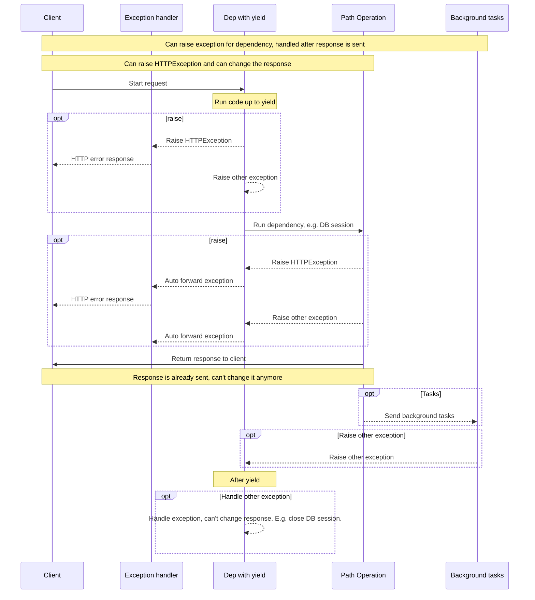

# 使用yield的依赖项

FastAPI支持在完成后执行一些<abbr title='有时也被称为“退出”("exit")，“清理”("cleanup")，“拆卸”("teardown")，“关闭”("close")，“上下文管理器”("context managers")。 ...'>额外步骤</abbr>的依赖项.

为此，请使用 `yield` 而不是 `return`，然后再编写额外的步骤（代码）。

!!! tip "提示"
    确保只使用一次 `yield` 。

!!! note "技术细节"

    任何一个可以与以下内容一起使用的函数：

    * <a href="https://docs.python.org/3/library/contextlib.html#contextlib.contextmanager" class="external-link" target="_blank">`@contextlib.contextmanager`</a> 或者
    * <a href="https://docs.python.org/3/library/contextlib.html#contextlib.asynccontextmanager" class="external-link" target="_blank">`@contextlib.asynccontextmanager`</a>

    都可以作为 **FastAPI** 的依赖项。

    实际上，FastAPI内部就使用了这两个装饰器。


## 使用 `yield` 的数据库依赖项

例如，您可以使用这种方式创建一个数据库会话，并在完成后关闭它。

在发送响应之前，只会执行 `yield` 语句及之前的代码：

```Python hl_lines="2-4"
{!../../../docs_src/dependencies/tutorial007.py!}
```

生成的值会注入到*路径操作*和其他依赖项中：

```Python hl_lines="4"
{!../../../docs_src/dependencies/tutorial007.py!}
```

"yield"语句后面的代码会在发送响应后执行：：

```Python hl_lines="5-6"
{!../../../docs_src/dependencies/tutorial007.py!}
```

!!! tip "提示"

    您可以使用 `async` 或普通函数。

    **FastAPI** 会像处理普通依赖关系一样，对每个依赖关系做正确的处理。

## 同时包含了 `yield` 和 `try` 的依赖项

如果在带有 `yield` 的依赖关系中使用 `try` 代码块，就会收到使用依赖关系时抛出的任何异常。

例如，如果中间某个代码在另一个依赖中或在*路径操作*中使数据库事务 "回滚 "或产生任何其他错误，您就会在依赖中收到异常。

因此，你可以使用 `except SomeException` 在依赖关系中查找特定的异常。

同样，您也可以使用 `finally` 来确保退出步骤得到执行，无论是否存在异常。

```Python hl_lines="3  5"
{!../../../docs_src/dependencies/tutorial007.py!}
```
## 使用`yield`的子依赖项

你可以拥有任意大小和形状的子依赖和子依赖的“树”，而且它们中的任何一个或所有的都可以使用`yield`。

**FastAPI** 会确保每个带有`yield`的依赖中的“退出代码”按正确顺序运行。

例如，`dependency_c` 可以依赖于 `dependency_b`，而 `dependency_b` 则依赖于 `dependency_a`。

=== "Python 3.9+"

    ```Python hl_lines="6  14  22"
    {!> ../../../docs_src/dependencies/tutorial008_an_py39.py!}
    ```

=== "Python 3.8+"

    ```Python hl_lines="5  13  21"
    {!> ../../../docs_src/dependencies/tutorial008_an.py!}
    ```

=== "Python 3.8+ non-Annotated"

    !!! tip
        如果可能，请尽量使用“ Annotated”版本。

    ```Python hl_lines="4  12  20"
    {!> ../../../docs_src/dependencies/tutorial008.py!}
    ```

所有这些依赖都可以使用`yield`。

在这种情况下，`dependency_c` 在执行其退出代码时需要`dependency_b`（此处称为 `dep_b`）的值仍然可用。

而`dependency_b` 反过来则需要`dependency_a`（此处称为 `dep_a`）的值在其退出代码中可用。

=== "Python 3.9+"

    ```Python hl_lines="18-19  26-27"
    {!> ../../../docs_src/dependencies/tutorial008_an_py39.py!}
    ```

=== "Python 3.8+"

    ```Python hl_lines="17-18  25-26"
    {!> ../../../docs_src/dependencies/tutorial008_an.py!}
    ```

=== "Python 3.8+ non-Annotated"

    !!! tip
        如果可能，请尽量使用“ Annotated”版本。

    ```Python hl_lines="16-17  24-25"
    {!> ../../../docs_src/dependencies/tutorial008.py!}
    ```

同样，你可以有混合了`yield`和`return`的依赖。

你也可以有一个单一的依赖需要多个其他带有`yield`的依赖，等等。

你可以拥有任何你想要的依赖组合。

**FastAPI** 将确保按正确的顺序运行所有内容。

!!! note "技术细节"

    这是由 Python 的<a href="https://docs.python.org/3/library/contextlib.html" class="external-link" target="_blank">上下文管理器</a>完成的。

    **FastAPI** 在内部使用它们来实现这一点。


## 使用 `yield` 和 `HTTPException` 的依赖项

您看到可以使用带有 `yield` 的依赖项，并且具有捕获异常的 `try` 块。

在 `yield` 后抛出 `HTTPException` 或类似的异常是很诱人的，但是**这不起作用**。

带有`yield`的依赖中的退出代码在响应发送之后执行，因此[异常处理程序](../handling-errors.md#install-custom-exception-handlers){.internal-link target=_blank}已经运行过。没有任何东西可以捕获退出代码（在`yield`之后）中的依赖抛出的异常。

所以，如果在`yield`之后抛出`HTTPException`，默认（或任何自定义）异常处理程序捕获`HTTPException`并返回HTTP 400响应的机制将不再能够捕获该异常。

这就是允许在依赖中设置的任何东西（例如数据库会话(DB session)）可以被后台任务使用的原因。

后台任务在响应发送之后运行。因此，无法触发`HTTPException`，因为甚至没有办法更改*已发送*的响应。

但如果后台任务产生了数据库错误，至少你可以在带有`yield`的依赖中回滚或清理关闭会话，并且可能记录错误或将其报告给远程跟踪系统。

如果你知道某些代码可能会引发异常，那就做最“Pythonic”的事情，就是在代码的那部分添加一个`try`块。

如果你有自定义异常，希望在返回响应之前处理，并且可能修改响应甚至触发`HTTPException`，可以创建[自定义异常处理程序](../handling-errors.md#install-custom-exception-handlers){.internal-link target=_blank}。

!!! tip

    在`yield`之前仍然可以引发包括`HTTPException`在内的异常，但在`yield`之后则不行。

执行的顺序大致如下图所示。时间从上到下流动。每列都是相互交互或执行代码的其中一部分。



!!! info
    只会向客户端发送**一次响应**，可能是一个错误响应之一，也可能是来自*路径操作*的响应。

    在发送了其中一个响应之后，就无法再发送其他响应了。

!!! tip
    这个图表展示了`HTTPException`，但你也可以引发任何其他你创建了[自定义异常处理程序](../handling-errors.md#install-custom-exception-handlers){.internal-link target=_blank}的异常。

    如果你引发任何异常，它将传递给带有`yield`的依赖，包括`HTTPException`，然后**再次**传递给异常处理程序。如果没有针对该异常的异常处理程序，那么它将被默认的内部`ServerErrorMiddleware`处理，返回500 HTTP状态码，告知客户端服务器发生了错误。

## 上下文管理器

### 什么是“上下文管理器”

“上下文管理器”是您可以在`with`语句中使用的任何Python对象。

例如，<a href="https://docs.python.org/zh-cn/3/tutorial/inputoutput.html#reading-and-writing-files" class="external-link" target="_blank">您可以使用`with`读取文件</a>：

```Python
with open("./somefile.txt") as f:
    contents = f.read()
    print(contents)
```

在底层，`open("./somefile.txt")`创建了一个被称为“上下文管理器”的对象。

当`with`块结束时，它会确保关闭文件，即使发生了异常也是如此。

当你使用`yield`创建一个依赖项时，**FastAPI**会在内部将其转换为上下文管理器，并与其他相关工具结合使用。

### 在依赖项中使用带有`yield`的上下文管理器

!!! warning
    这是一个更为“高级”的想法。

    如果您刚开始使用**FastAPI**，您可能暂时可以跳过它。

在Python中，你可以通过<a href="https://docs.python.org/3/reference/datamodel.html#context-managers" class="external-link" target="_blank">创建一个带有`__enter__()`和`__exit__()`方法的类</a>来创建上下文管理器。

你也可以在**FastAPI**的依赖项中使用带有`yield`的`with`或`async with`语句，通过在依赖函数内部使用它们。

```Python hl_lines="1-9  13"
{!../../../docs_src/dependencies/tutorial010.py!}
```

!!! tip
    另一种创建上下文管理器的方法是：

    * <a href="https://docs.python.org/zh-cn/3/library/contextlib.html#contextlib.contextmanager" class="external-link" target="_blank">`@contextlib.contextmanager`</a>或者
    * <a href="https://docs.python.org/zh-cn/3/library/contextlib.html#contextlib.asynccontextmanager" class="external-link" target="_blank">`@contextlib.asynccontextmanager`</a>

    使用上下文管理器装饰一个只有单个`yield`的函数。这就是**FastAPI**在内部用于带有`yield`的依赖项的方式。

    但是你不需要为FastAPI的依赖项使用这些装饰器（而且也不应该）。FastAPI会在内部为你处理这些。
