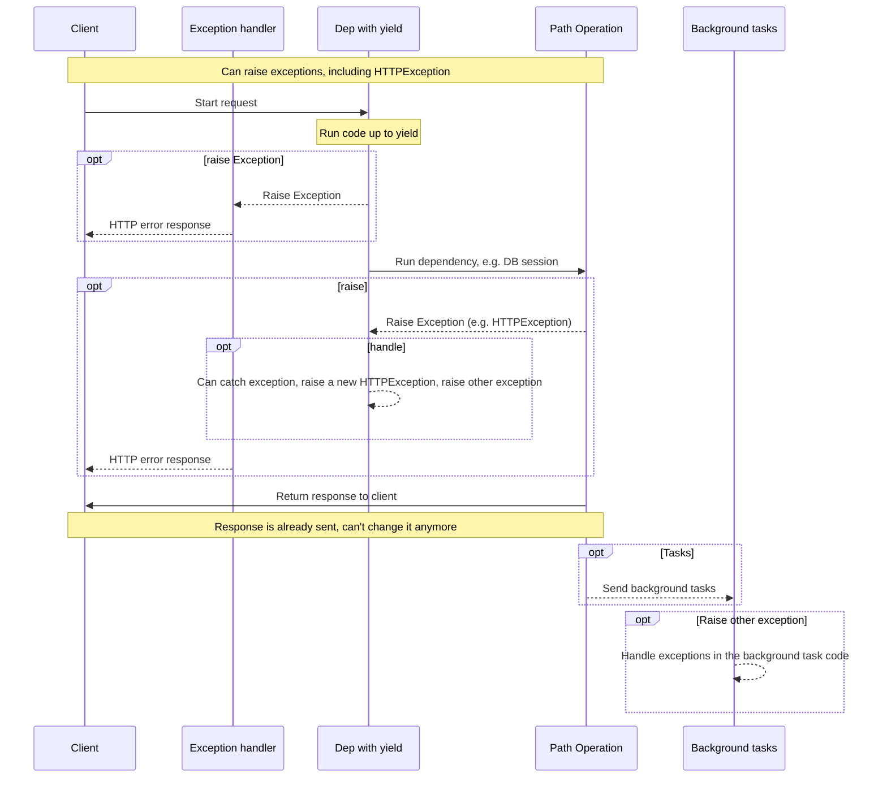
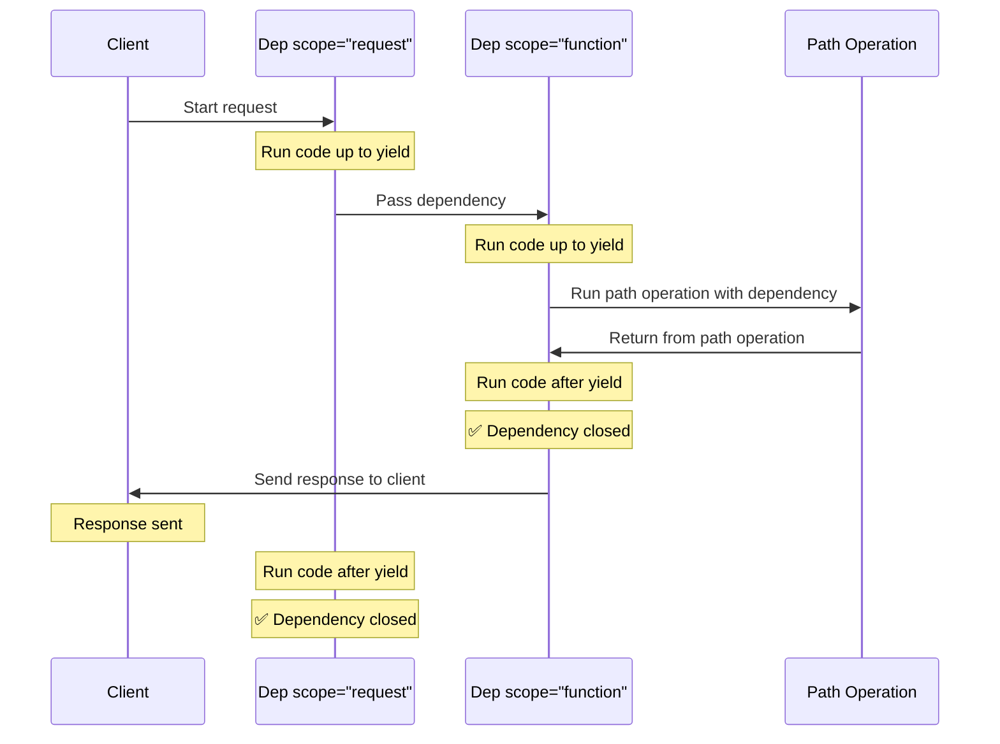

# 使用 yield 的依赖项 { #dependencies-with-yield }

FastAPI 支持那些在完成后执行一些<dfn title="有时也称为：“退出代码”、“清理代码”、“拆卸代码”、“关闭代码”、“上下文管理器退出代码”等">额外步骤</dfn>的依赖项。

为此，使用 `yield` 而不是 `return`，并把这些额外步骤（代码）写在后面。

/// tip | 提示

确保在每个依赖里只使用一次 `yield`。

///

/// note | 技术细节

任何可以与以下装饰器一起使用的函数：

* <a href="https://docs.python.org/3/library/contextlib.html#contextlib.contextmanager" class="external-link" target="_blank">`@contextlib.contextmanager`</a> 或
* <a href="https://docs.python.org/3/library/contextlib.html#contextlib.asynccontextmanager" class="external-link" target="_blank">`@contextlib.asynccontextmanager`</a>

都可以作为 **FastAPI** 的依赖项。

实际上，FastAPI 在内部就是用的这两个装饰器。

///

## 使用 `yield` 的数据库依赖项 { #a-database-dependency-with-yield }

例如，你可以用这种方式创建一个数据库会话，并在完成后将其关闭。

在创建响应之前，只会执行 `yield` 语句及其之前的代码：

{* ../../docs_src/dependencies/tutorial007_py310.py hl[2:4] *}

`yield` 产生的值会注入到 *路径操作* 和其他依赖项中：

{* ../../docs_src/dependencies/tutorial007_py310.py hl[4] *}

`yield` 语句后面的代码会在响应之后执行：

{* ../../docs_src/dependencies/tutorial007_py310.py hl[5:6] *}

/// tip | 提示

你可以使用 `async` 或普通函数。

**FastAPI** 会像处理普通依赖一样对它们进行正确处理。

///

## 同时使用 `yield` 和 `try` 的依赖项 { #a-dependency-with-yield-and-try }

如果你在带有 `yield` 的依赖中使用了 `try` 代码块，那么当使用该依赖时抛出的任何异常你都会收到。

例如，如果在中间的某处代码中（在另一个依赖或在某个 *路径操作* 中）发生了数据库事务“回滚”或产生了其他异常，你会在你的依赖中收到这个异常。

因此，你可以在该依赖中用 `except SomeException` 来捕获这个特定异常。

同样地，你可以使用 `finally` 来确保退出步骤一定会被执行，无论是否发生异常。

{* ../../docs_src/dependencies/tutorial007_py310.py hl[3,5] *}

## 使用 `yield` 的子依赖项 { #sub-dependencies-with-yield }

你可以声明任意大小和形状的子依赖及其“树”，其中任意一个或全部都可以使用 `yield`。

**FastAPI** 会确保每个带有 `yield` 的依赖中的“退出代码”按正确的顺序运行。

例如，`dependency_c` 可以依赖 `dependency_b`，而 `dependency_b` 则依赖 `dependency_a`：

{* ../../docs_src/dependencies/tutorial008_an_py310.py hl[6,14,22] *}

并且它们都可以使用 `yield`。

在这种情况下，`dependency_c` 在执行其退出代码时需要 `dependency_b`（此处命名为 `dep_b`）的值仍然可用。

而 `dependency_b` 又需要 `dependency_a`（此处命名为 `dep_a`）的值在其退出代码中可用。

{* ../../docs_src/dependencies/tutorial008_an_py310.py hl[18:19,26:27] *}

同样地，你可以将一些依赖用 `yield`，另一些用 `return`，并让其中一些依赖依赖于另一些。

你也可以有一个依赖需要多个带有 `yield` 的依赖，等等。

你可以拥有任何你想要的依赖组合。

**FastAPI** 将确保一切都按正确的顺序运行。

/// note | 技术细节

这要归功于 Python 的<a href="https://docs.python.org/3/library/contextlib.html" class="external-link" target="_blank">上下文管理器</a>。

**FastAPI** 在内部使用它们来实现这一点。

///

## 同时使用 `yield` 和 `HTTPException` 的依赖项 { #dependencies-with-yield-and-httpexception }

你已经看到可以在带有 `yield` 的依赖中使用 `try` 块尝试执行一些代码，然后在 `finally` 之后运行一些退出代码。

你也可以使用 `except` 来捕获引发的异常并对其进行处理。

例如，你可以抛出一个不同的异常，如 `HTTPException`。

/// tip | 提示

这是一种相对高级的技巧，在大多数情况下你并不需要使用它，因为你可以在应用的其他代码中（例如在 *路径操作函数* 里）抛出异常（包括 `HTTPException`）。

但是如果你需要，它就在这里。🤓

///

{* ../../docs_src/dependencies/tutorial008b_an_py310.py hl[18:22,31] *}

如果你想捕获异常并基于它创建一个自定义响应，请创建一个[自定义异常处理器](../handling-errors.md#install-custom-exception-handlers){.internal-link target=_blank}。

## 同时使用 `yield` 和 `except` 的依赖项 { #dependencies-with-yield-and-except }

如果你在带有 `yield` 的依赖中使用 `except` 捕获了一个异常，并且你没有再次抛出它（或抛出一个新异常），FastAPI 将无法察觉发生过异常，就像普通的 Python 代码那样：

{* ../../docs_src/dependencies/tutorial008c_an_py310.py hl[15:16] *}

在这种情况下，客户端会像预期那样看到一个 *HTTP 500 Internal Server Error* 响应，因为我们没有抛出 `HTTPException` 或类似异常，但服务器将**没有任何日志**或其他关于错误是什么的提示。😱

### 在带有 `yield` 和 `except` 的依赖中务必 `raise` { #always-raise-in-dependencies-with-yield-and-except }

如果你在带有 `yield` 的依赖中捕获到了一个异常，除非你抛出另一个 `HTTPException` 或类似异常，**否则你应该重新抛出原始异常**。

你可以使用 `raise` 重新抛出同一个异常：

{* ../../docs_src/dependencies/tutorial008d_an_py310.py hl[17] *}

现在客户端仍会得到同样的 *HTTP 500 Internal Server Error* 响应，但服务器日志中会有我们自定义的 `InternalError`。😎

## 使用 `yield` 的依赖项的执行 { #execution-of-dependencies-with-yield }

执行顺序大致如下图所示。时间轴从上到下，每一列都代表交互或执行代码的一部分。



/// info | 信息

只会向客户端发送**一次响应**。它可能是某个错误响应，或者是来自 *路径操作* 的响应。

在其中一个响应发送之后，就不能再发送其他响应了。

///

/// tip | 提示

如果你在 *路径操作函数* 的代码中引发任何异常，它都会被传递给带有 `yield` 的依赖项，包括 `HTTPException`。在大多数情况下，你会希望在带有 `yield` 的依赖中重新抛出相同的异常或一个新的异常，以确保它被正确处理。

///

## 提前退出与 `scope` { #early-exit-and-scope }

通常，带有 `yield` 的依赖的退出代码会在响应发送给客户端**之后**执行。

但如果你知道在从 *路径操作函数* 返回之后不再需要使用该依赖，你可以使用 `Depends(scope="function")` 告诉 FastAPI：应当在 *路径操作函数* 返回后、但在**响应发送之前**关闭该依赖。

{* ../../docs_src/dependencies/tutorial008e_an_py310.py hl[12,16] *}

`Depends()` 接收一个 `scope` 参数，可为：

* `"function"`：在处理请求的 *路径操作函数* 之前启动依赖，在 *路径操作函数* 结束后结束依赖，但在响应发送给客户端**之前**。因此，依赖函数将围绕这个*路径操作函数*执行。
* `"request"`：在处理请求的 *路径操作函数* 之前启动依赖（与使用 `"function"` 时类似），但在响应发送给客户端**之后**结束。因此，依赖函数将围绕这个**请求**与响应周期执行。

如果未指定且依赖包含 `yield`，则默认 `scope` 为 `"request"`。

### 子依赖的 `scope` { #scope-for-sub-dependencies }

当你声明一个 `scope="request"`（默认）的依赖时，任何子依赖也需要有 `"request"` 的 `scope`。

但一个 `scope` 为 `"function"` 的依赖可以有 `scope` 为 `"function"` 和 `"request"` 的子依赖。

这是因为任何依赖都需要能够在子依赖之前运行其退出代码，因为它的退出代码中可能还需要使用这些子依赖。



## 包含 `yield`、`HTTPException`、`except` 和后台任务的依赖项 { #dependencies-with-yield-httpexception-except-and-background-tasks }

带有 `yield` 的依赖项随着时间演进以涵盖不同的用例并修复了一些问题。

如果你想了解在不同 FastAPI 版本中发生了哪些变化，可以在进阶指南中阅读更多：[高级依赖项 —— 包含 `yield`、`HTTPException`、`except` 和后台任务的依赖项](../../advanced/advanced-dependencies.md#dependencies-with-yield-httpexception-except-and-background-tasks){.internal-link target=_blank}。

## 上下文管理器 { #context-managers }

### 什么是“上下文管理器” { #what-are-context-managers }

“上下文管理器”是你可以在 `with` 语句中使用的任意 Python 对象。

例如，<a href="https://docs.python.org/3/tutorial/inputoutput.html#reading-and-writing-files" class="external-link" target="_blank">你可以用 `with` 来读取文件</a>：

```Python
with open("./somefile.txt") as f:
    contents = f.read()
    print(contents)
```

在底层，`open("./somefile.txt")` 会创建一个“上下文管理器”对象。

当 `with` 代码块结束时，它会确保文件被关闭，即使期间发生了异常。

当你用 `yield` 创建一个依赖时，**FastAPI** 会在内部为它创建一个上下文管理器，并与其他相关工具结合使用。

### 在带有 `yield` 的依赖中使用上下文管理器 { #using-context-managers-in-dependencies-with-yield }

/// warning | 警告

这算是一个“高级”概念。

如果你刚开始使用 **FastAPI**，现在可以先跳过。

///

在 Python 中，你可以通过<a href="https://docs.python.org/3/reference/datamodel.html#context-managers" class="external-link" target="_blank">创建一个带有 `__enter__()` 和 `__exit__()` 方法的类</a>来创建上下文管理器。

你也可以在 **FastAPI** 的带有 `yield` 的依赖中，使用依赖函数内部的 `with` 或 `async with` 语句来使用它们：

{* ../../docs_src/dependencies/tutorial010_py310.py hl[1:9,13] *}

/// tip | 提示

另一种创建上下文管理器的方式是：

* <a href="https://docs.python.org/3/library/contextlib.html#contextlib.contextmanager" class="external-link" target="_blank">`@contextlib.contextmanager`</a> 或
* <a href="https://docs.python.org/3/library/contextlib.html#contextlib.asynccontextmanager" class="external-link" target="_blank">`@contextlib.asynccontextmanager`</a>

用它们去装饰一个只包含单个 `yield` 的函数。

这正是 **FastAPI** 在内部处理带有 `yield` 的依赖时所使用的方式。

但你不需要（也不应该）为 FastAPI 的依赖去使用这些装饰器。FastAPI 会在内部为你处理好。

///
