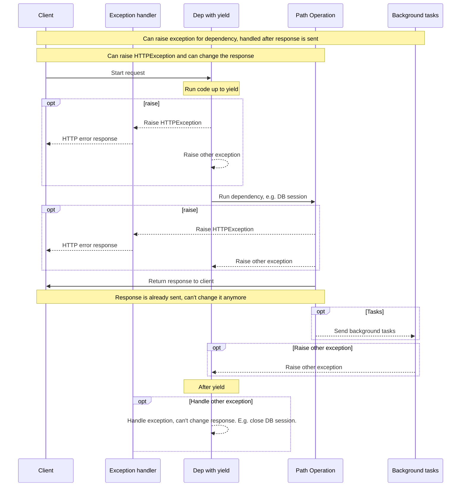

# 使用 yield 的依赖项

FastAPI 支持一些依赖项可以进行 <abbr title='有时被称作 "exit", "cleanup", "teardown", "close", "context managers", 等等'>完成后的额外步骤</abbr>.

要做到这一点，使用 `yield` 而不是 `return`，并在后面写额外的步骤。

!!! tip
    确保只使用一次 `yield` 。

!!! info
    为了做到这一点，您需要使用 **Python 3.7** 或以上版本, 或者使用 **Python 3.6** 并安装 "backports":

    ```
    pip install async-exit-stack async-generator
    ```

    这将安装 <a href="https://github.com/sorcio/async_exit_stack" class="external-link" target="_blank">async-exit-stack</a> 和 <a href="https://github.com/python-trio/async_generator" class="external-link" target="_blank">async-generator</a>.

!!! note "技术细节"
    任何可与下列装饰器一起有效使用的函数:

    * <a href="https://docs.python.org/3/library/contextlib.html#contextlib.contextmanager" class="external-link" target="_blank">`@contextlib.contextmanager`</a> 或
    * <a href="https://docs.python.org/3/library/contextlib.html#contextlib.asynccontextmanager" class="external-link" target="_blank">`@contextlib.asynccontextmanager`</a>

    都可以被用做有效的 **FastAPI** 依赖。

    事实上FastAPI 在内部使用这两个装饰器。

## 使用 `yield` 实现的数据库依赖

例如，您可以使用它创建一个数据库会话，并在完成后关闭它。

在发送响应之前，只有yield语句及之前的代码被执行:

```Python hl_lines="2-4"
{!../../../docs_src/dependencies/tutorial007.py!}
```

yield值是注入到 *路径操作* 和其他依赖项中的值:

```Python hl_lines="4"
{!../../../docs_src/dependencies/tutorial007.py!}
```

yield语句后面的代码在响应返回之后执行:

```Python hl_lines="5-6"
{!../../../docs_src/dependencies/tutorial007.py!}
```

!!! tip
    你可以使用 `async` 或普通函数。

    **FastAPI** 将对每个依赖项做正确的事情，就像对普通依赖项一样。

## 使用 `yield` 和 `try` 的依赖项

如果你在依赖中使用 `try` 块和 `yield` ，你会收到在使用依赖时抛出的任何异常。

例如，如果某些代码在中间的某个点，在另一个依赖或 *路径操作* 中，执行了数据库事务 "回滚" 或创建了任何其他错误，那么您将在依赖中收到异常。

所以，你可以用 `except SomeException` 在依赖中寻找特定的异常。

以同样的方式，您可以使用 `finally` 来确保退出步骤被执行，无论是否存在异常。

```Python hl_lines="3  5"
{!../../../docs_src/dependencies/tutorial007.py!}
```

## 使用 `yield` 的子依赖项

您可以有子依赖项和任意大小和形状的子依赖项的 "树" ，它们中的任何一个或所有都可以使用 `yield`。

**FastAPI** will make sure that the "exit code" in each dependency with `yield` is run in the correct order.
FastAPI**将确保每个 `yield` 依赖项中的 "退出代码" 以正确的顺序运行。

例如，`dependency_c` 可以依赖于 `dependency_b`, 并且 `dependency_b` 依赖于 `dependency_a`:

```Python hl_lines="4  12  20"
{!../../../docs_src/dependencies/tutorial008.py!}
```

它们都可以使用 `yield`。

在本例中 `dependency_c`, 要执行它的退出代码，需要 `dependency_b` (这里命名为 `dep_b`) 中的值仍然可用。

反过来， `dependency_b` 需要 `dependency_a` 的值 (这里称为 `dep_a`) 对于退出代码仍然可用。

```Python hl_lines="16-17  24-25"
{!../../../docs_src/dependencies/tutorial008.py!}
```

同样的，你也可以混合使用 `yield` 依赖项和 `return` 依赖项。

你可以有一个依赖项，它需要多个其他的 `yield` 依赖项，等等。

您可以根据你的需要，任意的组合依赖关系。

**FastAPI** 将确保一切都以正确的顺序运行。

!!! note "Technical Details"
    这些工作都多亏了 Python 的 <a href="https://docs.python.org/3/library/contextlib.html" class="external-link" target="_blank">Context Managers</a>.

    **FastAPI** 在内部使用它们来实现这一点。

## `yield` 依赖项和 `HTTPException`

您看到，您可以使用 `yield` 依赖项，并拥有捕获异常的 `try` 代码块。

在 `yield` 之后的退出代码中抛出一个 `HTTPException` 或类似的异常可能非常吸引人，但是 **它不会起作用** 。

`yield` 依赖项的退出代码是在[Exception Handlers](../handling-errors.md#install-custom-exception-handlers){.internal-link target=_blank} 之后执行。在你依赖项的退出代码(`yield` 之后)中抛出的异常并没有被捕获。

因此，如果你在 `yield` 之后抛出 `HTTPException` ，默认的 (或任何自定义的) 捕获 `HTTPException` 并返回 HTTP 400 响应的异常处理程序将不会在那里捕获异常。

这是为什么会允许在依赖项中设置任何东西(例如数据库会话)，例如，被后台任务使用。

后台任务在响应发送 *后* 运行。因为没有办法改变 *已经发送* 的响应， 所以你没有办法抛出 `HTTPException` 。

但如果后台任务创建了一个数据库错误，至少您可以在 `yield` 依赖项中回滚或干净地关闭会话，并可能记录错误或报告给远程跟踪系统。

If you have some code that you know could raise an exception, do the most normal/"Pythonic" thing and add a `try` block in that section of the code.
如果你知道某些代码可能会引发异常，做最普通的/"Pythonic" 的事情，并在该代码部分添加一个 `try` 代码块。

如果你有自定义异常，并且想在响应返回 *之前* 处理或可能修改该响应，甚至可能抛出一个 `HTTPException`，你可以创建一个[Custom Exception Handler](../handling-errors.md#install-custom-exception-handlers){.internal-link target=_blank}。

!!! tip
    You can still raise exceptions including `HTTPException` *before* the `yield`. But not after. 你仍然可以抛出异常，包括`HTTPException`， 但需要在 `yield` 之前而不知之后。

执行的顺序或多或少类似于此图。时间从上到下流动。而每一列都是交互或执行代码的一部分。



!!! info
    只有**一个响应**将发送给客户端。它可能是一个错误响应，也可能是来自 *路径操作* 的响应。

    在发送一个响应之后，就不能发送其他响应了。


!!! tip
    这个图显示了 `HTTPException`, 但是您也可以抛出任何其他异常，只要您为它创建了一个 [Custom Exception Handler](../handling-errors.md#install-custom-exception-handlers){.internal-link target=_blank}。该异常将由自定义异常处理程序处理，而不是依赖项退出代码。

    但是，如果您抛出的异常没有由异常处理程序处理，则依赖项的退出代码将处理该异常。

## 上下文管理器

### 什么是 "上下文管理器"

"上下文管理器" 是可以在 `with` 语句中使用的任何Python对象。

比如, <a href="https://docs.python.org/3/tutorial/inputoutput.html#reading-and-writing-files" class="external-link" target="_blank">您可以使用 `with` 来读取文件</a>:

```Python
with open("./somefile.txt") as f:
    contents = f.read()
    print(contents)
```

在底层, `open("./somefile.txt")` 创建了一个称为"上下文管理器"的对象。

当 `with` 代码块结束时, 它确保关闭文件，即使有异常。

当你创建一个 `yield` 依赖项, **FastAPI** 将在内部将其转换为上下文管理器，并将其与其他一些相关工具结合起来。

### 在 `yield` 依赖项中使用上下文管理器

!!! warning
    这或多或少是一个 "高级" 的想法。

    如果您刚开始使用 **FastAPI** ，您可能想跳过它。

在Python中，你可以通过<a href="https://docs.python.org/3/reference/datamodel.html#context-managers" class="external-link" target="_blank">创建一个有两个方法的类: `__enter__()` 和 `__exit__()`</a>创建一个上下文管理器。

你也可以在 **FastAPI** `yield` 依赖项中使用他们，通过在依赖项函数中使用 `with` 或 `async with` 语句:

```Python hl_lines="1-9  13"
{!../../../docs_src/dependencies/tutorial010.py!}
```

!!! tip
    另一种创建上下文管理器的方法是:

    * <a href="https://docs.python.org/3/library/contextlib.html#contextlib.contextmanager" class="external-link" target="_blank">`@contextlib.contextmanager`</a> or
    * <a href="https://docs.python.org/3/library/contextlib.html#contextlib.asynccontextmanager" class="external-link" target="_blank">`@contextlib.asynccontextmanager`</a>

    用它们来装饰一个含有单一 `yield` 的函数。

    这就是 **FastAPI** 在内部如何使用 `yield` 依赖项。

    但是您不必为FastAPI依赖项使用装饰器(您也不应该这样做)。

    FastAPI会在内部为你做这些事。
