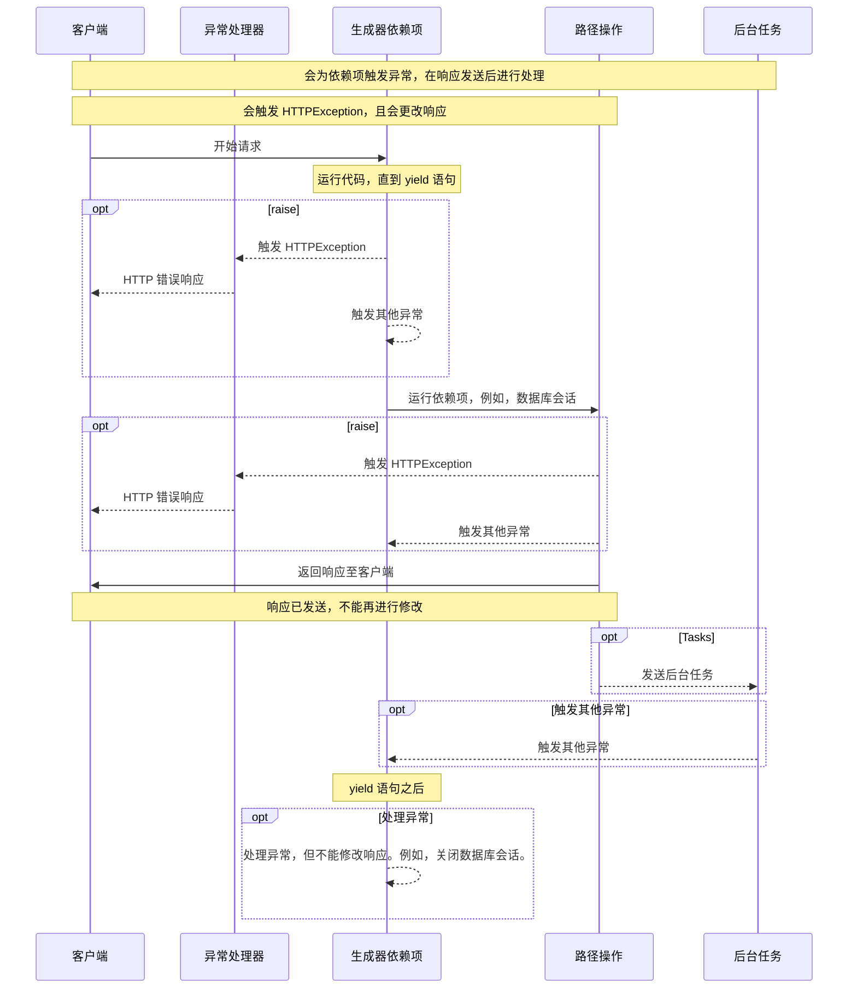

# 生成器依赖项

FastAPI 可以让依赖项执行<abbr title='也称为 "exit"、"cleanup"、"teardown"、"close"、"context managers" 等等'>完毕后</abbr>，再执行更多操作。

为了实现这种操作，要把依赖项中的 `return` 替换为 `yield` ，并在之后写上附加操作。

!!! tip "提示"

    注意，只能使用一次 `yield`。

!!! info "说明"

    为了能正常运行，需要使用 **Python 3.7** 或以上版本，如果使用 **Python 3.6**，则需要安装「backports」：
    
    ```
    pip install async-exit-stack async-generator
    ```
    
    此命令会安装 <a href="https://github.com/sorcio/async_exit_stack" class="external-link" target="_blank">async-exit-stack</a> 和 <a href="https://github.com/python-trio/async_generator" class="external-link" target="_blank">async-generator</a>。

!!! note "技术细节"

    任何兼容下面两个装饰器的函数都可以用作 **FastAPI** 的依赖项：
    
    * <a href="https://docs.python.org/3/library/contextlib.html#contextlib.contextmanager" class="external-link" target="_blank">`@contextlib.contextmanager`</a> 或 
    * <a href="https://docs.python.org/3/library/contextlib.html#contextlib.asynccontextmanager" class="external-link" target="_blank">`@contextlib.asynccontextmanager`</a>
    
    实际上，FastAPI 内部使用的就是这两个装饰器。

## 数据库生成器依赖项

开发人员可以使用**生成器依赖项**创建数据库会话，并在会话结束后关闭会话。

发送响应前，只会执行 `yield` 语句及该语句之前的代码：

```Python hl_lines="2-4"
{!../../../docs_src/dependencies/tutorial007.py!}
```

`yield` 生成的值会被注入到*路径操作*或其他依赖项：

```Python hl_lines="4"
{!../../../docs_src/dependencies/tutorial007.py!}
```

响应返回之后，再执行 `yield` 语句之后的代码：

```Python hl_lines="5-6"
{!../../../docs_src/dependencies/tutorial007.py!}
```

!!! tip "提示"

    生成器依赖项可以使用**异步**函数或普通函数。
    
    与普通依赖项一样，**FastAPI** 会正确处理每个生成器依赖项。

## 在依赖项中使用 `yield` 和 `try`

把依赖项的 `yield` 置于 `try`  代码块中，就可以接收到所有使用该依赖项时触发的异常。

假设执行过程中的某行代码（这行代码可能在*路径操作或其他依赖项中*）导致了数据库事务的「回滚」，或导致了任何其他错误，使用 `try`  就可以在当前依赖项中触发异常。

所以，可以使用 `except SomeException` 在依赖项中捕获的异常。

同理，可以使用 `finally` 以确保无论是否触发异常都执行退出步骤。

```Python hl_lines="3  5"
{!../../../docs_src/dependencies/tutorial007.py!}
```

## 子生成器依赖项

生成器依赖项支持子依赖项及任意层级的子依赖项「树」，且每个子依赖项都可以使用 `yield`。

**FastAPI** 将确保生成器依赖项中的「退出代码」以正确的顺序运行。

例如，`dependency_c` 依赖于 `dependency_b`，而 `dependency_b` 又依赖于 `dependency_a`：

```Python hl_lines="4  12  20"
{!../../../docs_src/dependencies/tutorial008.py!}
```

这三个依赖项都可以使用 `yield`。

本例中，运行 `dependency_c` 的退出代码时，需要使用 `dependency_b` （即 `dep_b`）的返回值。

并且，运行 `dependency_b` 的退出代码时，也要使用 `dependency_a`（即 `dep_a`）的返回值。

```Python hl_lines="16-17  24-25"
{!../../../docs_src/dependencies/tutorial008.py!}
```

**FastAPI** 支持混用生成器依赖项（`yield`） 和普通依赖项（`return`）。

还支持让单个依赖项调用多个生成器依赖项。

根据需要，开发人员可以使用任意形式的依赖项组合。

**FastAPI** 能够确保一切都以正确的顺序运行。

!!! note "技术细节"

    生成器依赖项的实现依托于 Python 的<a href="https://docs.python.org/3/library/contextlib.html" class="external-link" target="_blank">上下文管理器</a>。
    
    **FastAPI** 内部使用的就是 Python 的上下文管理器。

## 生成器依赖项和 `HTTPException`

上文中曾提及，依赖项可以使用 `yield` 及 `try` 代码块来处理异常。

您可能会想在依赖项的退出代码中，即 `yield` 之后，触发 `HTTPException` 或类似的异常，但实际上这种方式**行不通**。

生成器依赖项的退出代码是在[异常处理器](../handling-errors.md#install-custom-exception-handlers)之后执行的。也就是说，在依赖项退出代码（`yield` 语句之后）中触发的异常不会被捕获。

因此，如果在 yield 语句后触发 HTTPException，本应捕获 HTTPException 并返回 HTTP 400 响应的默认（或自定义）异常处理器将不会工作。

通过这种方式，**FastAPI** 允许依赖项中的任意对象（例如，数据库会话）都可以用于后台任务。

后台任务是在响应发送*后*执行的任务。所以，此时抛出  HTTPException  没有意义，因为没有办法改变*已发送*的响应。

但是，如果后台任务导致了数据库错误，至少可以在生成器依赖项中执行回滚操作，或干净地关闭会话，而且还可以生成错误日志，或向远程跟踪系统发送错误报告。

如果预计某些代码有可能触发异常，最「Pythonic」的做法就是在这段代码中添加 `try` 异常处理代码块。

如果需要在*返回响应*前处理自定义的异常，并且需要修改响应内容，或要触发 HTTPException，可以创建[自定义异常处理器](../handling-errors.md#install-custom-exception-handlers)。

!!! tip "提示"

    不要在 `yield` 语句之后，而是要在该语句之前触发 `HTTPException` 等异常。

代码执行的顺序类似于下图。时间流为从上到下，并且，每列的内容及代码执行时都会产生交互。



!!! info "说明"

    FastAPI 只会向客户端发送**一个响应**。这个响应可能是错误响应，也可能是来自*路径操作*的响应。
    
    发送完这个响应后，不能再发送其他响应。


!!! tip "提示"

    上图显示的是 `HTTPException`, 但是也可以触发创建了[自定义异常处理器](../handling-errors.md#install-custom-exception-handlers){.internal-link target=_blank}的任何其他异常。该异常不是由依赖项的退出代码处理，而是由自定义异常处理器处理。
    
    但是，如果触发的不是由异常处理器处理的异常，则依赖项的退出代码将处理该异常。

## 上下文管理器

### 什么是「上下文管理器」

「上下文管理器」是指可以在 `with` 语句中使用的任意 Python 对象。

比如，<a href="https://docs.python.org/3/tutorial/inputoutput.html#reading-and-writing-files" class="external-link" target="_blank">使用 `with` 读取文件</a>：

```Python
with open("./somefile.txt") as f:
    contents = f.read()
    print(contents)
```

在底层，`open("./somefile.txt")` 创建了一个「上下文管理器」对象。

`with` 代码块运行完毕时，即使触发了异常，也一定会关闭文件。

创建生成器依赖项，**FastAPI** 会在内部把该依赖项转换为上下文管理器，并将之与其他相关工具组合在一起。

### 在生成器依赖项中使用上下文管理器

!!! warning "警告"

    下述内容有点「难度」。
    
    如果您刚开始使用 **FastAPI**，可以先跳过这部分内容。

在 Python 中可以通过<a href="https://docs.python.org/3/reference/datamodel.html#context-managers" class="external-link" target="_blank">创建含有 `__enter__()` 和 `__exit__() 这两个方法的类`</a>来创建上下文管理器。

当然，也可以在生成器依赖项中，通过 `with` 或 `async with` 语句调用包含这两个方法的对象来使用上下文管理器：

```Python hl_lines="1-9  13"
{!../../../docs_src/dependencies/tutorial010.py!}
```

!!! tip "提示"

    创建上下文管理器还可以使用另一种方法：
    
    * <a href="https://docs.python.org/3/library/contextlib.html#contextlib.contextmanager" class="external-link" target="_blank">`@contextlib.contextmanager`</a> 或
    * <a href="https://docs.python.org/3/library/contextlib.html#contextlib.asynccontextmanager" class="external-link" target="_blank">`@contextlib.asynccontextmanager`</a>
    
    用这两个上下文管理器装饰含有单个 `yield` 的函数。
    
    这是 **FastAPI** 内部的生成器依赖项使用方式。
    
    但是，开发人员不必为 FastAPI 依赖项使用装饰器，我们不提倡这种操作。
    
    FastAPI 会在内部进行处理。