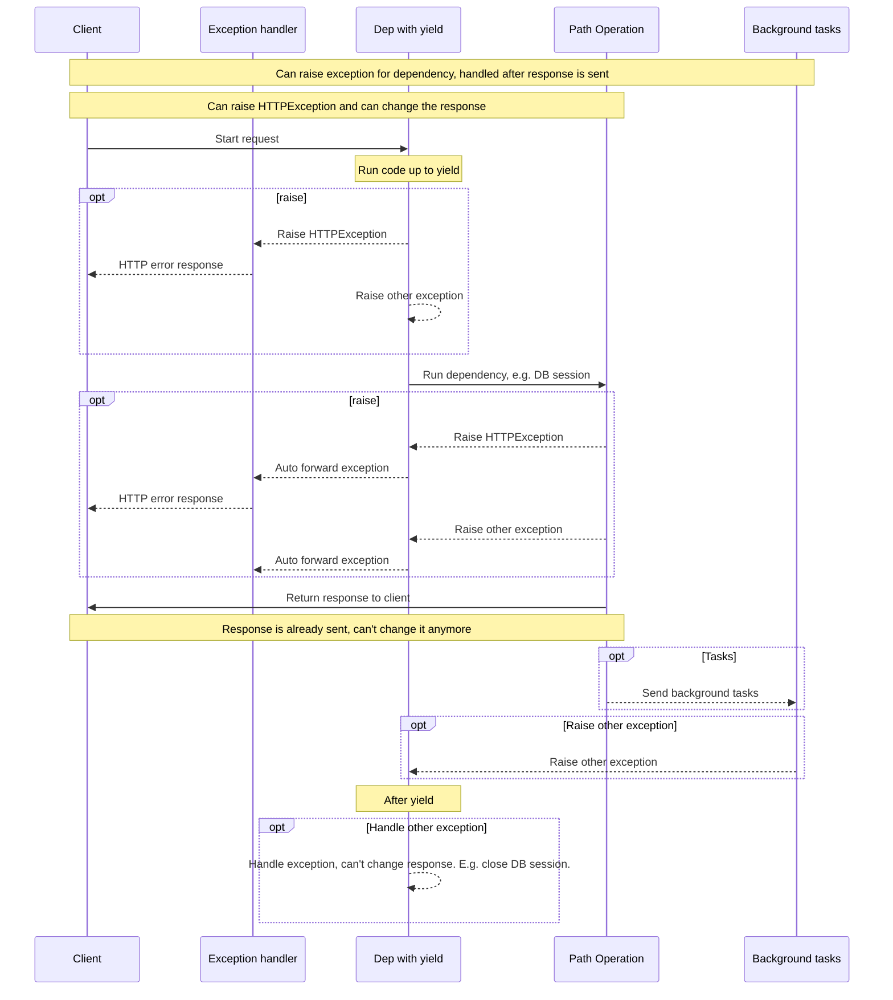

# 使用yield的依赖项

FastAPI支持执行某些额外步骤的依赖项，在完成之后进行清理操作。 

为此，请使用`yield`而不是`return`，然后在其后编写额外的步骤。

!!! 提示
    确保只使用一次`yield`。

!!! 注意 "技术细节"

    任何一个可以与以下内容一起使用的函数：

    * <a href="https://docs.python.org/3/library/contextlib.html#contextlib.contextmanager" class="external-link" target="_blank">`@contextlib.contextmanager`</a> 或者 
    * <a href="https://docs.python.org/3/library/contextlib.html#contextlib.asynccontextmanager" class="external-link" target="_blank">`@contextlib.asynccontextmanager`</a>

    都可以作为 **FastAPI** 的依赖项。

    实际上，FastAPI内部使用这两个装饰器。
    
    
 ## 使用`yield`的数据库依赖项

例如，您可以使用这种方式创建数据库会话，并在完成后关闭它。

仅在`yield`语句之前及其包括之前的代码会在发送响应之前执行：

```Python hl_lines="2-4"
{!../../../docs_src/dependencies/tutorial007.py!}
```

生成的值是注入到*路径操作*和其他依赖项中的值：

```Python hl_lines="4"
{!../../../docs_src/dependencies/tutorial007.py!}
```

紧随`yield`语句后的代码在响应已发送后执行：

```Python hl_lines="5-6"
{!../../../docs_src/dependencies/tutorial007.py!}
```

!!! 提示

    您可以使用`async`或正常函数。

    **FastAPI** 对于每个函数都会采取正确的处理方式，就如同处理通常的依赖项一样。

## 具有`yield`和`try`的依赖项

如果在具有`yield`的依赖项中使用`try`块，则会接收到在使用该依赖项时引发的任何异常。

例如，如果在某个中间点上的其他依赖项或*路径操作*中的某些代码回滚了数据库事务或创建了任何其他错误，您将在依赖项中收到该异常。

因此，您可以在依赖项中查找特定的异常，使用`except SomeException`。

同样，您可以使用`finally`确保执行退出步骤，无论是否发生异常。

```Python hl_lines="3  5"
{!../../../docs_src/dependencies/tutorial007.py!}
```
## 使用`yield`的子依赖项

您可以有任何大小和形状的子依赖项和子依赖项"树"，并且所有或部分都可以使用`yield`。

**FastAPI** 将确保使用`yield`的每个依赖项中的“退出代码”按正确的顺序运行。

例如，`dependency_c` 可以对 `dependency_b` 有依赖，而且 `dependency_b` 对 `dependency_a` 有依赖：

=== "Python 3.9+"

    ```Python hl_lines="6  14  22"
    {!> ../../../docs_src/dependencies/tutorial008_an_py39.py!}
    ```

=== "Python 3.6+"

    ```Python hl_lines="5  13  21"
    {!> ../../../docs_src/dependencies/tutorial008_an.py!}
    ```

=== "Python 3.6+ non-Annotated"

    !!! tip
        如果可能，请尽量使用“ Annotated”版本。

    ```Python hl_lines="4  12  20"
    {!> ../../../docs_src/dependencies/tutorial008.py!}
    ```

并且它们都可以使用`yield`。

在这种情况下，dependency_c 执行其退出代码所需的前提是需要已经有 dependency_b 的值（此处命名为 dep_b）可用。

反过来，dependency_b 执行其退出代码所需的前提是需要已经有 dependency_a 的值（此处命名为 dep_a）可用。

=== "Python 3.9+"

    ```Python hl_lines="18-19  26-27"
    {!> ../../../docs_src/dependencies/tutorial008_an_py39.py!}
    ```

=== "Python 3.6+"

    ```Python hl_lines="17-18  25-26"
    {!> ../../../docs_src/dependencies/tutorial008_an.py!}
    ```

=== "Python 3.6+ non-Annotated"
    
    !!! tip
        如果可能，请尽量使用“ Annotated”版本。

    ```Python hl_lines="16-17  24-25"
    {!> ../../../docs_src/dependencies/tutorial008.py!}
    ```

同样，您可以具有依赖于 `yield` 和 `return` 混合的依赖关系。

您甚至可以具有单个依赖项，其中需要使用`yield`的多个其他依赖项等等。

您可以拥有任何想要的依赖组合。

**FastAPI** 将确保按正确的顺序运行所有内容。

!!! note "技术细节"

    这是由 Python 的<a href="https://docs.python.org/3/library/contextlib.html" class="external-link" target="_blank">上下文管理器</a>完成的。

    **FastAPI** 在内部使用它们来实现这一点。
    

## 使用 `yield` 和 `HTTPException` 的依赖项

您看到可以使用带有 `yield` 的依赖项，并且具有捕获异常的 `try` 块。

在 `yield` 后抛出 `HTTPException` 或类似的异常是很诱人的，但是**这不起作用**。

具有 `yield` 的依赖项中的退出代码在发送响应后执行，因此 [异常处理程序](../handling-errors.md#install-custom-exception-handlers){.internal-link target=_blank}已经运行。没有任何东西在 `yield` 后捕获依赖项中引发的异常（退出代码）。

因此，如果在 `yield` 后引发 `HTTPException`，则默认的（或任何自定义的）异常处理程序无法捕获该异常并返回 HTTP 400 响应。

这就允许依赖项中设置的任何内容（例如 DB 会话）被后台任务使用。

后台任务在响应发送后运行。因此，没有办法引发 `HTTPException`，因为甚至没有办法更改已经发送的响应。

但是，如果后台任务创建了 DB 错误，则至少可以在带有 `yield` 的依赖项中回滚或清理关闭会话，并可能记录错误或将其报告给远程跟踪系统。

如果您有一些可能引发异常的代码，请在该代码段中添加一个 `try` 块，这是最正常/“ Pythonic” 的做法。

如果您有自定义异常要在返回响应之前处理并可能修改响应和甚至引发 `HTTPException`，请创建[自定义异常处理程序](../handling-errors.md#install-custom-exception-handlers){.internal-link target=_blank}。

!!! tip

    仍然可以在 `yield` 前引发包括 `HTTPException` 在内的异常，但是之后不行。

执行的顺序大致如下图所示。时间从上到下流动。每列都是相互交互或执行代码的其中一部分。



!!! info
    只会向客户端发送**一次响应**，可能是一个错误响应之一，也可能是来自*路径操作*的响应。

    发送其中一个响应后，不能再发送其他响应。

!!! tip
    此图示展示了`HTTPException`，但您也可以提出任何其他异常，只要您创建了一个[自定义异常处理程序](../handling-errors.md#install-custom-exception-handlers){.internal-link target=_blank}。

    如果抛出任何异常，将将其传递给依赖项，包括`HTTPException`，然后**再次**传递给异常处理程序。如果没有该异常的异常处理程序，则由内置的`ServerErrorMiddleware`处理，返回500个HTTP状态码，以让客户端知道服务器出错了。

## 上下文管理器

### 什么是“上下文管理器”

“上下文管理器”是您可以在`with`语句中使用的任何Python对象。

例如，<a href="https://docs.python.org/zh-cn/3/tutorial/inputoutput.html#reading-and-writing-files" class="external-link" target="_blank">您可以使用`with`读取文件</a>：

```Python
with open("./somefile.txt") as f:
    contents = f.read()
    print(contents)
```

在下面，`open（"./somefile.txt"）`创建了一个称为“上下文管理器”的对象。

当`with`块完成时，它会确保关闭文件，即使有异常。

当您使用`yield`创建依赖项时，**FastAPI**将在内部将其转换为上下文管理器，并将其与一些其他相关工具结合使用。

### 在具有`yield`的依赖项中使用上下文管理器

!!! warning
    这是一个更为“高级”的想法。

    如果您刚开始使用**FastAPI**，您可能希望暂时跳过它。

在Python中，您可以通过<a href="https://docs.python.org/zh-cn/3/reference/datamodel.html#context-managers" class="external-link" target="_blank">创建具有两个方法的类：`__enter__()`和`__exit__()`</a>来创建上下文管理器。

您也可以在依赖函数中使用`with`或`async with`语句，以使用上下文管理器：

```Python hl_lines="1-9  13"
{!../../../docs_src/dependencies/tutorial010.py!}
```

!!! tip
    另一种创建上下文管理器的方法是：

    * <a href="https://docs.python.org/zh-cn/3/library/contextlib.html#contextlib.contextmanager" class="external-link" target="_blank">`@contextlib.contextmanager`</a>或者
    * <a href="https://docs.python.org/zh-cn/3/library/contextlib.html#contextlib.asynccontextmanager" class="external-link" target="_blank">`@contextlib.asynccontextmanager`</a>

    用于装饰具有单个`yield`的函数。

    这就是**FastAPI**在具有`yield`的依赖项中的内部使用方法。

    但是您不必使用装饰器进行FastAPI依赖项（您也不应该）。

    **FastAPI**将为您在内部执行此操作。
