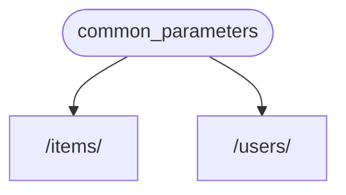

# 依赖文件 - 初步

**FastAPI** 有一个非常强大而直观的 **<abbr title="也可称为元件、资源、提供者、服务、注入文件">依赖文件注入</abbr>** 系统。

它被设计成非常容易使用，且开发者可以轻易将其他元件与 **FastAPI**进行整合。

## 什么是“依赖文件注入“

**"依赖文件注入"** 表示在编程过程中，您的代码（以此处的*路径操作函数*为例）得以声明其运行时所需要以及使用的物件：“依赖文件”。

然后，那个系统 (以 **FastAPI**为例) 将会着手于为您的代码提供需要的依赖文件 （"注入" 依赖文件）。

这将在以下情况非常有用:

* 拥有共享逻辑（重复使用同一逻辑代码）。
* 共享数据库连接。
* 执行安全、验证、角色需求等。
* 其他...

不仅如此，**FastAPI**会最小化代码的重复使用。

## 第一步

让我们来看一个非常简单的例子，其过于简单而暂时不是很有用，但是这样我们才能着重于**依赖文件注入**系统如何工作的。

### 创建一个依赖文件，或“可依赖文件“

首先让我们着重于依赖文件

它就像是一个能读取所有函数的*操作路径函数*：

```Python hl_lines="8-9"
{!../../../docs_src/dependencies/tutorial001.py!}
```

就是这样。

**两行代码**。

它就像是一个能读取所有函数的*操作路径函数*

您可以把它想象成一个没有“装饰器“的*操作路径函数* (没有`@app.get("/some-path")`).

并且可以返还一切你想要的结果。

在这个例子里，这个依赖文件需要：

* 一个自选的`str`查询参数`q`
* 一个自选的`int`查询参数`skip`，默认为`0`
* 一个自选的`int`查询参数`limit`，默认为`100`

然后它将返还一个包括以上数值的`dict`

### 导入`依赖文件`

```Python hl_lines="3"
{!../../../docs_src/dependencies/tutorial001.py!}
```

### 在“依赖文件“中声明其依赖性

以使用`躯干`、`请求`的方式使用您的*操作路径文件*，在一个新的参数中使用`依赖文件`
```Python hl_lines="13  18"
{!../../../docs_src/dependencies/tutorial001.py!}
```

即使您在函数参数中使用`依赖文件`的方法与您使用`躯干`、`请求`等方法一致，但`依赖文件`的运行方式略有不同

您只赋予`依赖文件`一个单独的参数

该参数需要与一个函数类似

而且那个函数读取参数的方式与*操作路径函数*一致

!!! 提示：
    您将会在下一章节看到函数以外的其它“文件”被用作依赖文件。

每当一个新的请求出现，FastAPI将会处理以下任务：

* 以正确的参数来调用你的依赖函数
* 得出您的函数的结果
* 将结果分配到您的*路径操作函数*的参数中



这样一来每当您编写一次共享代码后，**FastAPI**将会负责为您的*路径操作*进行调用操作。

!!! 注意
    请注意，您不必创建一个特殊的类别并将其传递给**FastAPI**以“注册”它或任何类似的东西。
    

您只需要将代码传递给 `依赖文件` ， **FastAPI** 知道剩下的该怎么做。

##`异步`与否

鉴于依赖文件也将会被**FastAPI**调用（与您的*操作路径函数*一致），相同的规则同样适用于定义您的函数。

您可以使用`async def`或者普通的`def`。

而且您可以使用一个内置`async def`的普通`def`*路径操作函数*，或内置`def`依赖文件的`async def`*路径操作函数*等来声明依赖文件。

这些不重要，**FastAPI**知道该怎么做。

!!! 笔记
    如果你不知道该怎么做，请参考 [Async: *"In a hurry?"*](../../async.md){.internal-link target=_blank} 文档中关于`async`与`await`的区域

## 与OpenAPI结合

您所有的依赖项（和子依赖项）的所有请求声明、验证和要求都将集成在同一个OpenAPI模式中。

因此，互动文档也将会包含所有来自那些依赖文件的信息：


## 简单使用

如果您仔细观察，*路径操作函数*被声明在每当*路径*和*操作*匹配时使用, 然后**FastAPI**负责调用具有正确参数的函数，从请求中提取数据。

事实上，几乎所有的网络框架都以这种方式运行。

您将永远不会直接调用那些函数，它们将由您的框架进行调用。（以**FastAPI**为例）

随着依赖注入系统，您还可以让**FastAPI**知道您的*路径操作函数*还“依赖”于应该在*路径操作函数*之前执行的其他内容，然后**FastAPI**将会负责执行函数并“注入“结果。

与“依赖文件注入”用法一致的其它常用术语为：

* 资源
* 来源
* 服务
* 注入文件
* 元件

## **FastAPI** 插件

依赖文件注入系统可用于制作集成文件与“插件”，但事实上我们**没有必要去制作“插件”**，因为通过使用“依赖项”，我们可以声明无限数量的集成文件和交互文件，它们可用于您的*路径操作功能*

而且依赖项可以以非常简单、直观的方式创造出来，您只需要导入需要的Python组件，并用几行代码将它们与您的API函数集成。

您将在接下来的章节中看到这样相关联的和NoSQL数据库与安全问题等。

## **FastAPI** 的适用性

依赖注入系统的简单性使得**FastAPI**与以下内容兼容：

* 所有相关数据库
* NoSQL数据库
* 外部组件
* 外部API
* 认证和授权系统
* API用量情况检验
* 回应数据注入系统
* 其它

## 简单且强大

虽然分层依赖注入系统定义和使用非常简单，但它仍然非常强大。

您可以定义依赖项，而这些依赖项又可以定义依赖项本身。

最后，一个分层的依赖关系树建成了，依赖注入系统负责为您（及其子依赖）解决所有这些依赖关系，并在每一步提供（注入）结果。

例如，您有四个API端点（*操作路径*）

* `/items/public/`
* `/items/private/`
* `/users/{user_id}/activate`
* `/items/pro/`

那么您可以只使用依赖项和子依赖项为每个人添加不同的权限要求:


## 与**OpenAPI**结合

所有这些依赖在声明它们的需求的同时，还会向你的*路径操作*添加参数、验证等。

**FastAPI**将负责将其全部添加到OpenAPI模式中，这样它们便能在交互式文档系统中显示。
