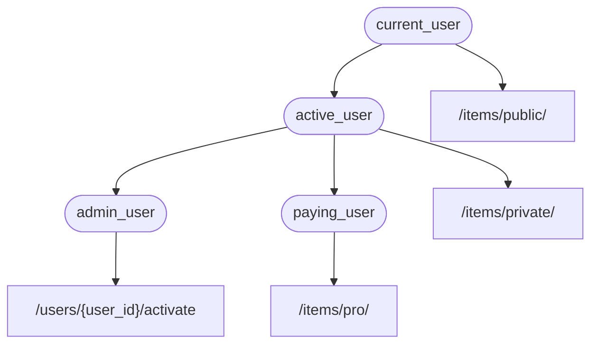

# 依赖项 { #dependencies }

**FastAPI** 提供了简单直观但功能强大的**<dfn title="也称为：组件、资源、提供者、服务、可注入项">依赖注入</dfn>**系统。

它被设计得非常易用，能让任何开发者都能轻松把其他组件与 **FastAPI** 集成。

## 什么是「依赖注入」 { #what-is-dependency-injection }

在编程中，**「依赖注入」**指的是，你的代码（本文中为*路径操作函数*）声明其运行所需并要使用的东西：“依赖”。

然后，由该系统（本文中为 **FastAPI**）负责执行所有必要的逻辑，为你的代码提供这些所需的依赖（“注入”依赖）。

当你需要以下内容时，这非常有用：

* 共享业务逻辑（同一段代码逻辑反复复用）
* 共享数据库连接
* 实施安全、认证、角色权限等要求
* 以及更多其他内容...

同时尽量减少代码重复。

## 第一步 { #first-steps }

先来看一个非常简单的例子。它现在简单到几乎没什么用。

但这样我们就可以专注于**依赖注入**系统是如何工作的。

### 创建依赖项，或“dependable” { #create-a-dependency-or-dependable }

首先关注依赖项。

它只是一个函数，且可以接收与*路径操作函数*相同的所有参数：

{* ../../docs_src/dependencies/tutorial001_an_py310.py hl[8:9] *}

大功告成。

**2 行**。

它的形式和结构与所有*路径操作函数*相同。

你可以把它当作没有“装饰器”（没有 `@app.get("/some-path")`）的*路径操作函数*。

而且它可以返回任何你想要的内容。

本例中的依赖项预期接收：

* 类型为 `str` 的可选查询参数 `q`
* 类型为 `int` 的可选查询参数 `skip`，默认值 `0`
* 类型为 `int` 的可选查询参数 `limit`，默认值 `100`

然后它只需返回一个包含这些值的 `dict`。

/// info | 信息

FastAPI 在 0.95.0 版本中新增了对 `Annotated` 的支持（并开始推荐使用）。

如果你的版本较旧，尝试使用 `Annotated` 会报错。

在使用 `Annotated` 之前，请确保[升级 FastAPI 版本](../../deployment/versions.md#upgrading-the-fastapi-versions){.internal-link target=_blank}到至少 0.95.1。

///

### 导入 `Depends` { #import-depends }

{* ../../docs_src/dependencies/tutorial001_an_py310.py hl[3] *}

### 在“dependant”中声明依赖项 { #declare-the-dependency-in-the-dependant }

与在*路径操作函数*的参数中使用 `Body`、`Query` 等相同，给参数使用 `Depends` 来声明一个新的依赖项：

{* ../../docs_src/dependencies/tutorial001_an_py310.py hl[13,18] *}

虽然你在函数参数中使用 `Depends` 的方式与 `Body`、`Query` 等相同，但 `Depends` 的工作方式略有不同。

这里只能给 `Depends` 传入一个参数。

这个参数必须是类似函数的可调用对象。

你不需要直接调用它（不要在末尾加括号），只需将其作为参数传给 `Depends()`。

该函数接收的参数与*路径操作函数*的参数相同。

/// tip | 提示

下一章会介绍除了函数之外，还有哪些“东西”可以用作依赖项。

///

接收到新的请求时，**FastAPI** 会负责：

* 用正确的参数调用你的依赖项（“dependable”）函数
* 获取函数返回的结果
* 将该结果赋值给你的*路径操作函数*中的参数


这样，你只需编写一次共享代码，**FastAPI** 会在你的*路径操作*中为你调用它。

/// check | 检查

注意，无需创建专门的类并传给 **FastAPI** 去“注册”之类的操作。

只要把它传给 `Depends`，**FastAPI** 就知道该怎么做了。

///

## 共享 `Annotated` 依赖项 { #share-annotated-dependencies }

在上面的示例中，你会发现这里有一点点**代码重复**。

当你需要使用 `common_parameters()` 这个依赖时，你必须写出完整的带类型注解和 `Depends()` 的参数：

```Python
commons: Annotated[dict, Depends(common_parameters)]
```

但因为我们使用了 `Annotated`，可以把这个 `Annotated` 的值存到一个变量里，在多个地方复用：

{* ../../docs_src/dependencies/tutorial001_02_an_py310.py hl[12,16,21] *}

/// tip | 提示

这只是标准的 Python，叫做“类型别名”，并不是 **FastAPI** 特有的。

但因为 **FastAPI** 基于 Python 标准（包括 `Annotated`），你就可以在代码里使用这个技巧。😎

///

这些依赖会照常工作，而**最棒的是**，**类型信息会被保留**，这意味着你的编辑器依然能提供**自动补全**、**行内报错**等。同样适用于 `mypy` 等其他工具。

当你在**大型代码库**中，在**很多*路径操作***里反复使用**相同的依赖**时，这会特别有用。

## 要不要使用 `async`？ { #to-async-or-not-to-async }

由于依赖项也会由 **FastAPI** 调用（与*路径操作函数*相同），因此定义函数时同样的规则也适用。

你可以使用 `async def` 或普通的 `def`。

你可以在普通的 `def` *路径操作函数*中声明 `async def` 的依赖项；也可以在异步的 `async def` *路径操作函数*中声明普通的 `def` 依赖项，等等。

都没关系，**FastAPI** 知道该怎么处理。

/// note | 注意

如果不了解异步，请参阅文档中关于 `async` 和 `await` 的章节：[异步：*“着急了？”*](../../async.md#in-a-hurry){.internal-link target=_blank}。

///

## 与 OpenAPI 集成 { #integrated-with-openapi }

依赖项及子依赖项中声明的所有请求、验证和需求都会集成到同一个 OpenAPI 模式中。

因此，交互式文档中也会包含这些依赖项的所有信息：


## 简单用法 { #simple-usage }

观察一下就会发现，只要*路径*和*操作*匹配，就会使用声明的*路径操作函数*。随后，**FastAPI** 会用正确的参数调用该函数，并从请求中提取数据。

事实上，所有（或大多数）Web 框架的工作方式都是这样的。

你从不会直接调用这些函数。它们由你的框架（此处为 **FastAPI**）调用。

通过依赖注入系统，你还可以告诉 **FastAPI**，你的*路径操作函数*还“依赖”某些应在*路径操作函数*之前执行的内容，**FastAPI** 会负责执行它并“注入”结果。

“依赖注入”的其他常见术语包括：

* 资源（resources）
* 提供方（providers）
* 服务（services）
* 可注入（injectables）
* 组件（components）

## **FastAPI** 插件 { #fastapi-plug-ins }

可以使用**依赖注入**系统构建集成和“插件”。但实际上，根本**不需要创建“插件”**，因为通过依赖项可以声明无限多的集成与交互，使其可用于*路径操作函数*。

依赖项可以用非常简单直观的方式创建，你只需导入所需的 Python 包，用*字面意义上的*几行代码就能把它们与你的 API 函数集成起来。

在接下来的章节中，你会看到关于关系型数据库、NoSQL 数据库、安全等方面的示例。

## **FastAPI** 兼容性 { #fastapi-compatibility }

依赖注入系统的简洁让 **FastAPI** 能与以下内容兼容：

* 各类关系型数据库
* NoSQL 数据库
* 外部包
* 外部 API
* 认证与授权系统
* API 使用监控系统
* 响应数据注入系统
* 等等...

## 简单而强大 { #simple-and-powerful }

虽然**层级式依赖注入系统**的定义与使用非常简单，但它依然非常强大。

你可以定义依赖其他依赖项的依赖项。

最终会构建出一个依赖项的层级树，**依赖注入**系统会处理所有这些依赖（及其子依赖），并在每一步提供（注入）相应的结果。

例如，假设你有 4 个 API 路径操作（*端点*）：

* `/items/public/`
* `/items/private/`
* `/users/{user_id}/activate`
* `/items/pro/`

你可以仅通过依赖项及其子依赖项为它们添加不同的权限要求：



## 与 **OpenAPI** 集成 { #integrated-with-openapi_1 }

在声明需求的同时，所有这些依赖项也会为你的*路径操作*添加参数、验证等内容。

**FastAPI** 会负责把这些全部添加到 OpenAPI 模式中，以便它们显示在交互式文档系统里。
