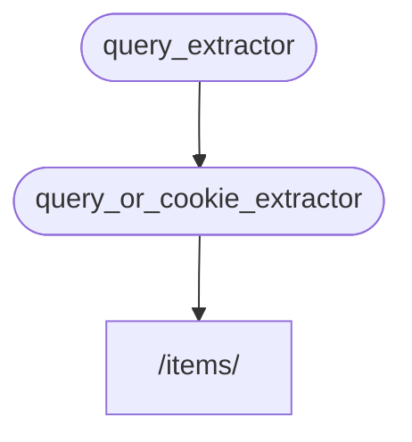

# 子依赖项 { #sub-dependencies }

你可以创建包含**子依赖项**的依赖项。

它们可以按需嵌套到任意**深度**。

**FastAPI** 会负责解析它们。

## 第一层依赖项「dependable」 { #first-dependency-dependable }

你可以像这样创建第一个依赖项（「dependable」）：

{* ../../docs_src/dependencies/tutorial005_an_py310.py hl[8:9] *}

它声明了一个可选查询参数 `q`，类型为 `str`，然后直接返回它。

这很简单（不是很有用），但能帮助我们专注于子依赖项是如何工作的。

## 第二层依赖项：「dependable」与「dependant」 { #second-dependency-dependable-and-dependant }

然后你可以创建另一个依赖项函数（一个「dependable」），它同时声明了它自己的依赖项（所以它也是一个「dependant」）：

{* ../../docs_src/dependencies/tutorial005_an_py310.py hl[13] *}

我们来重点看看声明的参数：

* 尽管这个函数本身是一个依赖项（「dependable」），它也声明了另一个依赖项（它会「依赖」于其他东西）。
    * 它依赖 `query_extractor`，并将它返回的值赋给参数 `q`。
* 它还声明了一个可选的 `last_query` cookie，类型为 `str`。
    * 如果用户没有提供任何查询参数 `q`，我们就使用上一次使用过的查询，并且我们之前把它保存在 cookie 里了。

## 使用依赖项 { #use-the-dependency }

然后我们可以这样使用该依赖项：

{* ../../docs_src/dependencies/tutorial005_an_py310.py hl[23] *}

/// info | 信息

注意，我们在*路径操作函数*中只声明了一个依赖项，即 `query_or_cookie_extractor`。

但 **FastAPI** 知道它必须先解析 `query_extractor`，并在调用 `query_or_cookie_extractor` 时把结果传给它。

///



## 多次使用同一个依赖项 { #using-the-same-dependency-multiple-times }

如果你的某个依赖项在同一个*路径操作*中被声明了多次，例如，多个依赖项有一个共同的子依赖项，**FastAPI** 会知道每个请求只调用一次该子依赖项。

并且它会将返回值保存在一个 <abbr title="一个实用程序/系统来存储计算/生成的值，以便重用它们，而不是再次计算它们。">"cache"</abbr> 中，并把它传递给该请求中所有需要它的「dependants」，而不是为同一个请求多次调用同一个依赖项。

在更高级的场景中，如果你知道你需要在同一个请求中的每一步（可能多次）都调用该依赖项，而不是使用「cached」值，你可以在使用 `Depends` 时设置参数 `use_cache=False`：

//// tab | Python 3.9+

```Python hl_lines="1"
async def needy_dependency(fresh_value: Annotated[str, Depends(get_value, use_cache=False)]):
    return {"fresh_value": fresh_value}
```

////

//// tab | Python 3.9+ 非 Annotated

/// tip | 提示

如果可能，优先使用 `Annotated` 版本。

///

```Python hl_lines="1"
async def needy_dependency(fresh_value: str = Depends(get_value, use_cache=False)):
    return {"fresh_value": fresh_value}
```

////

## 小结 { #recap }

除了这里使用的各种花哨说法外，**依赖注入**系统其实相当简单。

它就是一些看起来和*路径操作函数*一样的函数。

但它仍然非常强大，并允许你声明任意深度嵌套的依赖「图」（树）。

/// tip | 提示

对于这些简单的例子来说，这一切看起来可能没那么有用。

但你会在关于**安全**的章节中看到它有多么有用。

你也会看到它能为你节省多少代码。

///
