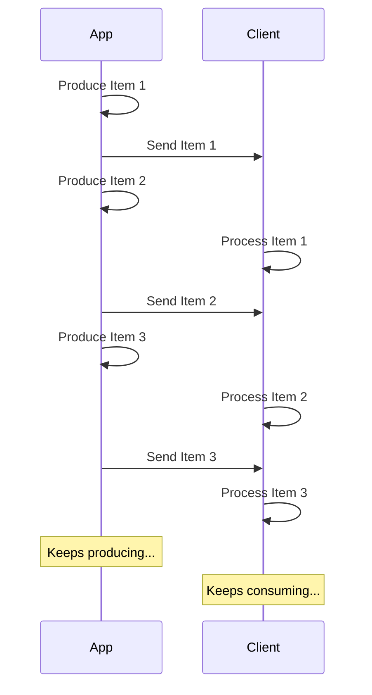

# 流式传输 JSON Lines { #stream-json-lines }

当你想以“流”的方式发送一系列数据时，可以使用 JSON Lines。

/// info | 信息

新增于 FastAPI 0.134.0。

///

## 什么是流 { #what-is-a-stream }

“流式传输”数据意味着你的应用会在整段数据全部准备好之前，就开始把每个数据项发送给客户端。

也就是说，它会先发送第一个数据项，客户端会接收并开始处理它，而此时你的应用可能还在生成下一个数据项。



它甚至可以是一个无限流，你可以一直持续发送数据。

## JSON Lines { #json-lines }

在这些场景中，常见的做法是发送 “JSON Lines”，这是一种每行发送一个 JSON 对象的格式。

响应的内容类型是 `application/jsonl`（而不是 `application/json`），响应体类似这样：

```json
{"name": "Plumbus", "description": "A multi-purpose household device."}
{"name": "Portal Gun", "description": "A portal opening device."}
{"name": "Meeseeks Box", "description": "A box that summons a Meeseeks."}
```

它与 JSON 数组（相当于 Python 的 list）非常相似，但不是用 `[]` 包裹、并在各项之间使用 `,` 分隔，而是每行一个 JSON 对象，彼此以换行符分隔。

/// info | 信息

关键在于你的应用可以逐行生成数据，而客户端在消费前面的行。

///

/// note | 技术细节

由于每个 JSON 对象将以换行分隔，它们的内容中不能包含字面量换行符，但可以包含转义换行符（`\n`），这属于 JSON 标准的一部分。

不过通常你无需操心，这些都会自动完成，继续阅读即可。🤓

///

## 使用场景 { #use-cases }

你可以用它来从 AI LLM 服务、日志或遥测中流式传输数据，或其他可以用 JSON 项目来结构化的数据。

/// tip | 提示

如果你想流式传输二进制数据，例如视频或音频，请查看进阶指南：[流式传输数据](../advanced/stream-data.md)。

///

## 使用 FastAPI 流式传输 JSON Lines { #stream-json-lines-with-fastapi }

要在 FastAPI 中流式传输 JSON Lines，可以在路径操作函数中不用 `return`，而是用 `yield` 逐个产生每个数据项。

{* ../../docs_src/stream_json_lines/tutorial001_py310.py ln[1:24] hl[24] *}

如果你要返回的每个 JSON 项是类型 `Item`（一个 Pydantic 模型），并且这是一个异步函数，你可以将返回类型声明为 `AsyncIterable[Item]`：

{* ../../docs_src/stream_json_lines/tutorial001_py310.py ln[1:24] hl[9:11,22] *}

如果你声明了返回类型，FastAPI 会用它来验证数据、在 OpenAPI 中生成文档、进行过滤，并使用 Pydantic 进行序列化。

/// tip | 提示

由于 Pydantic 会在 Rust 侧进行序列化，如果你声明了返回类型，将获得更高的性能。

///

### 非异步的*路径操作函数* { #non-async-path-operation-functions }

你也可以使用常规的 `def` 函数（不带 `async`），并以同样的方式使用 `yield`。

FastAPI 会确保其正确运行，不会阻塞事件循环。

因为这个函数不是异步的，合适的返回类型是 `Iterable[Item]`：

{* ../../docs_src/stream_json_lines/tutorial001_py310.py ln[27:30] hl[28] *}

### 无返回类型 { #no-return-type }

你也可以省略返回类型。此时 FastAPI 会使用 [`jsonable_encoder`](./encoder.md) 将数据转换为可序列化为 JSON 的形式，然后以 JSON Lines 发送。

{* ../../docs_src/stream_json_lines/tutorial001_py310.py ln[33:36] hl[34] *}

## 服务器发送事件（SSE） { #server-sent-events-sse }

FastAPI 还对 Server-Sent Events（SSE）提供一等支持，它们与此非常相似，但有一些额外细节。你可以在下一章了解更多：[服务器发送事件（SSE）](server-sent-events.md)。🤓
