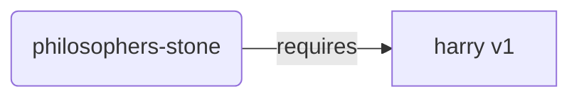
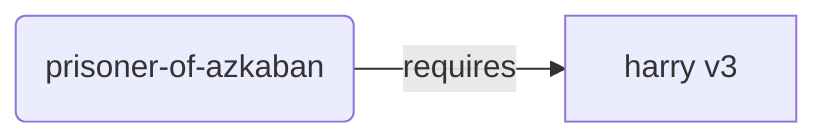
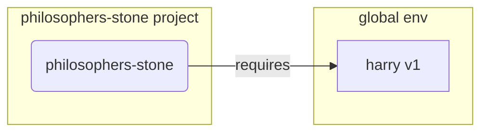
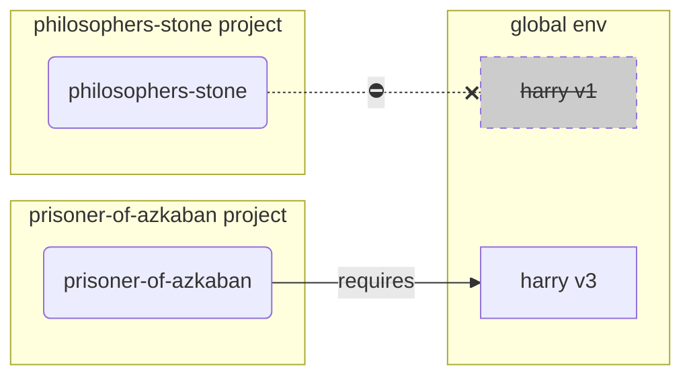
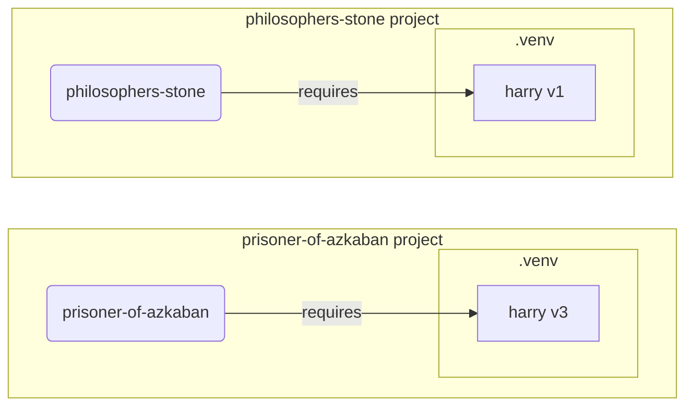

# 虚拟环境 { #virtual-environments }

当你在 Python 工程中工作时，你可能应该使用一个**虚拟环境**（或类似的机制）来隔离你为每个工程安装的包。

/// info | 信息

如果你已经了解虚拟环境，知道如何创建和使用它们，你可能想跳过这一节。🤓

///

/// tip | 提示

**虚拟环境**和**环境变量**是不同的。

**环境变量**是系统中的一个变量，可以被程序使用。

**虚拟环境**是一个包含一些文件的目录。

///

/// info | 信息

这个页面将教你如何使用**虚拟环境**以及了解它们的工作原理。

如果你已经准备好采用一个**为你管理一切的工具**（包括安装 Python），试试 <a href="https://github.com/astral-sh/uv" class="external-link" target="_blank">uv</a>。

///

## 创建一个工程 { #create-a-project }

首先，为你的工程创建一个目录。

我通常会在我的主目录/用户目录下创建一个名为 `code` 的目录。

然后在其中为每个工程创建一个目录。

<div class="termy">

```console
// Go to the home directory
$ cd
// Create a directory for all your code projects
$ mkdir code
// Enter into that code directory
$ cd code
// Create a directory for this project
$ mkdir awesome-project
// Enter into that project directory
$ cd awesome-project
```

</div>

## 创建一个虚拟环境 { #create-a-virtual-environment }

当你**第一次**开始一个 Python 工程时，在**<abbr title="there are other options, this is a simple guideline - 还有其他选择，这是一个简单的指南">工程内部</abbr>**创建一个虚拟环境。

/// tip | 提示

你只需要 **每个工程执行一次**，而不是每次工作时都执行。

///

//// tab | `venv`

要创建虚拟环境，你可以使用 Python 自带的 `venv` 模块。

<div class="termy">

```console
$ python -m venv .venv
```

</div>

/// details | 上述命令的含义

* `python`: 使用名为 `python` 的程序
* `-m`: 以脚本的方式调用一个模块，我们将告诉它接下来使用哪个模块
* `venv`: 使用名为 `venv` 的模块，这个模块通常随 Python 一起安装
* `.venv`: 在新目录 `.venv` 中创建虚拟环境

///

////

//// tab | `uv`

如果你安装了 <a href="https://github.com/astral-sh/uv" class="external-link" target="_blank">`uv`</a>，你也可以使用它来创建一个虚拟环境。

<div class="termy">

```console
$ uv venv
```

</div>

/// tip | 提示

默认情况下，`uv` 会在一个名为 `.venv` 的目录中创建一个虚拟环境。

但你可以通过传递一个额外的参数来自定义它，指定目录的名称。

///

////

这个命令会在一个名为 `.venv` 的目录中创建一个新的虚拟环境。

/// details | `.venv`，或是其他名称

你可以在不同的目录下创建虚拟环境，但通常我们会把它命名为 `.venv`。

///

## 激活虚拟环境 { #activate-the-virtual-environment }

激活新的虚拟环境，让你运行的任何 Python 命令或安装的包都使用它。

/// tip | 提示

**每次**开始一个 **新的终端会话** 来工作在这个工程时，都要执行一次。

///

//// tab | Linux, macOS

<div class="termy">

```console
$ source .venv/bin/activate
```

</div>

////

//// tab | Windows PowerShell

<div class="termy">

```console
$ .venv\Scripts\Activate.ps1
```

</div>

////

//// tab | Windows Bash

或者，如果你在 Windows 上使用 Bash（例如 <a href="https://gitforwindows.org/" class="external-link" target="_blank">Git Bash</a>）：

<div class="termy">

```console
$ source .venv/Scripts/activate
```

</div>

////

/// tip | 提示

每次你在这个环境中安装一个 **新的包** 后，都要再次 **激活** 这个环境。

这样可以确保：当你使用某个包安装的 **终端（<abbr title="command line interface - 命令行界面">CLI</abbr>）程序**时，用的是虚拟环境里的那个，而不是全局安装的、可能版本不同的那个。

///

## 检查虚拟环境是否激活 { #check-the-virtual-environment-is-active }

检查虚拟环境是否已激活（前面的命令是否生效）。

/// tip | 提示

这是 **可选的**，但这是一个很好的方法，可以 **检查** 一切是否按预期工作，以及你是否使用了你打算使用的虚拟环境。

///

//// tab | Linux, macOS, Windows Bash

<div class="termy">

```console
$ which python

/home/user/code/awesome-project/.venv/bin/python
```

</div>

如果它显示了在你工程（在这个例子中是 `awesome-project`）内部的 `.venv/bin/python` 位置的 `python` 二进制文件，那么它就生效了。🎉

////

//// tab | Windows PowerShell

<div class="termy">

```console
$ Get-Command python

C:\Users\user\code\awesome-project\.venv\Scripts\python
```

</div>

如果它显示了在你工程（在这个例子中是 `awesome-project`）内部的 `.venv\Scripts\python` 位置的 `python` 二进制文件，那么它就生效了。🎉

////

## 升级 `pip` { #upgrade-pip }

/// tip | 提示

如果你使用 <a href="https://github.com/astral-sh/uv" class="external-link" target="_blank">`uv`</a> 来安装内容，而不是 `pip`，那么你就不需要升级 `pip`。😎

///

如果你使用 `pip` 来安装包（Python 默认自带它），你应该将它 **升级** 到最新版本。

在安装包时出现的许多奇怪错误都可以通过先升级 `pip` 来解决。

/// tip | 提示

通常你只需要在创建虚拟环境后 **执行一次** 这个操作。

///

确保虚拟环境是激活的（使用上面的命令），然后运行：

<div class="termy">

```console
$ python -m pip install --upgrade pip

---> 100%
```

</div>

/// tip | 提示

有时，你在尝试升级 pip 时可能会遇到 **`No module named pip`** 错误。

如果发生这种情况，使用下面的命令安装并升级 pip：

<div class="termy">

```console
$ python -m ensurepip --upgrade

---> 100%
```

</div>

这个命令会在 pip 尚未安装时安装它，并确保安装的 pip 版本至少与 `ensurepip` 中可用的版本一样新。

///

## 添加 `.gitignore` { #add-gitignore }

如果你在使用 **Git**（你应该用），添加一个 `.gitignore` 文件，把 `.venv` 中的所有内容从 Git 中排除。

/// tip | 提示

如果你使用 <a href="https://github.com/astral-sh/uv" class="external-link" target="_blank">`uv`</a> 创建了虚拟环境，它已经为你做了这一步，你可以跳过。😎

///

/// tip | 提示

通常你只需要在创建虚拟环境后 **执行一次** 这个操作。

///

<div class="termy">

```console
$ echo "*" > .venv/.gitignore
```

</div>

/// details | 上述命令的含义

* `echo "*"`: 将在终端中“打印”文本 `*`（下一部分会稍微改变这一点）
* `>`: 左边命令打印到终端的任何内容都不会被打印出来，而是会被写入到右边的文件中
* `.gitignore`: 用于写入文本的文件名

而 `*` 对于 Git 来说意味着“所有内容”。所以，它会忽略 `.venv` 目录中的所有内容。

该命令会创建一个名为 `.gitignore` 的文件，内容如下：

```gitignore
*
```

///

## 安装软件包 { #install-packages }

激活环境后，你就可以在其中安装软件包。

/// tip | 提示

当你需要安装或升级工程所需的软件包时，执行本操作**一次**。

如果你需要升级版本或添加新包，你就 **再次执行** 这个操作。

///

### 直接安装软件包 { #install-packages-directly }

如果你赶时间，不想用文件来声明工程的软件包依赖，你可以直接安装它们。

/// tip | 提示

把程序所需的软件包及其版本写到文件中（例如 `requirements.txt` 或 `pyproject.toml`）是个（非常）好的主意。

///

//// tab | `pip`

<div class="termy">

```console
$ pip install "fastapi[standard]"

---> 100%
```

</div>

////

//// tab | `uv`

如果你有 <a href="https://github.com/astral-sh/uv" class="external-link" target="_blank">`uv`</a>:

<div class="termy">

```console
$ uv pip install "fastapi[standard]"
---> 100%
```

</div>

////

### 从 `requirements.txt` 安装 { #install-from-requirements-txt }

如果你有一个 `requirements.txt`，现在可以用它来安装其中的软件包。

//// tab | `pip`

<div class="termy">

```console
$ pip install -r requirements.txt
---> 100%
```

</div>

////

//// tab | `uv`

如果你有 <a href="https://github.com/astral-sh/uv" class="external-link" target="_blank">`uv`</a>:

<div class="termy">

```console
$ uv pip install -r requirements.txt
---> 100%
```

</div>

////

/// details | `requirements.txt`

一个包含一些软件包的 `requirements.txt` 文件可能长这样：

```requirements.txt
fastapi[standard]==0.113.0
pydantic==2.8.0
```

///

## 运行你的程序 { #run-your-program }

在你激活虚拟环境后，你可以运行你的程序，它将使用虚拟环境中的 Python，以及你在其中安装的软件包。

<div class="termy">

```console
$ python main.py

Hello World
```

</div>

## 配置你的编辑器 { #configure-your-editor }

你可能会用到编辑器，确保配置它使用你创建的同一个虚拟环境（它可能会自动检测到），这样你就可以获得自动补全和内联错误提示。

例如：

* <a href="https://code.visualstudio.com/docs/python/environments#_select-and-activate-an-environment" class="external-link" target="_blank">VS Code</a>
* <a href="https://www.jetbrains.com/help/pycharm/creating-virtual-environment.html" class="external-link" target="_blank">PyCharm</a>

/// tip | 提示

通常你只需要在创建虚拟环境时执行此操作**一次**。

///

## 停用虚拟环境 { #deactivate-the-virtual-environment }

当你完成工程的工作后，你可以**停用**虚拟环境。

<div class="termy">

```console
$ deactivate
```

</div>

这样，当你运行 `python` 时，它就不会尝试从那个虚拟环境（以及其中安装的软件包）来运行。

## 准备开始工作 { #ready-to-work }

现在你已经准备好开始在工程上工作了。


/// tip | 提示

你想要理解上面这些到底是什么吗？

继续阅读。👇🤓

///

## 为什么要使用虚拟环境 { #why-virtual-environments }

要使用 FastAPI，你需要安装 <a href="https://www.python.org/" class="external-link" target="_blank">Python</a>。

之后，你需要**安装** FastAPI 和你想要使用的任何其他**软件包**。

要安装软件包，你通常会使用随 Python 一起提供的 `pip` 命令（或类似的替代方案）。

不过，如果你直接使用 `pip`，软件包会被安装到你的**全局 Python 环境**中（Python 的全局安装）。

### 存在的问题 { #the-problem }

那么，在全局 Python 环境中安装软件包有什么问题呢？

有一天，你可能会编写许多不同的程序，这些程序依赖于**不同的软件包**；你所做的一些工程也会依赖于**同一软件包的不同版本**。😱

例如，你可能会创建一个名为 `philosophers-stone` 的工程，这个程序依赖于另一个名为 **`harry` 的软件包，使用版本 `1`**。因此，你需要安装 `harry`。



然后，在之后的某个时候，你又创建了另一个名为 `prisoner-of-azkaban` 的工程，这个工程也依赖于 `harry`，但是这个工程需要 **`harry` 版本 `3`**。



但现在的问题是，如果你将软件包安装在全局环境中（全局环境）而不是本地**虚拟环境**中，你将不得不选择安装哪个版本的 `harry`。

如果你想运行 `philosophers-stone`，你需要先安装 `harry` 版本 `1`，例如：

<div class="termy">

```console
$ pip install "harry==1"
```

</div>

然后你最终会在全局 Python 环境中安装 `harry` 版本 `1`。



但如果你想运行 `prisoner-of-azkaban`，你就需要卸载 `harry` 版本 `1` 并安装 `harry` 版本 `3`（或者仅安装版本 `3` 就会自动卸载版本 `1`）。

<div class="termy">

```console
$ pip install "harry==3"
```

</div>

然后你最终会在全局 Python 环境中安装 `harry` 版本 `3`。

如果你再次尝试运行 `philosophers-stone`，它有可能会 **无法工作**，因为它需要 `harry` 版本 `1`。



/// tip | 提示

Python 包在发布**新版本**时通常会尽力**避免破坏性变更**，但更安全的做法是有意识地安装新版本，并在你能运行测试、确认一切工作正常时再升级。

///

现在，想象一下还有**很多**其他你的**工程所依赖的**软件包。那将非常难以管理。你很可能会让一些工程在某些**不兼容的版本**下运行，然后却不知道为什么某些东西无法正常工作。

此外，取决于你的操作系统（例如 Linux、Windows、macOS），它可能已经预先安装了 Python。在这种情况下，它可能已经预装了一些软件包及其特定版本，**系统需要**它们。如果你在全局 Python 环境中安装软件包，最终可能会**破坏**一些随操作系统一起安装的程序。

## 软件包安装在哪里 { #where-are-packages-installed }

当你安装 Python 时，它会在你的计算机上创建一些目录，并在这些目录中放一些文件。

其中一些目录负责存放你安装的所有软件包。

当你运行：

<div class="termy">

```console
// Don't run this now, it's just an example 🤓
$ pip install "fastapi[standard]"
---> 100%
```

</div>

这将下载一个包含 FastAPI 代码的压缩文件，通常来自 <a href="https://pypi.org/project/fastapi/" class="external-link" target="_blank">PyPI</a>。

它还会**下载** FastAPI 依赖的其他软件包的文件。

然后它会**解压**所有这些文件，并将它们放在你的计算机上的一个目录中。

默认情况下，它会将下载并解压的这些文件放在随 Python 安装的目录中，这就是**全局环境**。

## 什么是虚拟环境 { #what-are-virtual-environments }

解决所有软件包都在全局环境中的问题的方法，是为你所做的每个工程使用一个**虚拟环境**。

虚拟环境是一个**目录**，与全局环境非常相似，你可以在其中为某个工程安装软件包。

这样，每个工程都会有自己的虚拟环境（`.venv` 目录），其中包含自己的软件包。



## 激活虚拟环境意味着什么 { #what-does-activating-a-virtual-environment-mean }

当你激活一个虚拟环境时，例如：

//// tab | Linux, macOS

<div class="termy">

```console
$ source .venv/bin/activate
```

</div>

////

//// tab | Windows PowerShell

<div class="termy">

```console
$ .venv\Scripts\Activate.ps1
```

</div>

////

//// tab | Windows Bash

或者如果你在 Windows 上使用 Bash（例如 <a href="https://gitforwindows.org/" class="external-link" target="_blank">Git Bash</a>）：

<div class="termy">

```console
$ source .venv/Scripts/activate
```

</div>

////

这个命令会创建或修改一些[环境变量](environment-variables.md){.internal-link target=_blank}，这些环境变量将在后续命令中可用。

其中之一是 `PATH` 变量。

/// tip | 提示

你可以在 [Environment Variables](environment-variables.md#path-environment-variable){.internal-link target=_blank} 部分了解更多关于 `PATH` 环境变量的内容。

///

激活虚拟环境会将其路径 `.venv/bin`（在 Linux 和 macOS 上）或 `.venv\Scripts`（在 Windows 上）添加到 `PATH` 环境变量中。

假设在激活环境之前，`PATH` 变量看起来像这样：

//// tab | Linux, macOS

```plaintext
/usr/bin:/bin:/usr/sbin:/sbin
```

这意味着系统会在以下目录中查找程序：

* `/usr/bin`
* `/bin`
* `/usr/sbin`
* `/sbin`

////

//// tab | Windows

```plaintext
C:\Windows\System32
```

这意味着系统会在以下目录中查找程序：

* `C:\Windows\System32`

////

激活虚拟环境后，`PATH` 变量会变成这样：

//// tab | Linux, macOS

```plaintext
/home/user/code/awesome-project/.venv/bin:/usr/bin:/bin:/usr/sbin:/sbin
```

这意味着系统现在会首先在以下目录中查找程序：

```plaintext
/home/user/code/awesome-project/.venv/bin
```

然后再在其他目录中查找。

因此，当你在终端中输入 `python` 时，系统会在以下目录中找到 Python 程序：

```plaintext
/home/user/code/awesome-project/.venv/bin/python
```

并使用它。

////

//// tab | Windows

```plaintext
C:\Users\user\code\awesome-project\.venv\Scripts;C:\Windows\System32
```

这意味着系统现在会首先在以下目录中查找程序：

```plaintext
C:\Users\user\code\awesome-project\.venv\Scripts
```

然后再在其他目录中查找。

因此，当你在终端中输入 `python` 时，系统会在以下目录中找到 Python 程序：

```plaintext
C:\Users\user\code\awesome-project\.venv\Scripts\python
```

并使用它。

////

一个重要的细节是，它会把虚拟环境路径放在 `PATH` 变量的**开头**。系统会在找到任何其他可用的 Python **之前**找到它。这样，当你运行 `python` 时，它会使用**来自虚拟环境**的 Python，而不是任何其他 `python`（例如来自全局环境的 `python`）。

激活虚拟环境还会改变其他一些东西，但这是它所做的最重要的事情之一。

## 检查虚拟环境 { #checking-a-virtual-environment }

当你检查虚拟环境是否激活时，例如：

//// tab | Linux, macOS, Windows Bash

<div class="termy">

```console
$ which python

/home/user/code/awesome-project/.venv/bin/python
```

</div>

////

//// tab | Windows PowerShell

<div class="termy">

```console
$ Get-Command python

C:\Users\user\code\awesome-project\.venv\Scripts\python
```

</div>

////

这意味着将使用的 `python` 程序是**虚拟环境中**的那个。

在 Linux 和 macOS 中使用 `which`，在 Windows PowerShell 中使用 `Get-Command`。

这个命令的工作方式是，它会在 `PATH` 环境变量中查找，按顺序遍历**每个路径**，寻找名为 `python` 的程序。一旦找到，它会**显示该程序的路径**。

最重要的部分是：当你调用 `python` 时，将执行的就是这个确切的 "`python`"。

因此，你可以确认你是否在正确的虚拟环境中。

/// tip | 提示

激活一个虚拟环境，得到一个 Python，然后**转到另一个工程**是很容易的事。

但第二个工程**无法工作**，是因为你使用了另一个工程虚拟环境中的、**不正确的 Python**。

能够检查正在使用哪个 `python` 很有用。🤓

///

## 为什么要停用虚拟环境 { #why-deactivate-a-virtual-environment }

例如，你可能正在一个工程 `philosophers-stone` 上工作，**激活了该虚拟环境**，安装了软件包并在该环境中工作。

然后你想要在**另一个工程** `prisoner-of-azkaban` 上工作。

你进入那个工程：

<div class="termy">

```console
$ cd ~/code/prisoner-of-azkaban
```

</div>

如果你不去停用 `philosophers-stone` 的虚拟环境，当你在终端中运行 `python` 时，它会尝试使用 `philosophers-stone` 里的 Python。

<div class="termy">

```console
$ cd ~/code/prisoner-of-azkaban

$ python main.py

// Error importing sirius, it's not installed 😱
Traceback (most recent call last):
    File "main.py", line 1, in <module>
        import sirius
```

</div>

但是如果你停用虚拟环境并激活 `prisoner-of-askaban` 的新虚拟环境，那么当你运行 `python` 时，它会使用 `prisoner-of-azkaban` 的虚拟环境中的 Python。

<div class="termy">

```console
$ cd ~/code/prisoner-of-azkaban

// You don't need to be in the old directory to deactivate, you can do it wherever you are, even after going to the other project 😎
$ deactivate

// Activate the virtual environment in prisoner-of-azkaban/.venv 🚀
$ source .venv/bin/activate

// Now when you run python, it will find the package sirius installed in this virtual environment ✨
$ python main.py

I solemnly swear 🐺
```

</div>

## 替代方案 { #alternatives }

这是一个简单的指南，帮助你入门并教会你一切在**底层**是如何工作的。

有许多**替代方案**来管理虚拟环境、包依赖（requirements）、工程。

当你准备好并想要使用一个工具来**管理整个工程**、包依赖、虚拟环境等，我建议你试试 <a href="https://github.com/astral-sh/uv" class="external-link" target="_blank">uv</a>。

`uv` 可以做很多事情，它可以：

* 为你**安装 Python**，包括不同版本
* 为你的工程管理**虚拟环境**
* 安装**软件包**
* 为你的工程管理软件包的**依赖和版本**
* 确保你有一个**确切**的软件包和版本集合来安装（包括它们的依赖），这样你就能确保在生产环境运行工程与在你的电脑上开发时运行的工程完全相同，这被称为**locking**
* 还有很多其他功能

## 结论 { #conclusion }

如果你读过并理解了所有这些，现在你对虚拟环境的了解**比很多开发者都要多**。🤓

当你未来在调试一些看起来复杂的东西时，了解这些细节很可能会有用，因为你会知道**它在底层是如何工作的**。😎
