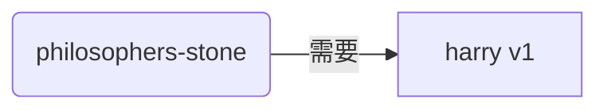
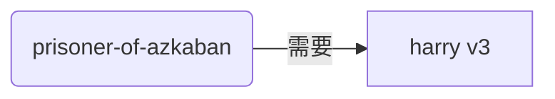
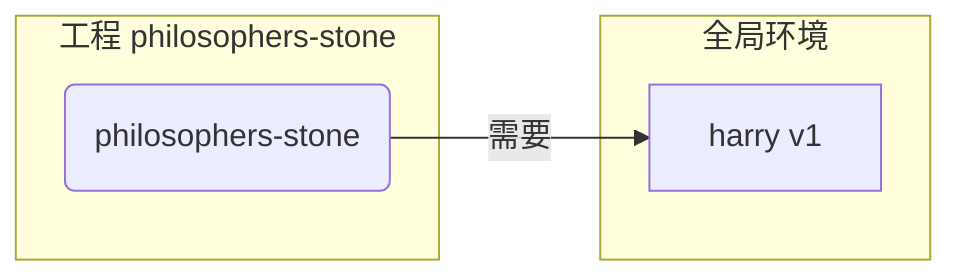
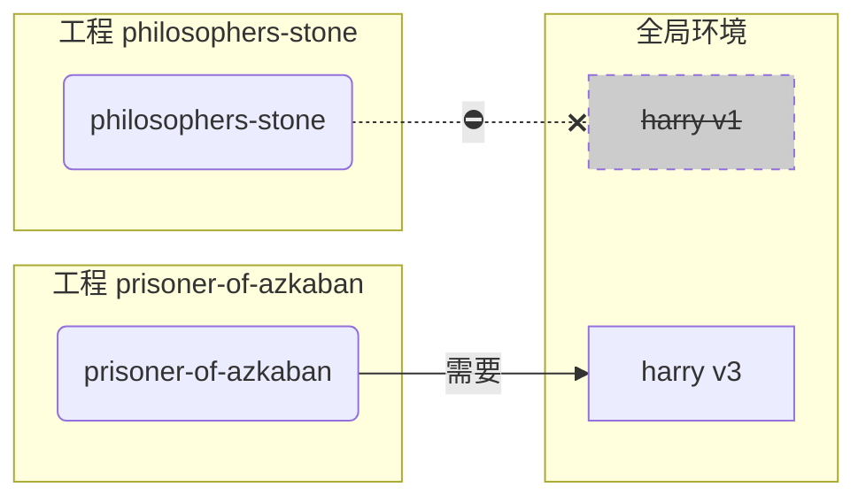
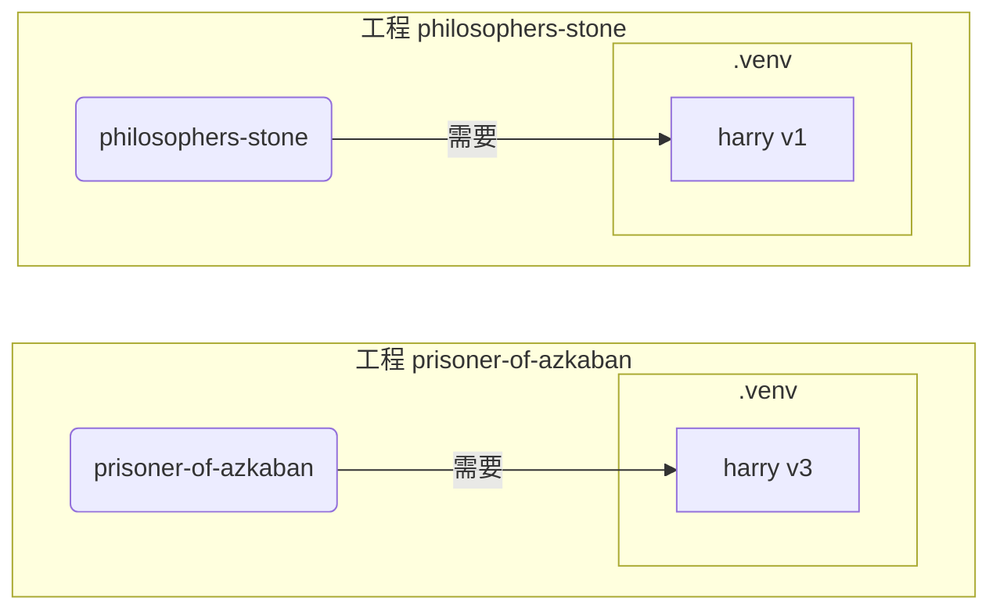

# 虚拟环境

当你在 Python 工程中工作时，你可能会有必要用到一个**虚拟环境**（或类似的机制）来隔离你为每个工程安装的包。

/// info

如果你已经了解虚拟环境，知道如何创建和使用它们，你可以考虑跳过这一部分。🤓

///

/// tip

**虚拟环境**和**环境变量**是不同的。

**环境变量**是系统中的一个变量，可以被程序使用。

**虚拟环境**是一个包含一些文件的目录。

///

/// info

这个页面将教你如何使用**虚拟环境**以及了解它们的工作原理。

如果你计划使用一个**可以为你管理一切的工具**（包括安装 Python），试试 <a href="https://github.com/astral-sh/uv" class="external-link" target="_blank">uv</a>。

///

## 创建一个工程

首先，为你的工程创建一个目录。

我 (指原作者 —— 译者注) 通常会在我的主目录下创建一个名为 `code` 的目录。

在这个目录下，我再为每个工程创建一个目录。

<div class="termy">

```console
// 进入主目录
$ cd
// 创建一个用于存放所有代码工程的目录
$ mkdir code
// 进入 code 目录
$ cd code
// 创建一个用于存放这个工程的目录
$ mkdir awesome-project
// 进入这个工程的目录
$ cd awesome-project
```

</div>

## 创建一个虚拟环境

在开始一个 Python 工程的**第一时间**，**<abbr title="还有其他做法，此处仅作一个简单的指南">在你的工程内部</abbr>**创建一个虚拟环境。

/// tip

你只需要 **在每个工程中操作一次**，而不是每次工作时都操作。

///

//// tab | `venv`

你可以使用 Python 自带的 `venv` 模块来创建一个虚拟环境。

<div class="termy">

```console
$ python -m venv .venv
```

</div>

/// details | 上述命令的含义

* `python`: 使用名为 `python` 的程序
* `-m`: 以脚本的方式调用一个模块，我们将告诉它接下来使用哪个模块
* `venv`: 使用名为 `venv` 的模块，这个模块通常随 Python 一起安装
* `.venv`: 在新目录 `.venv` 中创建虚拟环境

///

////

//// tab | `uv`

如果你安装了 <a href="https://github.com/astral-sh/uv" class="external-link" target="_blank">`uv`</a>，你也可以使用它来创建一个虚拟环境。

<div class="termy">

```console
$ uv venv
```

</div>

/// tip

默认情况下，`uv` 会在一个名为 `.venv` 的目录中创建一个虚拟环境。

但你可以通过传递一个额外的参数来自定义它，指定目录的名称。

///

////

这个命令会在一个名为 `.venv` 的目录中创建一个新的虚拟环境。

/// details | `.venv`，或是其他名称

你可以在不同的目录下创建虚拟环境，但通常我们会把它命名为 `.venv`。

///

## 激活虚拟环境

激活新的虚拟环境来确保你运行的任何 Python 命令或安装的包都能使用到它。

/// tip

**每次**开始一个 **新的终端会话** 来工作在这个工程时，你都需要执行这个操作。

///

//// tab | Linux, macOS

<div class="termy">

```console
$ source .venv/bin/activate
```

</div>

////

//// tab | Windows PowerShell

<div class="termy">

```console
$ .venv\Scripts\Activate.ps1
```

</div>

////

//// tab | Windows Bash

或者，如果你在 Windows 上使用 Bash（例如 <a href="https://gitforwindows.org/" class="external-link" target="_blank">Git Bash</a>）：

<div class="termy">

```console
$ source .venv/Scripts/activate
```

</div>

////

/// tip

每次你在这个环境中安装一个 **新的包** 时，都需要 **重新激活** 这个环境。

这么做确保了当你使用一个由这个包安装的 **终端（<abbr title="命令行界面">CLI</abbr>）程序** 时，你使用的是你的虚拟环境中的程序，而不是全局安装、可能版本不同的程序。

///

## 检查虚拟环境是否激活

检查虚拟环境是否激活 (前面的命令是否生效)。

/// tip

这是 **可选的**，但这是一个很好的方法，可以 **检查** 一切是否按预期工作，以及你是否使用了你打算使用的虚拟环境。

///

//// tab | Linux, macOS, Windows Bash

<div class="termy">

```console
$ which python

/home/user/code/awesome-project/.venv/bin/python
```

</div>

如果它显示了在你工程 (在这个例子中是 `awesome-project`) 的 `.venv/bin/python` 中的 `python` 二进制文件，那么它就生效了。🎉

////

//// tab | Windows PowerShell

<div class="termy">

```console
$ Get-Command python

C:\Users\user\code\awesome-project\.venv\Scripts\python
```

</div>

如果它显示了在你工程 (在这个例子中是 `awesome-project`) 的 `.venv\Scripts\python` 中的 `python` 二进制文件，那么它就生效了。🎉

////

## 升级 `pip`

/// tip

如果你使用 <a href="https://github.com/astral-sh/uv" class="external-link" target="_blank">`uv`</a> 来安装内容，而不是 `pip`，那么你就不需要升级 `pip`。😎

///

如果你使用 `pip` 来安装包（它是 Python 的默认组件），你应该将它 **升级** 到最新版本。

在安装包时出现的许多奇怪的错误都可以通过先升级 `pip` 来解决。

/// tip

通常你只需要在创建虚拟环境后 **执行一次** 这个操作。

///

确保虚拟环境是激活的 (使用上面的命令)，然后运行：

<div class="termy">

```console
$ python -m pip install --upgrade pip

---> 100%
```

</div>

## 添加 `.gitignore`

如果你使用 **Git** (这是你应该使用的)，添加一个 `.gitignore` 文件来排除你的 `.venv` 中的所有内容。

/// tip

如果你使用 <a href="https://github.com/astral-sh/uv" class="external-link" target="_blank">`uv`</a> 来创建虚拟环境，它会自动为你完成这个操作，你可以跳过这一步。😎

///

/// tip

通常你只需要在创建虚拟环境后 **执行一次** 这个操作。

///

<div class="termy">

```console
$ echo "*" > .venv/.gitignore
```

</div>

/// details | 上述命令的含义

* `echo "*"`: 将在终端中 "打印" 文本 `*`（接下来的部分会对这个操作进行一些修改）
* `>`: 使左边的命令打印到终端的任何内容实际上都不会被打印，而是会被写入到右边的文件中
* `.gitignore`: 被写入文本的文件的名称

而 `*` 对于 Git 来说意味着 "所有内容"。所以，它会忽略 `.venv` 目录中的所有内容。

该命令会创建一个名为 `.gitignore` 的文件，内容如下：

```gitignore
*
```

///

## 安装软件包

在激活虚拟环境后，你可以在其中安装软件包。

/// tip

当你需要安装或升级软件包时，执行本操作**一次**；

如果你需要再升级版本或添加新软件包，你可以**再次执行此操作**。

///

### 直接安装包

如果你急于安装，不想使用文件来声明工程的软件包依赖，您可以直接安装它们。

/// tip

将程序所需的软件包及其版本放在文件中（例如 `requirements.txt` 或 `pyproject.toml`）是个好（并且非常好）的主意。

///

//// tab | `pip`

<div class="termy">

```console
$ pip install "fastapi[standard]"

---> 100%
```

</div>

////

//// tab | `uv`

如果你有 <a href="https://github.com/astral-sh/uv" class="external-link" target="_blank">`uv`</a>:

<div class="termy">

```console
$ uv pip install "fastapi[standard]"
---> 100%
```

</div>

////

### 从 `requirements.txt` 安装

如果你有一个 `requirements.txt` 文件，你可以使用它来安装其中的软件包。

//// tab | `pip`

<div class="termy">

```console
$ pip install -r requirements.txt
---> 100%
```

</div>

////

//// tab | `uv`

如果你有 <a href="https://github.com/astral-sh/uv" class="external-link" target="_blank">`uv`</a>:

<div class="termy">

```console
$ uv pip install -r requirements.txt
---> 100%
```

</div>

////

/// details | 关于 `requirements.txt`

一个包含一些软件包的 `requirements.txt` 文件看起来应该是这样的：

```requirements.txt
fastapi[standard]==0.113.0
pydantic==2.8.0
```

///

## 运行程序

在你激活虚拟环境后，你可以运行你的程序，它将使用虚拟环境中的 Python 和你在其中安装的软件包。

<div class="termy">

```console
$ python main.py

Hello World
```

</div>

## 配置编辑器

你可能会用到编辑器（即 IDE —— 译者注），请确保配置它使用与你创建的相同的虚拟环境（它可能会自动检测到），以便你可以获得自动补全和内联错误提示。

例如：

* <a href="https://code.visualstudio.com/docs/python/environments#_select-and-activate-an-environment" class="external-link" target="_blank">VS Code</a>
* <a href="https://www.jetbrains.com/help/pycharm/creating-virtual-environment.html" class="external-link" target="_blank">PyCharm</a>

/// tip

通常你只需要在创建虚拟环境时执行此操作**一次**。

///

## 退出虚拟环境

当你完成工作后，你可以**退出**虚拟环境。

<div class="termy">

```console
$ deactivate
```

</div>

这样，当你运行 `python` 时，它不会尝试从安装了软件包的虚拟环境中运行。（即，它将不再会尝试从虚拟环境中运行，也不会使用其中安装的软件包。—— 译者注）

## 开始工作

现在你已经准备好开始你的工作了。


/// tip

你想要理解上面的所有内容吗？

继续阅读。👇🤓

///

## 为什么要使用虚拟环境

你需要安装 <a href="https://www.python.org/" class="external-link" target="_blank">Python</a> 才能使用 FastAPI。

之后，你需要**安装** FastAPI 和你想要使用的任何其他**软件包**。

要安装软件包，你通常会使用随 Python 一起提供的 `pip` 命令（或类似的替代方案）。

然而，如果你直接使用 `pip`，软件包将被安装在你的**全局 Python 环境**中（即 Python 的全局安装）。

### 存在的问题

那么，在全局 Python 环境中安装软件包有什么问题呢？

有些时候，你可能会编写许多不同的程序，这些程序依赖于**不同的软件包**；你所做的一些工程也会依赖于**同一软件包的不同版本**。😱

例如，你可能会创建一个名为 `philosophers-stone` 的工程，这个程序依赖于另一个名为 **`harry` 的软件包，使用版本 `1`**。因此，你需要安装 `harry`。



然而在此之后，你又创建了另一个名为 `prisoner-of-azkaban` 的工程，这个工程也依赖于 `harry`，但是这个工程需要 **`harry` 版本 `3`**。



那么现在的问题是，如果你将软件包安装在全局环境中而不是在本地**虚拟环境**中，你将不得不面临选择安装哪个版本的 `harry` 的问题。

如果你想运行 `philosophers-stone`，你需要首先安装 `harry` 版本 `1`，例如：

<div class="termy">

```console
$ pip install "harry==1"
```

</div>

然后你将在全局 Python 环境中安装 `harry` 版本 `1`。



但是如果你想运行 `prisoner-of-azkaban`，你需要卸载 `harry` 版本 `1` 并安装 `harry` 版本 `3`（或者说，只要你安装版本 `3` ，版本 `1` 就会自动卸载）。

<div class="termy">

```console
$ pip install "harry==3"
```

</div>

于是，你在你的全局 Python 环境中安装了 `harry` 版本 `3`。

如果你再次尝试运行 `philosophers-stone`，有可能它**无法正常工作**，因为它需要 `harry` 版本 `1`。



/// tip

Python 包在推出**新版本**时通常会尽量**避免破坏性更改**，但最好还是要小心，要想清楚再安装新版本，而且在运行测试以确保一切能正常工作时再安装。

///

现在，想象一下，如果有**许多**其他**软件包**，它们都是你的**工程所依赖的**。这是非常难以管理的。你可能会发现，有些工程使用了一些**不兼容的软件包版本**，而不知道为什么某些东西无法正常工作。

此外，取决于你的操作系统（例如 Linux、Windows、macOS），它可能已经预先安装了 Python。在这种情况下，它可能已经预先安装了一些软件包，这些软件包的特定版本是**系统所需的**。如果你在全局 Python 环境中安装软件包，你可能会**破坏**一些随操作系统一起安装的程序。

## 软件包安装在哪里

当你安装 Python 时，它会在你的计算机上创建一些目录，并在这些目录中放一些文件。

其中一些目录负责存放你安装的所有软件包。

当你运行：

<div class="termy">

```console
// 先别去运行这个命令，这只是一个示例 🤓
$ pip install "fastapi[standard]"
---> 100%
```

</div>

这将会从 <a href="https://pypi.org/project/fastapi/" class="external-link" target="_blank">PyPI</a> 下载一个压缩文件，其中包含 FastAPI 代码。

它还会**下载** FastAPI 依赖的其他软件包的文件。

然后它会**解压**所有这些文件，并将它们放在你的计算机上的一个目录中。

默认情况下，它会将下载并解压的这些文件放在随 Python 安装的目录中，这就是**全局环境**。

## 什么是虚拟环境

解决软件包都安装在全局环境中的问题的方法是为你所做的每个工程使用一个**虚拟环境**。

虚拟环境是一个**目录**，与全局环境非常相似，你可以在其中专为某个工程安装软件包。

这样，每个工程都会有自己的虚拟环境（`.venv` 目录），其中包含自己的软件包。



## 激活虚拟环境意味着什么

当你激活了一个虚拟环境，例如：

//// tab | Linux, macOS

<div class="termy">

```console
$ source .venv/bin/activate
```

</div>

////

//// tab | Windows PowerShell

<div class="termy">

```console
$ .venv\Scripts\Activate.ps1
```

</div>

////

//// tab | Windows Bash

或者如果你在 Windows 上使用 Bash（例如 <a href="https://gitforwindows.org/" class="external-link" target="_blank">Git Bash</a>）：

<div class="termy">

```console
$ source .venv/Scripts/activate
```

</div>

////

这个命令会创建或修改一些[环境变量](environment-variables.md){.internal-link target=_blank}，这些环境变量将在接下来的命令中可用。

其中之一是 `PATH` 变量。

/// tip

你可以在 [环境变量](environment-variables.md#path-environment-variable){.internal-link target=_blank} 部分了解更多关于 `PATH` 环境变量的内容。

///

激活虚拟环境会将其路径 `.venv/bin`（在 Linux 和 macOS 上）或 `.venv\Scripts`（在 Windows 上）添加到 `PATH` 环境变量中。

假设在激活环境之前，`PATH` 变量看起来像这样：

//// tab | Linux, macOS

```plaintext
/usr/bin:/bin:/usr/sbin:/sbin
```

这意味着系统会在以下目录中查找程序：

* `/usr/bin`
* `/bin`
* `/usr/sbin`
* `/sbin`

////

//// tab | Windows

```plaintext
C:\Windows\System32
```

这意味着系统会在以下目录中查找程序：

* `C:\Windows\System32`

////

激活虚拟环境后，`PATH` 变量会变成这样：

//// tab | Linux, macOS

```plaintext
/home/user/code/awesome-project/.venv/bin:/usr/bin:/bin:/usr/sbin:/sbin
```

这意味着系统现在会首先在以下目录中查找程序：

```plaintext
/home/user/code/awesome-project/.venv/bin
```

然后再在其他目录中查找。

因此，当你在终端中输入 `python` 时，系统会在以下目录中找到 Python 程序：

```plaintext
/home/user/code/awesome-project/.venv/bin/python
```

并使用这个。

////

//// tab | Windows

```plaintext
C:\Users\user\code\awesome-project\.venv\Scripts;C:\Windows\System32
```

这意味着系统现在会首先在以下目录中查找程序：

```plaintext
C:\Users\user\code\awesome-project\.venv\Scripts
```

然后再在其他目录中查找。

因此，当你在终端中输入 `python` 时，系统会在以下目录中找到 Python 程序：

```plaintext
C:\Users\user\code\awesome-project\.venv\Scripts\python
```

并使用这个。

////

一个重要的细节是，虚拟环境路径会被放在 `PATH` 变量的**开头**。系统会在找到任何其他可用的 Python **之前**找到它。这样，当你运行 `python` 时，它会使用**虚拟环境中**的 Python，而不是任何其他 `python`（例如，全局环境中的 `python`）。

激活虚拟环境还会改变其他一些东西，但这是它所做的最重要的事情之一。

## 检查虚拟环境

当你检查虚拟环境是否激活时，例如：

//// tab | Linux, macOS, Windows Bash

<div class="termy">

```console
$ which python

/home/user/code/awesome-project/.venv/bin/python
```

</div>

////

//// tab | Windows PowerShell

<div class="termy">

```console
$ Get-Command python

C:\Users\user\code\awesome-project\.venv\Scripts\python
```

</div>

////

这意味着将使用的 `python` 程序是**在虚拟环境中**的那个。

在 Linux 和 macOS 中使用 `which`，在 Windows PowerShell 中使用 `Get-Command`。

这个命令的工作方式是，它会在 `PATH` 环境变量中查找，按顺序**逐个路径**查找名为 `python` 的程序。一旦找到，它会**显示该程序的路径**。

最重要的部分是，当你调用 `python` 时，将执行的就是这个确切的 "`python`"。

因此，你可以确认你是否在正确的虚拟环境中。

/// tip

激活一个虚拟环境，获取一个 Python，然后**转到另一个工程**是一件很容易的事情；

但如果第二个工程**无法工作**，那是因为你使用了来自另一个工程的虚拟环境的、**不正确的 Python**。

因此，会检查正在使用的 `python` 是很有用的。🤓

///

## 为什么要停用虚拟环境

例如，你可能正在一个工程 `philosophers-stone` 上工作，**激活了该虚拟环境**，安装了包并使用了该环境，

然后你想要在**另一个工程** `prisoner-of-azkaban` 上工作，

你进入那个工程：

<div class="termy">

```console
$ cd ~/code/prisoner-of-azkaban
```

</div>

如果你不去停用 `philosophers-stone` 的虚拟环境，当你在终端中运行 `python` 时，它会尝试使用 `philosophers-stone` 中的 Python。

<div class="termy">

```console
$ cd ~/code/prisoner-of-azkaban

$ python main.py

// 导入 sirius 报错，它没有安装 😱
Traceback (most recent call last):
    File "main.py", line 1, in <module>
        import sirius
```

</div>

但是如果你停用虚拟环境并激活 `prisoner-of-askaban` 的新虚拟环境，那么当你运行 `python` 时，它会使用 `prisoner-of-askaban` 中的虚拟环境中的 Python。

<div class="termy">

```console
$ cd ~/code/prisoner-of-azkaban

// 你不需要在旧目录中操作停用，你可以在任何地方操作停用，甚至在转到另一个工程之后 😎
$ deactivate

// 激活 prisoner-of-azkaban/.venv 中的虚拟环境 🚀
$ source .venv/bin/activate

// 现在当你运行 python 时，它会在这个虚拟环境中找到安装的 sirius 包 ✨
$ python main.py

I solemnly swear 🐺
```

</div>

## 替代方案

这是一个简单的指南，可以帮助你入门并教会你如何理解一切**底层**的东西。

有许多**替代方案**来管理虚拟环境、包依赖（requirements）、工程。

一旦你准备好并想要使用一个工具来**管理整个工程**、包依赖、虚拟环境等，建议你尝试 <a href="https://github.com/astral-sh/uv" class="external-link" target="_blank">uv</a>。

`uv` 可以做很多事情，它可以：

* 为你**安装 Python**，包括不同的版本
* 为你的工程管理**虚拟环境**
* 安装**软件包**
* 为你的工程管理软件包的**依赖和版本**
* 确保你有一个**确切**的软件包和版本集合来安装，包括它们的依赖项，这样你就可以确保在生产中运行你的工程与在开发时在你的计算机上运行的工程完全相同，这被称为**锁定**
* 还有很多其他功能

## 结论

如果你读过并理解了所有这些，现在**你对虚拟环境的了解比很多开发者都要多**。🤓

在未来当你调试看起来复杂的东西时，了解这些细节很可能会有用，你会知道**它是如何在底层工作的**。😎
