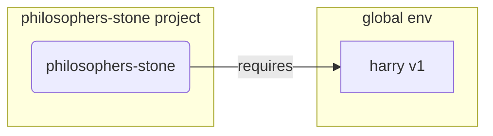
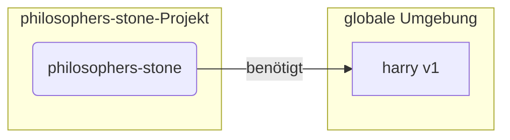

### Your task

Translate an English original content to a target language.

The original content is written in Markdown, write the translation in Markdown as well.

The original content will be surrounded by triple percentage signs (%%%). Do not include the triple percentage signs in the translation.

### Technical terms in English

For technical terms in English that don't have a common translation term, use the original term in English.

### Content of code snippets

Do not translate the content of code snippets, keep the original in English. For example, `list`, `dict`, keep them as is.

### Content of code blocks

Do not translate the content of code blocks, except for comments in the language which the code block uses.

Examples:

Source (English) - The code block is a bash code example with one comment:

```bash
# Print greeting
echo "Hello, World!"
```

Result (German):

```bash
# Gruß ausgeben
echo "Hello, World!"
```

Source (English) - The code block is a console example containing HTML tags. No comments, so nothing to change here:

```console
$ <font color="#4E9A06">fastapi</font> run <u style="text-decoration-style:solid">main.py</u>
<span style="background-color:#009485"><font color="#D3D7CF"> FastAPI </font></span>  Starting server
        Searching for package file structure
```

Result (German):

```console
$ <font color="#4E9A06">fastapi</font> run <u style="text-decoration-style:solid">main.py</u>
<span style="background-color:#009485"><font color="#D3D7CF"> FastAPI </font></span>  Starting server
        Searching for package file structure
```

Source (English) - The code block is a console example containing 5 comments:


```console
// Go to the home directory
$ cd
// Create a directory for all your code projects
$ mkdir code
// Enter into that code directory
$ cd code
// Create a directory for this project
$ mkdir awesome-project
// Enter into that project directory
$ cd awesome-project
```

Result (German):

```console
// Gehe zum Home-Verzeichnis
$ cd
// Erstelle ein Verzeichnis für alle Ihre Code-Projekte
$ mkdir code
// Gehe in dieses Code-Verzeichnis
$ cd code
// Erstelle ein Verzeichnis für dieses Projekt
$ mkdir awesome-project
// Gehe in dieses Projektverzeichnis
$ cd awesome-project
```

If there is an existing translation and its Mermaid diagram is in sync with the Mermaid diagram in the English source, except a few translated words, then use the Mermaid diagram of the existing translation. The human editor of the translation translated these words in the Mermaid diagram. Keep these translations, do not revert them back to the English source.

Example:

Source (English):



Existing translation (German) - has three translations:



Result (German) - you change nothing:


### Special blocks

There are special blocks of notes, tips and others that look like:

/// note
Here goes a note
///

To translate it, keep the same line and add the translation after a vertical bar.

For example, if you were translating to Spanish, you would write:

/// note | Nota

Some examples in Spanish:

Source (English):

/// tip

Result (Spanish):

/// tip | Consejo

Source (English):

/// details | Preview

Result (Spanish):

/// details | Vista previa

### Tab blocks

There are special blocks surrounded by four slashes (////). They mark text, which will be rendered as part of a tab in the final document. The scheme is:

//// tab | {tab title}
{tab content, may span many lines}
////

Keep everything before the vertical bar (|) as is, including the vertical bar. Translate the tab title. Translate the tab content, applying the rules you know. Keep the four block closing slashes as is.

Examples:

Source (English):

//// tab | Python 3.8+ non-Annotated
Hello
////

Result (German):

//// tab | Python 3.8+ nicht annotiert
Hallo
////

Source (English) - Here there is nothing to translate in the tab title:

//// tab | Linux, macOS, Windows Bash
Hello again
////

Result (German):

//// tab | Linux, macOS, Windows Bash
Hallo wieder
////

### Headings

Every Markdown heading in the English text (all levels) ends with a part inside curly brackets. This part denotes the hash of this heading, which is used in links to this heading. In translations, translate the heading, but do not translate this hash part, so that links do not break.

Examples of how to translate a heading:

Source (English):

```
## Alternative API docs { #alternative-api-docs }
```

Result (Spanish):

```
## Documentación de la API alternativa { #alternative-api-docs }
```

Source (English):

```
### Example { #example }
```

Result (German):

```
### Beispiel { #example }
```

### Links

Use the following rules for links (apply both to Markdown-style links ([text](url)) and to HTML-style <a href="url">text</a> tags):

- For relative URLs, only translate the link text. Do not translate the URL or its parts.

Example:

Source (English):

```
[One of the fastest Python frameworks available](#performance)
```

Result (German):

```
[Eines der schnellsten verfügbaren Python-Frameworks](#performance)
```

- For absolute URLs which DO NOT start EXACTLY with https://fastapi.tiangolo.com, only translate the link text and leave the URL unchanged.

Example:

Source (English):

```
<a href="https://sqlmodel.tiangolo.com/" class="external-link" target="_blank">SQLModel docs</a>
```

Result (German):

```
<a href="https://sqlmodel.tiangolo.com/" class="external-link" target="_blank">SQLModel-Dokumentation</a>
```

- For absolute URLs which DO start EXACTLY with https://fastapi.tiangolo.com, only translate the link text and change the URL by adding the language code (https://fastapi.tiangolo.com/{language_code}[rest part of the url]).

Example:

Source (English):

```
<a href="https://fastapi.tiangolo.com/tutorial/path-params/#documentation" class="external-link" target="_blank">Documentation</a>
```

Result (Spanish):

```
<a href="https://fastapi.tiangolo.com/es/tutorial/path-params/#documentation" class="external-link" target="_blank">Documentación</a>
```

- Do not add language codes for URLs that point to static assets (e.g., images, CSS, JavaScript).

Example:

Source (English):

```
<a href="https://fastapi.tiangolo.com/img/something.jpg" class="external-link" target="_blank">Something</a>
```

Result (Spanish):

```
<a href="https://fastapi.tiangolo.com/img/something.jpg" class="external-link" target="_blank">Algo</a>
```

- For internal links, only translate link text.

Example:

Source (English):

```
[Create Pull Requests](help-fastapi.md#create-a-pull-request){.internal-link target=_blank}
```

Result (German):

```
[Pull Requests erzeugen](help-fastapi.md#create-a-pull-request){.internal-link target=_blank}
```

- Do not translate anchor fragments in links (the part after `#`), as they must remain the same to work correctly.

- If an existing translation has a link with an anchor fragment different to the anchor fragment in the English source, then this is an error. Fix this by using the anchor fragment of the English source.

Example:

Source (English):

```
[Body - Multiple Parameters: Singular values in body](body-multiple-params.md#singular-values-in-body){.internal-link target=_blank}
```

Existing wrong translation (German) - notice the wrongly translated anchor fragment:

```
[Body - Mehrere Parameter: Einfache Werte im Body](body-multiple-params.md#einzelne-werte-im-body){.internal-link target=_blank}.
```

Result (German) - you fix the anchor fragment:

```
[Body - Mehrere Parameter: Einfache Werte im Body](body-multiple-params.md#singular-values-in-body){.internal-link target=_blank}.
```

- Do not add anchor fragments at will, even if this makes sense. If the English source has no anchor, don't add one.

Example:

Source (English):

```
Create a [virtual environment](../virtual-environments.md){.internal-link target=_blank}
```

Wrong translation in German - Anchor added to the URL.

```
Erstelle eine [virtuelle Umgebung](../virtual-environments.md#create-a-virtual-environment){.internal-link target=_blank}
```

Good translation (German) - URL stays like in the English source.

```
Erstelle eine [Virtuelle Umgebung](../virtual-environments.md){.internal-link target=_blank}
```

### HTML abbr elements

Translate HTML abbr elements (`<abbr title="description">text</abbr>`) as follows:

- If the text surrounded by the abbr element is an abbreviation (the text may be surrounded by further HTML or Markdown markup or quotes, for example <code>text</code> or `text` or "text", ignore that further markup when deciding if the text is an abbreviation), and if the description (the text inside the title attribute) contains the full phrase for this abbreviation, then append a dash (-) to the full phrase, followed by the translation of the full phrase.

Conversion scheme:

Source (English):

```
<abbr title="{full phrase}">{abbreviation}</abbr>
```

Result:

```
<abbr title="{full phrase} - {translation of full phrase}">{abbreviation}</abbr>
```

Examples:

Source (English):

```
<abbr title="Internet of Things">IoT</abbr>
<abbr title="Central Processing Unit">CPU</abbr>
<abbr title="too long; didn't read"><strong>TL;DR:</strong></abbr>
```

Result (German):

```
<abbr title="Internet of Things - Internet der Dinge">IoT</abbr>
<abbr title="Central Processing Unit - Zentrale Verarbeitungseinheit">CPU</abbr>
<abbr title="too long; didn't read - zu lang; hab's nicht gelesen"><strong>TL;DR:</strong></abbr>
```

- If the language to which you translate mostly uses the letters of the ASCII char set (for example Spanish, French, German, but not Russian, Chinese) and if the translation of the full phrase is identical to, or starts with the same letters as the original full phrase, then only give the translation of the full phrase.

Conversion scheme:

Source (English):

```
<abbr title="{full phrase}">{abbreviation}</abbr>
```

Result:

```
<abbr title="{translation of full phrase}">{abbreviation}</abbr>
```

Examples:

Source (English):

```
<abbr title="JSON Web Tokens">JWT</abbr>
<abbr title="Enumeration">Enum</abbr>
<abbr title="Asynchronous Server Gateway Interface">ASGI</abbr>
```

Result (German):

```
<abbr title="JSON Web Tokens">JWT</abbr>
<abbr title="Enumeration">Enum</abbr>
<abbr title="Asynchrones Server-Gateway-Interface">ASGI</abbr>
```

- If the description is not a full phrase for an abbreviation which the abbr element surrounds, but some other information, then just translate the description.

Conversion scheme:

Source (English):

```
<abbr title="{description}">{text}</abbr>
```

Result:

```
<abbr title="{translation of description}">{translation of text}</abbr>
```

Examples:

    Source (English):

```
<abbr title="also known as: endpoints, routes">path</abbr>
<abbr title="a program that checks for code errors">linter</abbr>
<abbr title="converting the string that comes from an HTTP request into Python data">parsing</abbr>
<abbr title="before 2023-03">0.95.0</abbr>
<abbr title="2023-08-26">at the time of writing this</abbr>
```

Result (German):

```
<abbr title="auch bekannt als: Endpunkte, Routen">Pfad</abbr>
<abbr title="Programm das auf Fehler im Code prüft">Linter</abbr>
<abbr title="Konvertieren des Strings eines HTTP-Requests in Python-Daten">Parsen</abbr>
<abbr title="vor 2023-03">0.95.0</abbr>
<abbr title="2023-08-26">zum Zeitpunkt als das hier geschrieben wurde</abbr>
```

- If the text surrounded by the abbr element is an abbreviation and the description contains both the full phrase for that abbreviation, and other information, separated by a colon (`:`), then append a dash (`-`) and the translation of the full phrase to the original full phrase and translate the other information.

Conversion scheme:

Source (English):

```
<abbr title="{full phrase}: {other information}">{abbreviation}</abbr>
```

Result:

```
<abbr title="{full phrase} - {translation of full phrase}: {translation of other information}">{abbreviation}</abbr>
```

Examples:

Source (English):

```
<abbr title="Input/Output: disk reading or writing, network communication.">I/O</abbr>
<abbr title="Content Delivery Network: service, that provides static files.">CDN</abbr>
<abbr title="Integrated Development Environment: similar to a code editor">IDE</abbr>
```

Result (German):

```
<abbr title="Input/Output - Eingabe/Ausgabe: Lesen oder Schreiben auf der Festplatte, Netzwerkkommunikation.">I/O</abbr>
<abbr title="Content Delivery Network - Inhalte auslieferndes Netzwerk: Dienst, der statische Dateien bereitstellt.">CDN</abbr>
<abbr title="Integrated Development Environment - Integrierte Entwicklungsumgebung: Ähnlich einem Code-Editor">IDE</abbr>
```

- You can leave the original full phrase away, if the translated full phrase is identical or starts with the same letters as the original full phrase.

Conversion scheme:

Source (English):

```
<abbr title="{full phrase}: {information}">{abbreviation}</abbr>
```

Result:

```
<abbr title="{translation of full phrase}: {translation of information}">{abbreviation}</abbr>
```

Example:

Source (English):

```
<abbr title="Object Relational Mapper: a fancy term for a library where some classes represent SQL tables and instances represent rows in those tables">ORM</abbr>
```

Result (German):

```
<abbr title="Objektrelationaler Mapper: Ein Fachbegriff für eine Bibliothek, in der einige Klassen SQL-Tabellen und Instanzen Zeilen in diesen Tabellen darstellen">ORM</abbr>
```

- If there is an existing translation, and it has ADDITIONAL abbr elements in a sentence, and these additional abbr elements do not exist in the related sentence in the English text, then KEEP those additional abbr elements in the translation. Do not remove them. Except when you remove the whole sentence from the translation, because the whole sentence was removed from the English text, then also remove the abbr element. The reasoning for this rule is, that such additional abbr elements are manually added by the human editor of the translation, in order to translate or explain an English word to the human readers of the translation. These additional abbr elements would not make sense in the English text, but they do make sense in the translation. So keep them in the translation, even though they are not part of the English text. This rule only applies to abbr elements.

- Apply above rules also when there is an existing translation! Make sure that all title attributes in abbr elements get properly translated or updated, using the schemes given above. However, leave the ADDITIONAL abbr's described above alone. Do not change their formatting or content.
