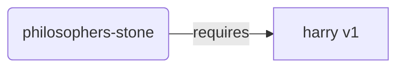

# Code blocks { #code-blocks }

Some text

```python
# This is a sample Python code block
def hello_world():
    # Comment with indentation
    print("Hello, world!")  # Print greeting
```

Some more text

The following block has wrong language code (should be TOML):

```
# This is a sample TOML code block
title = "TOML Example"  # Title of the document
```

And more text

```console
// Use the command "live" and pass the language code as a CLI argument
$ python ./scripts/docs.py live es

<span style="color: green;">[INFO]</span> Serving on http://127.0.0.1:8008
<span style="color: green;">[INFO]</span> Start watching changes
<span style="color: green;">[INFO]</span> Start detecting changes
```

And even more text

```json
{
    // This is a sample JSON code block
    "greeting": "Hello, world!" // Greeting
}
```

Диаграма Mermaid


